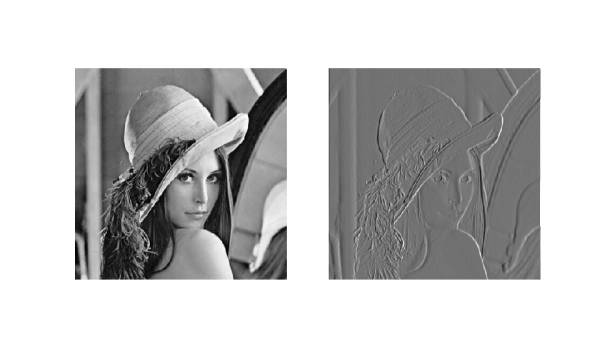
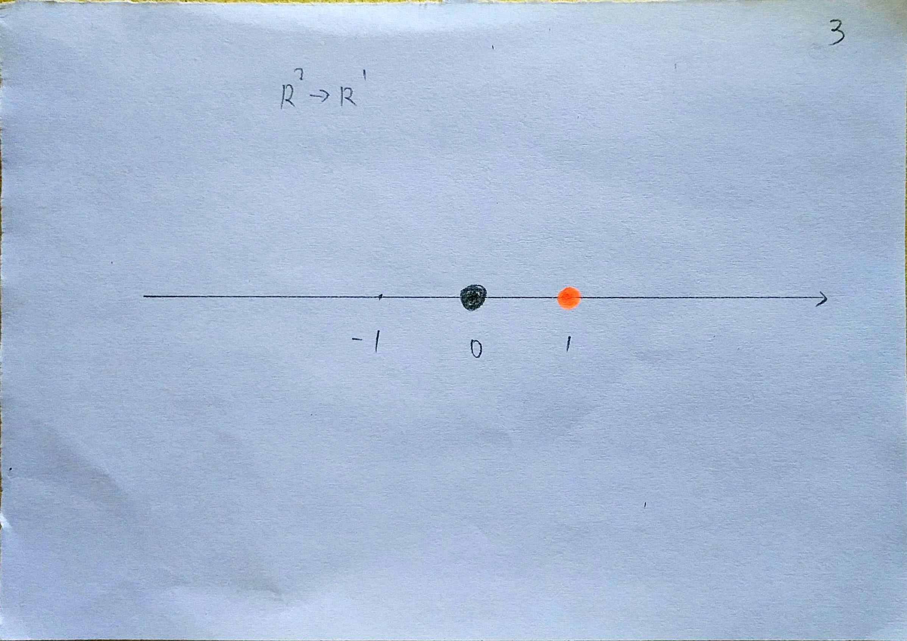

---

layout:            post  
title:             "我对 CNN 的理解"  
date:              2017-09-22 18:25:00 +0300  
tags:              ML
category:          Tech  
author:            Qiang  

---

## 基础结构中的两部分（卷积部分，全连接部分）

### 卷积部分
- 
- 提取特征（边缘, 总览等）

### 全连接部分
- 
- 使用特征进行分类
- 请参考 [ReLU是如何起作用的](http://blog.qiangzhonghua.com/blog/tech/HowReluWorks)

## 参考：
- [最形象的卷积神经网络详解：从算法思想到编程实现](https://www.sohu.com/a/126742834_473283/?pvid=000115_3w_a)
- [YJango的卷积神经网络——介绍](https://zhuanlan.zhihu.com/p/27642620)
- 普林斯顿算法课中的图片裁剪
    - [Seam Carving](http://nifty.stanford.edu/2015/hug-seam-carving/)
    - [Algorithms, Princeton, Coursera课程整理与回顾](http://blog.csdn.net/yunhsiao/article/details/50405328)
