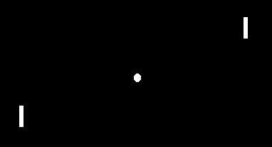
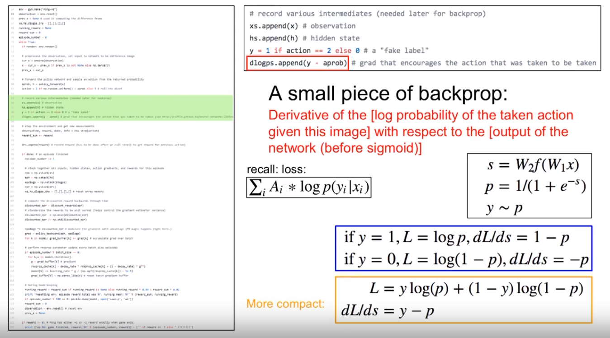

---

layout:            post  
title:             "Policy Gradient Note"  
tags:              ML
category:          Tech  
author:            Qiang  

---

  

- 最大化目标函数 E
- 计算其 theta 梯度
- 取样 所有经过的 state，所有使用的 action
- 当 p 为使用 sigmoid 的深度网络时，梯度类似 sigmoid + cross entropy
    - 
- The softmax is a generalization of the sigmoid function in the sense that a softmax for two dimensions (events) is exactly the sigmoid function. 
    - [What is the relationship between softmax and sigmoid since their derivatives are alike?](https://www.quora.com/What-is-the-relationship-between-softmax-and-sigmoid-since-their-derivatives-are-alike)
- backpropergation of cross-entropy
    - [Gradient descent on a Softmax cross-entropy cost function](https://madalinabuzau.github.io/2016/11/29/gradient-descent-on-a-softmax-cross-entropy-cost-function.html)

# 参考
- [CS294 Deep Reinforcement Learning - Policy Gradient](http://rll.berkeley.edu/deeprlcourse/f17docs/lecture_4_policy_gradient.pdf)
- [Deep Reinforcement Learning: Pong from Pixels](http://karpathy.github.io/2016/05/31/rl/)
- [Deep RL Bootcamp Lecture 4B Policy Gradients Revisited - Andrej Karpathy](https://www.youtube.com/watch?v=tqrcjHuNdmQ)
- [CS231n - L14 - Reinforcement Learning](http://cs231n.stanford.edu/slides/2017/cs231n_2017_lecture14.pdf)
- [Reinforcement Learning - David Silver - L7: Policy Gradient](http://www0.cs.ucl.ac.uk/staff/D.Silver/web/Teaching_files/pg.pdf)
