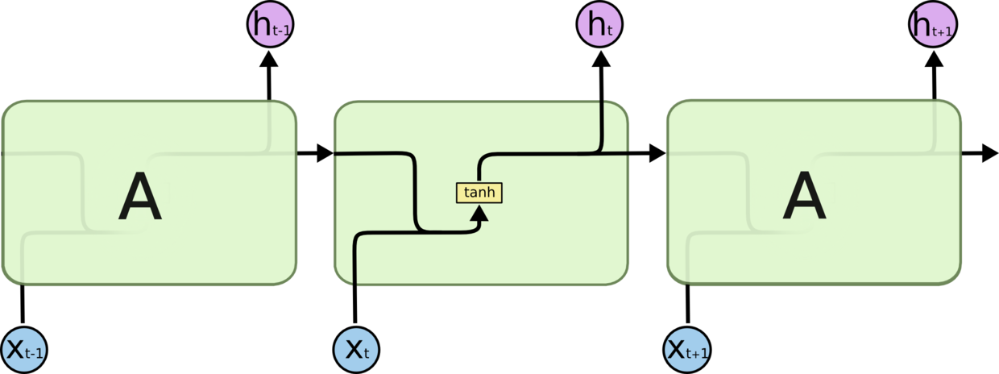
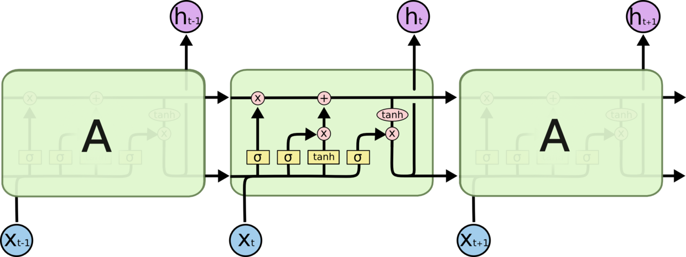
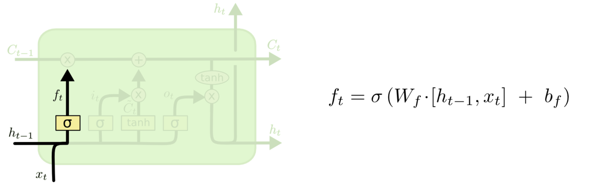
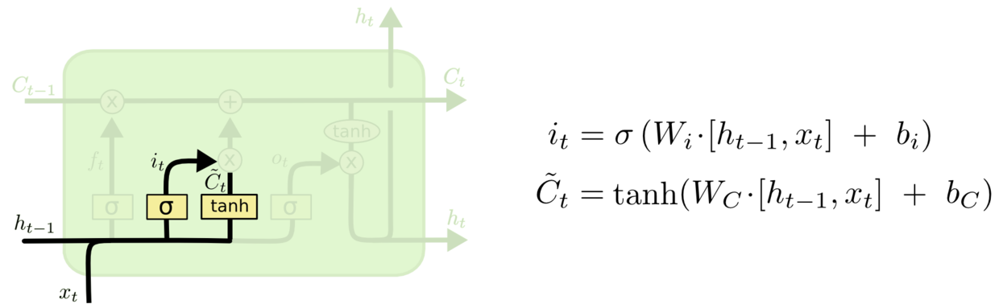
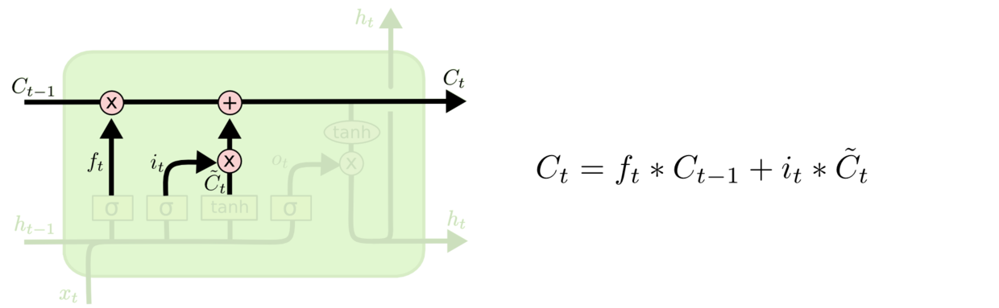
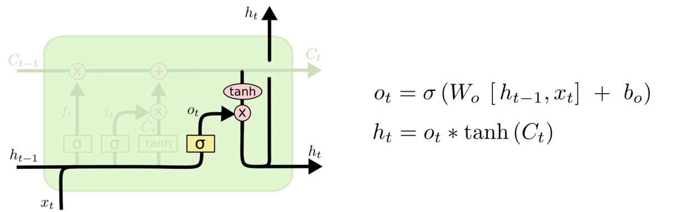
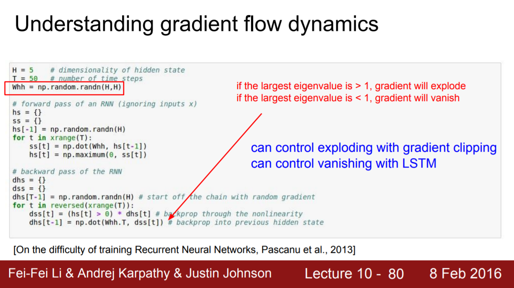

---

layout:            post  
title:             "我对 LSTM 的理解"  
date:              2017-10-19 18:25:00 +0300  
tags:              ML
category:          Tech  
author:            Qiang  

---

<!-- TOC -->

- [1. LSTM](#1-lstm)
    - [1.1. rnn 短期记忆](#11-rnn-短期记忆)
    - [1.2. lstm 保持长期记忆](#12-lstm-保持长期记忆)
    - [1.3. sigmoid 是关键](#13-sigmoid-是关键)
    - [1.4. 解决梯度爆炸](#14-解决梯度爆炸)
    - [1.5. 遗留问题 - 反向传播公式](#15-遗留问题---反向传播公式)
- [2. 参考](#2-参考)

<!-- /TOC -->

# 1. LSTM

## 1.1. rnn 短期记忆
- 
- 由于梯度消失、或爆炸使 rnn 对于长期记忆无法稳定保存，甚至无法训练。
- 参考：[RNN 循环神经网络（下）：长期依赖的挑战与长短期记忆](http://xiaosheng.me/2017/06/26/article74/)

## 1.2. lstm 保持长期记忆
- C，Cell，细胞状态，直接在整个链上运行，只有一些少量的线性交互。信息在上面流传保持不变会很容易。
    
- 忘记门，Cell中哪些需要保留，哪些无需再保留。原来有主语“小明”，现在新输入主语“小红”，那么“小明"被忘记掉。
    
- 输入门，什么信息准备新加入“小红”
    
- 更新细胞, 将“小红”记入到细胞中
    
- 输出门，什么信息被最终输出, 比如“爱漂亮”
    

## 1.3. sigmoid 是关键
- 所有 sigmoid 函数都起到的过滤的作用，过滤什么旧信息被保留，过滤什么新信息被加入，过滤最终显示什么信息。
    

## 1.4. 解决梯度爆炸
- rnn 反向传播时，短期记忆 h 被不断的累乘, lstm 是累加。lstm 解决了梯度消失问题，但是依然会有梯度爆炸问题。
- 因为是相加，所以有些为0，也不会引起全部为0
- 因为是相加，所以有些为无限大，会引起全部为无限大
- cs231n 如是说
    - 
- 参见
    - [cs231n 2016 winter lecture 10 ]( http://cs231n.stanford.edu/slides/2016/winter1516_lecture10.pdf)
    - [Why can Constant Error Carousels (CECs) prevent LSTM from the problems of vanishing/exploding gradients?]( https://www.reddit.com/r/MachineLearning/comments/34piyi/why_can_constant_error_carousels_cecs_prevent/)
    - [RNN（Recurrent Neural Network）的几个难点](http://www.cnblogs.com/congliu/p/4546634.html)

## 1.5. 遗留问题 - 反向传播公式
- 有待学习反向传播的推导

# 2. 参考
- [（译）理解 LSTM 网络](http://www.jianshu.com/p/9dc9f41f0b29)
- [记忆网络RNN与LSTM](http://blog.younggy.com/2017/05/09/%E8%AE%B0%E5%BF%86%E7%BD%91%E7%BB%9CRNN%E4%B8%8ELSTM/)
- [Understanding LSTM Networks](http://colah.github.io/posts/2015-08-Understanding-LSTMs/)
- [How does LSTM help prevent the vanishing (and exploding) gradient problem in a recurrent neural network?](https://www.quora.com/How-does-LSTM-help-prevent-the-vanishing-and-exploding-gradient-problem-in-a-recurrent-neural-network)
- [LSTM如何来避免梯度弥散和梯度爆炸？](https://www.zhihu.com/question/34878706)
- [零基础入门深度学习(6) - 长短时记忆网络(LSTM)](https://www.zybuluo.com/hanbingtao/note/581764)
- [探索LSTM：基本概念到内部结构](https://zhuanlan.zhihu.com/p/27345523)
- [The Unreasonable Effectiveness of Recurrent Neural Networks](http://karpathy.github.io/2015/05/21/rnn-effectiveness/)
- [递归神经网络 RNN 笔记](http://www.shuang0420.com/2017/07/21/%E9%80%92%E5%BD%92%E7%A5%9E%E7%BB%8F%E7%BD%91%E7%BB%9C%20RNN%20%E7%AC%94%E8%AE%B0/)

