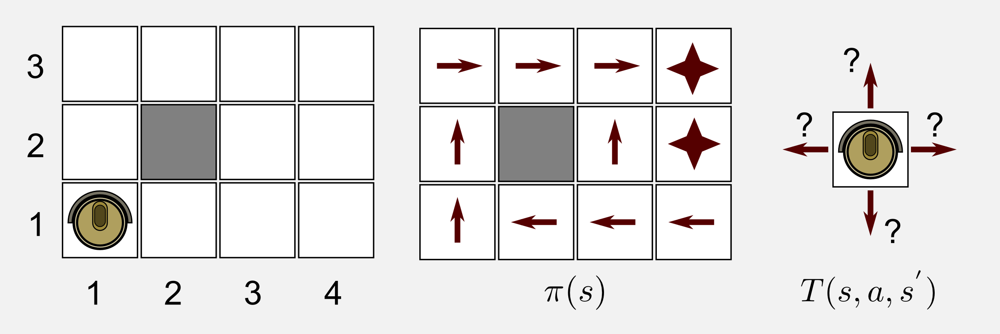
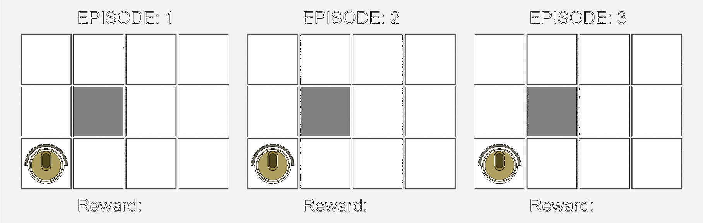
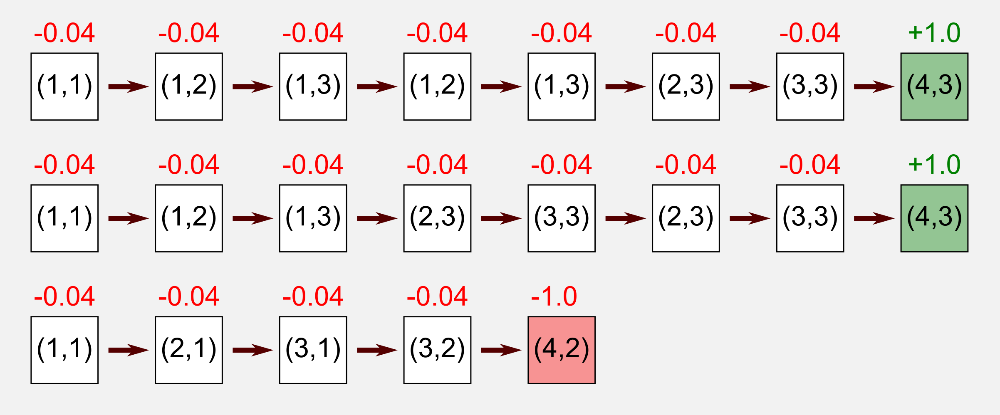
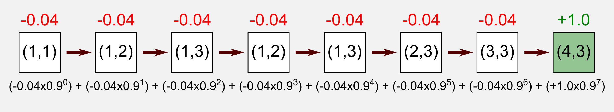
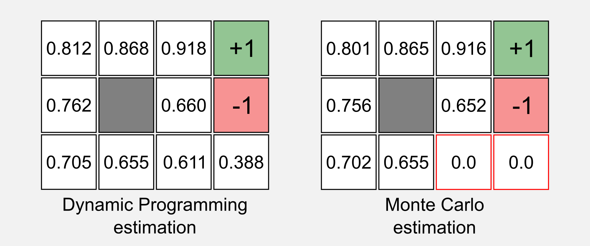
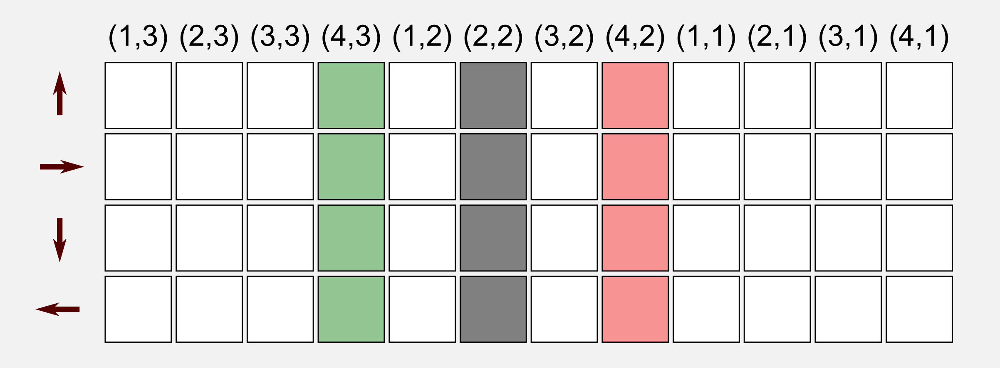
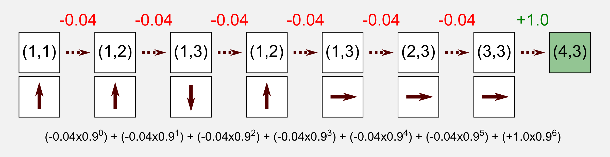
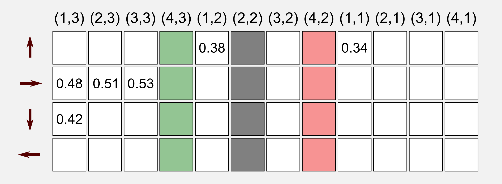
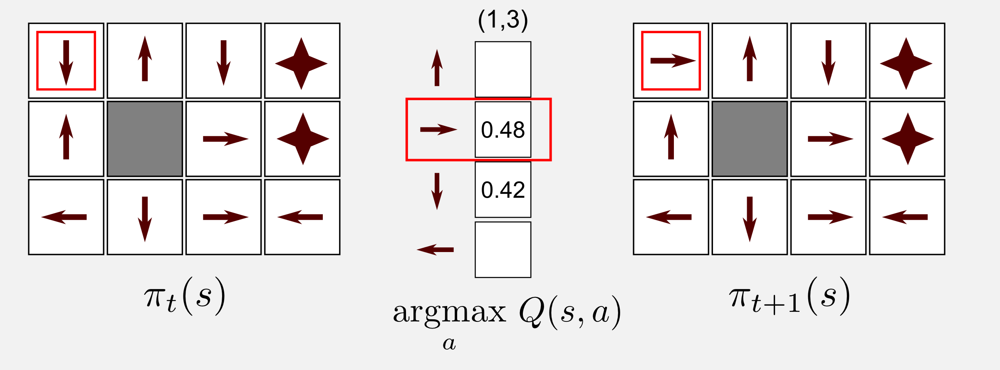

---

layout:            post  
title:             "Dissecting Reinforcement Learning-P2 Note"  
tags:              ML
category:          Tech  
author:            Qiang  

---

<!-- TOC -->

- [1. MC](#1-mc)
    - [1.1. Beyond dynamic programming](#11-beyond-dynamic-programming)
    - [1.2. The Monte Carlo method](#12-the-monte-carlo-method)
    - [1.3. Python implementation](#13-python-implementation)
    - [1.4. Monte Carlo control](#14-monte-carlo-control)
    - [1.5. Action Values and the Q-function](#15-action-values-and-the-q-function)
    - [1.6. Python implementation](#16-python-implementation)
    - [1.7. Conclusions](#17-conclusions)
- [2. 参考](#2-参考)

<!-- /TOC -->

# 1. MC

## 1.1. Beyond dynamic programming
- model-free 没有模型转换，即没有T
- passive 消极型，按已有策略计算utility
    - 
- active 积极型，无策略计算策略和utility

## 1.2. The Monte Carlo method
- 从交互中学习方法，集中于较少的状态
- 类似深度搜索，跑一遍更新utiltiy
- 
- 
- 

## 1.3. Python implementation

```
import numpy as np
from gridworld import GridWorld

# 定义 3x4 世界
env = GridWorld(3, 4)
state_matrix = np.zeros((3,4))
state_matrix[0, 3] = 1
state_matrix[1, 3] = 1
state_matrix[1, 1] = -1

# 定义每位置的回报
reward_matrix = np.full((3,4), -0.04)
reward_matrix[0, 3] = 1
reward_matrix[1, 3] = -1

# 定义行动转换矩阵
transition_matrix = np.array([[0.8, 0.1, 0.0, 0.1],
                              [0.1, 0.8, 0.1, 0.0],
                              [0.0, 0.1, 0.8, 0.1],
                              [0.1, 0.0, 0.1, 0.8]])

# 定义行动策略
# 0=UP, 1=RIGHT, 2=DOWN, 3=LEFT, NaN=Obstacle, -1=NoAction
policy_matrix = np.array([[1,      1,  1,  -1],
                          [0, np.NaN,  0,  -1],
                          [0,      3,  3,   3]])

# 加载以上设置
env.setStateMatrix(state_matrix)
env.setRewardMatrix(reward_matrix)
env.setTransitionMatrix(transition_matrix)

# 初始化
observation = env.reset()
env.render()
```

```
 -  -  -  * 
 -  #  -  * 
 ○  -  -  -
```

- 行动

```
for _ in range(1000):
    action = policy_matrix[observation[0], observation[1]]
    observation, reward, done = env.step(action)
    print("")
    print("ACTION: " + str(action))
    print("REWARD: " + str(reward))
    print("DONE: " + str(done))
    env.render()
    if done: break
```

```
 -  -  -  *      -  -  -  *      ○  -  -  *
 -  #  -  *      ○  #  -  *      -  #  -  *
 ○  -  -  -      -  -  -  -      -  -  -  -


 -  ○  -  *      -  -  ○  *      -  -  -  ○
 -  #  -  *      -  #  -  *      -  #  -  *
 -  -  -  -      -  -  -  -      -  -  -  -
```

- 获取回报

```
# 根据一个 episode 中的所有 visit 计算 return
def get_return(state_list, gamma):
    counter = 0
    return_value = 0
    for visit in state_list:
        reward = visit[1]
        return_value += reward * np.power(gamma, counter)
        counter += 1
    return return_value

#######
# state_list 即 episode_list
# state_list = [[observation, reward], 
#               [......],
#               [......]]

```

- 运行

```
utility_matrix = np.zeros((3,4))
running_mean_matrix = np.full((3,4), 1.0e-10) 
gamma = 0.999 
tot_epoch = 50000
print_epoch = 1000

for epoch in range(tot_epoch):
    episode_list = list()
    observation= env.reset(exploring_start=False)
    for _ in range(1000):
        # 获取 action
        action = policy_matrix[observation[0], observation[1]]
        #  走一步
        observation, reward, done = env.step(action)
        # 将 visit 记录到 espisode
        episode_list.append((observation, reward))
        if done: break

    # 开始计算 utility
    counter = 0
    checkup_matrix = np.zeros((3,4))
    for visit in episode_list:    # visit = [observation, reward]
        observation = visit[0]
        row = observation[0]
        col = observation[1]
        reward = visit[1]
        if(checkup_matrix[row, col] == 0):    # 检查是第一次进入该状态吗
            # 计算该 state 的return
            return_value = get_return(episode_list[counter:], gamma)
            # 记录该 state 总计算次数
            running_mean_matrix[row, col] += 1
            # 计算 utility
            utility_matrix[row, col] += return_value
            # 该 state 本 espisode 已计算过
            checkup_matrix[row, col] = 1
        # episode 次数加一
        counter += 1

    # 当前轮 utility
    if(epoch % print_epoch == 0):
        print("Utility matrix after " + str(epoch+1) + " iterations:") 
        print(utility_matrix / running_mean_matrix)

# 最终 utility
print("Utility matrix after " + str(tot_epoch) + " iterations:")
print(utility_matrix / running_mean_matrix)
```

```
Utility matrix after 1 iterations:
[[ 0.59184009  0.71385957  0.75461418  1.        ]
 [ 0.55124825  0.          0.87712296  0.        ]
 [ 0.510697    0.          0.          0.        ]]

Utility matrix after 1001 iterations:
[[ 0.81379324  0.87288388  0.92520101  1.        ]
 [ 0.76332603  0.          0.73812382 -1.        ]
 [ 0.70553067  0.65729802  0.          0.        ]]

Utility matrix after 2001 iterations:
[[ 0.81020502  0.87129531  0.92286107  1.        ]
 [ 0.75980199  0.          0.71287269 -1.        ]
 [ 0.70275487  0.65583747  0.          0.        ]]


...

Utility matrix after 50000 iterations:
[[ 0.80764909  0.8650596   0.91610018  1.        ]
 [ 0.7563441   0.          0.65231439 -1.        ]
 [ 0.69873614  0.6478315   0.          0.        ]]

```

- 与动态规划相比，有两个遗漏点，可以通过随机起始点来解决
    

```
observation = env.reset(exploring_start=True)
```

```
Utility matrix after 1 iterations:
[[ 0.87712296  0.918041    0.959       1.        ]
 [ 0.83624584  0.          0.          0.        ]
 [ 0.          0.          0.          0.        ]]

Utility matrix after 1001 iterations:
[[ 0.81345829  0.8568502   0.91298468  1.        ]
 [ 0.76971062  0.          0.64240071 -1.        ]
 [ 0.71048183  0.65156625  0.62423942  0.3622782 ]]

Utility matrix after 2001 iterations:
[[ 0.80248079  0.85321     0.90835335  1.        ]
 [ 0.75558086  0.          0.64510648 -1.        ]
 [ 0.69689178  0.64712344  0.6096939   0.34484468]]

...

Utility matrix after 50000 iterations:
[[ 0.8077211   0.86449595  0.91575904  1.        ]
 [ 0.75630573  0.          0.65417382 -1.        ]
 [ 0.6989143   0.64707444  0.60495949  0.36857044]]
```

## 1.4. Monte Carlo control
- 之前至少还知道策略是什么，现在要策略和Utility一起算
- 使 utility 依附与 state-action

## 1.5. Action Values and the Q-function
- 
- 
- 
- 

## 1.6. Python implementation

```
def get_return(state_list, gamma):
   """ Get the return for a list of action-state values.

   @return get the Return
   """ 
   counter = 0
   return_value = 0
   for visit in state_list:
      reward = visit[2]
      return_value += reward * np.power(gamma, counter)
      counter += 1
   return return_value

#######
# state_list 比原来多了一个 action 值
# state_list = [[observation, action, reward], 
#               [......],
#               [......]]
```

- 更新策略

```
def update_policy(episode_list, policy_matrix, state_action_matrix):
  for visit in episode_list:
    observation = visit[0]
    col = observation[1] + (observation[0]*4)
    if(policy_matrix[observation[0], observation[1]] != -1):
      # 选取 state-action 中最大值的 action 作为策略
      policy_matrix[observation[0], observation[1]] = \
          np.argmax(state_action_matrix[:,col])
  return policy_matrix
```

- 运行

```
# 初始化随机策略
policy_matrix = np.random.randint(low=0, high=4, 
                                  size=(3, 4)).astype(np.float32)
policy_matrix[1,1] = np.NaN
policy_matrix[0,3] = policy_matrix[1,3] = -1

# 运行
for epoch in range(tot_epoch):
episode_list = list()
observation = env.reset(exploring_starts=True)
is_starting = True
for _ in range(1000):
    action = policy_matrix[observation[0], observation[1]]
    if(is_starting): 
        # 随机化起始运动方向
        action = np.random.randint(0, 4)
        is_starting = False
    # 走一步    
    new_observation, reward, done = env.step(action)
    # 记录 visit 到 episode
    episode_list.append((observation, action, reward))
    observation = new_observation
    if done: break

# 计算 utility
counter = 0
checkup_matrix = np.zeros((4,12))
for visit in episode_list:
    observation = visit[0]
    action = visit[1]
    col = observation[1] + (observation[0]*4)
    row = action
    # 仅计算第一次该 state 执行该 action 的 return
    if(checkup_matrix[row, col] == 0):
        return_value = get_return(episode_list[counter:], gamma)
        running_mean_matrix[row, col] += 1
        state_action_matrix[row, col] += return_value
        checkup_matrix[row, col] = 1
    counter += 1

# 更新策略
policy_matrix = update_policy(episode_list, 
                              policy_matrix, 
                              state_action_matrix/running_mean_matrix)

if(epoch % print_epoch == 0):
    print("")
    print("State-Action matrix after " + str(epoch+1) + " iterations:") 
    print(state_action_matrix / running_mean_matrix)
    print("Policy matrix after " + str(epoch+1) + " iterations:") 
    print(policy_matrix)
    print_policy(policy_matrix)

print("Utility matrix after " + str(tot_epoch) + " iterations:")
print(state_action_matrix / running_mean_matrix)
```

```
Policy after 1 iterations:
 ^   >   v   * 
 <   #   v   * 
 v   >   <   >

...

Policy after 3001 iterations:
 >   >   >   * 
 >   #   ^   * 
 >   >   ^   < 

...

Policy after 78001 iterations:
 >   >   >   * 
 ^   #   ^   * 
 ^   <   ^   <

...

Policy after 405001 iterations:
 >   >   >   * 
 ^   #   ^   * 
 ^   <   <   <

...

Policy after 500000 iterations:
 >   >   >   * 
 ^   #   ^   * 
 ^   <   <   < 
```

## 1.7. Conclusions
- 交互中更新，无完整转化函数，很棒
- 但是，要深搜到底才会有 return
- 看看 Q-Learning 怎么解决这个问题

# 2. 参考
- [Dissecting Reinforcement Learning-Part.2](https://mpatacchiola.github.io/blog/2017/01/15/dissecting-reinforcement-learning-2.html)