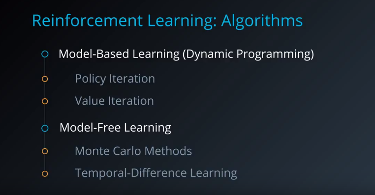
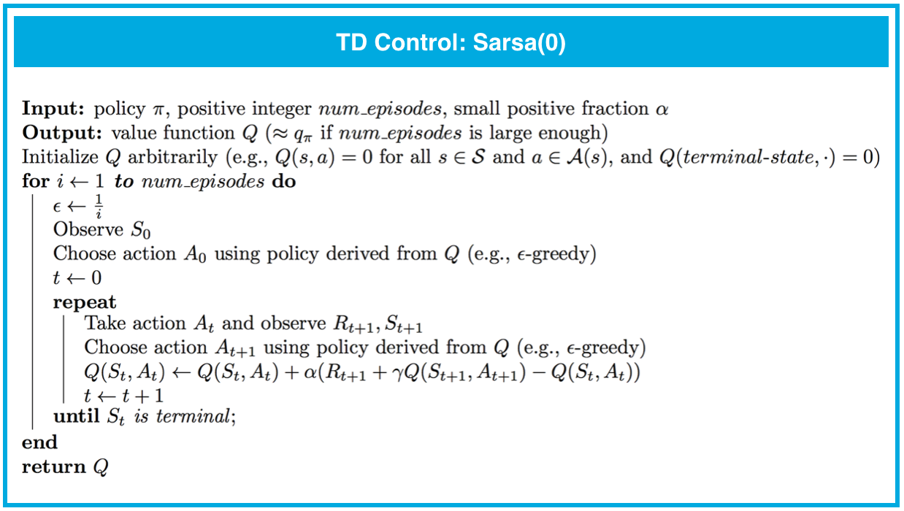

# 强化学习 Temporal Difference Methods

- [强化学习 Temporal Difference Methods](#temporal-difference-methods)
    - [支持方法](#)
        - [TD Prediction: TD(0)](#td-prediction--td0)
        - [TD Prediction: Action Values](#td-prediction--action-values)
    - [完整方法](#)
        - [TD Control: Sarsa(0)](#td-control--sarsa0)
        - [TD Control: Sarsamax](#td-control--sarsamax)
        - [TD Control: Expected Sarsa](#td-control--expected-sarsa)
        - [Analyzing Performance](#analyzing-performance)
        - [sarsa vs q-learning](#sarsa-vs-q-learning)
    - [reference](#reference)

## 支持方法

### TD Prediction: TD(0)
- policy -> state-value
- 一步更新，无需走完整个 episode 

### TD Prediction: Action Values
- policy -> action-value
- 基本同上

## 完整方法
- 都基于 policy iteration（仍是 value-based）

### TD Control: Sarsa(0)
- -> action-value
- 单步更新 action-value

### TD Control: Sarsamax
- -> action-value
- 即所谓的 Q-Learning，使用 max(action-value) 更新 Q-table
- off policy 类型，基于非当前运行的 action 更新 Q-table

### TD Control: Expected Sarsa
- -> action-value
- -> 使用 state 下的整体 action 期待，更新 Q-table

### Analyzing Performance
- On-policy TD control methods (like Expected Sarsa and Sarsa) have better online performance than off-policy TD control methods (like Q-learning).
- Expected Sarsa generally achieves better performance than Sarsa.

### sarsa vs q-learning

---

## reference
- [Temporal Difference Summary](./ref/Temporal_Difference_Summary.png)
- [Analyzing Performance](./ref/analyzing_performance.png)
- [Temporal Differnce Solution](./ref/Temporal_Difference_Solution.html)
