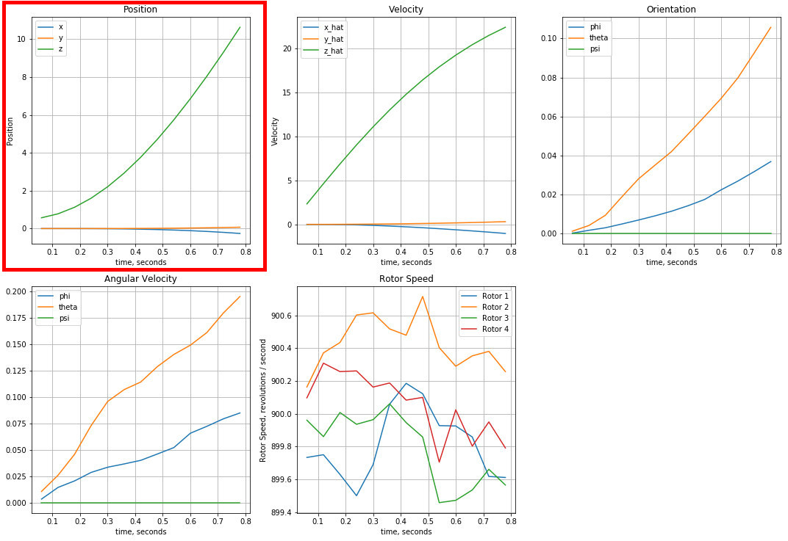
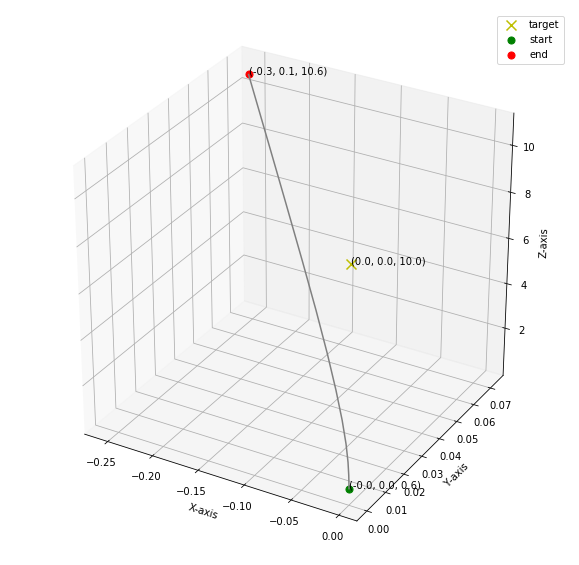
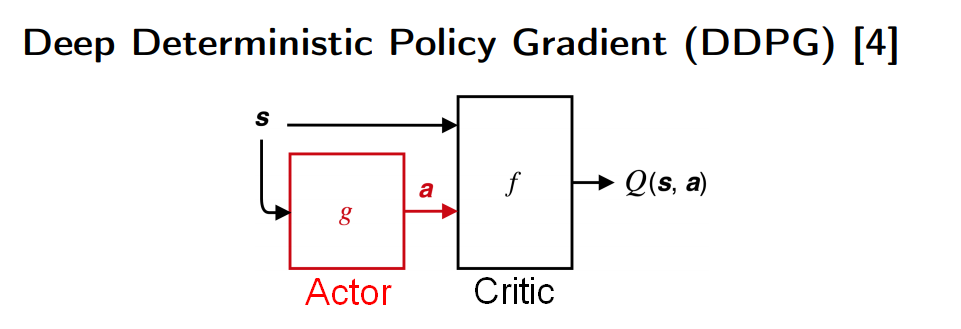
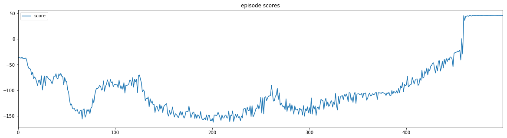
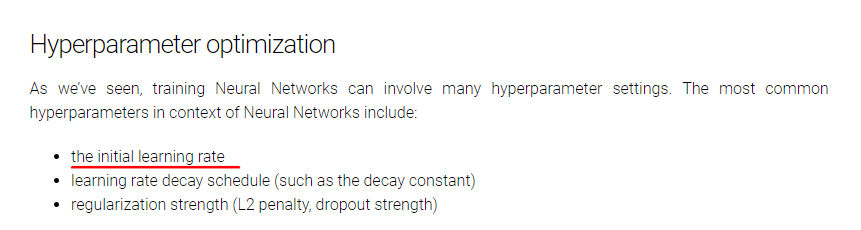
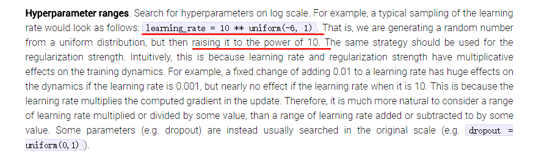

# Quadcopter笔记

- [Quadcopter笔记](#quadcopter)
    - [问题](#)
    - [痛点](#)
    - [已有](#)
    - [原理](#)
    - [需做](#)
    - [尝试](#)
    - [reference](#reference)

## 问题
[项目：指导四轴飞行器学会飞行](https://github.com/udacity/cn-deep-learning/blob/master/RL-Quadcopter-2/Quadcopter_Project.ipynb)  
设计一个能够使四轴飞行器飞行的智能体，然后使用你选择的强化学习算法训练它！

## 痛点

无可视化内容

[mplot3d-lines3d](https://matplotlib.org/gallery/mplot3d/lines3d.html#sphx-glr-gallery-mplot3d-lines3d-py)

## 已有

- DDPG
- Actor
- Critic
- Replay, Noise

## 原理

- 行动
    
- 更新
    

## 需做
- Set Target
    - 简化目标，比如只要求飞行器快速向上飞行
- Set Reward
    - 缩短时间
        - 如果需要训练飞行器升高，只要到达高度便结束
    - 多种奖励，比例均衡
        - 当目标为高度 10 ，即使高度大于 10 也给于大幅奖励
        - 高度，速度，平衡度，xy偏离度
- hypterparameter optimiaztion
    - 见下面尝试
- 有图有真相
    - 
    - 再结合开篇的所说的可视化路径图

## 尝试

[CS231n - Hyperparameter Optimization](http://cs231n.github.io/neural-networks-3/#hyper)

当神经网络在可正常学习的情况下，可先考虑调整其 learning rate , 并以指数级方式调整，如 0.1, 0.01, 0.001 等。同时 DDPG 包含了一个 Target Ctritic 和 Target Actor 会用到 tau 参数进行 softupdate，同样可按以上方式调整。

最后可尝试 Bayesian optimization, grid search, random search 进行自动优化超参: 
[Using Bayesian Optimization for Reinforcement Learning](https://blog.sigopt.com/posts/using-bayesian-optimization-for-reinforcement-learning)

## reference
- [RL Course by David Silver](https://www.youtube.com/playlist?list=PLqYmG7hTraZDM-OYHWgPebj2MfCFzFObQ)
- [CS294-112 Fall 2017](https://www.youtube.com/playlist?list=PLkFD6_40KJIznC9CDbVTjAF2oyt8_VAe3)
- [CS231n](http://cs231n.stanford.edu/)
- [Dissecting Reinforcement Learning-Part.4](https://mpatacchiola.github.io/blog/2017/02/11/dissecting-reinforcement-learning-4.html)
- [National Tsing Hua University - CS565600 Deep Learning](https://nthu-datalab.github.io/ml/slides/17_Deep-Reinforcement-Learning.pdf)
- [强化学习_Deep_Deterministic_Policy_Gradient](https://github.com/chinaq/bloq/blob/master/posts/2018-04-27-%E5%BC%BA%E5%8C%96%E5%AD%A6%E4%B9%A0_Deep_Deterministic_Policy_Gradient/deep_deterministic_policy_gradient.md)