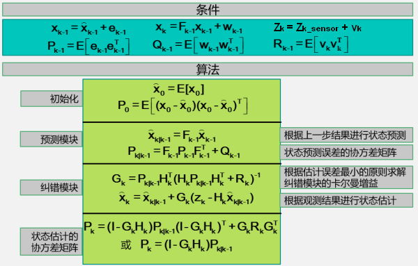
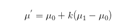
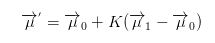
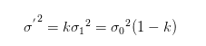
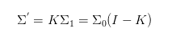
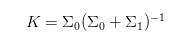

# Kalman Filter

- [Kalman Filter](#kalman-filter)
    - [concept](#concept)
        - [measurement update](#measurement-update)
        - [predict](#predict)
        - [equation](#equation)
    - [single and mutli varible](#single-and-mutli-varible)
    - [compare to bayes filter](#compare-to-bayes-filter)
    - [ref](#ref)

## concept

### measurement update
- 使用当前测到的位置 z 和 当前预估的位置 H*x' ，重新确认当前更可信的位置 x

### predict
- 使用当前更可信的位置 x，预估下一可能位置 x'_next

### equation

<!--  -->

- 状态
    - X：均值
    - P：协方差
- 包含的协方差
    - P：状态协方差
    - Q：状态转换协方差
    - R：测量协方差
    - S ~ P+R

## single and mutli varible
--- | single variable | multi varible
--- | --- | --- 
区别 | 方差 | 协方差
mean |  | 
diviation |  | 
k |  |  

## compare to bayes filter
- 如果贝叶斯滤波为高斯分布，即可由卡尔曼滤波解

## ref
- [我所理解的卡尔曼滤波](https://www.jianshu.com/p/d3b1c3d307e0) - main conception
- [sensor-fusion-ekf-reference.pdf](https://s3.amazonaws.com/video.udacity-data.com/topher/2017/February/58b461d5_sensor-fusion-ekf-reference/sensor-fusion-ekf-reference.pdf) - pdf about equations
- [细说Kalman滤波：The Kalman Filter](https://www.cnblogs.com/ycwang16/p/5999034.html) - compare to bayes filter