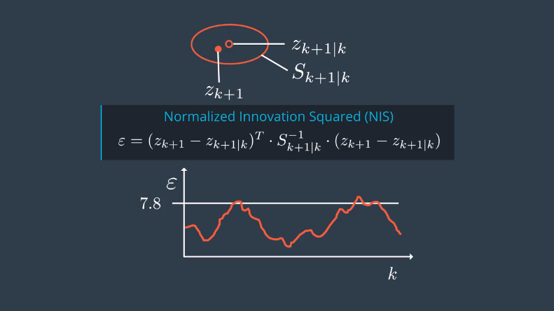

# Unscented Kalman Filter

- [Unscented Kalman Filter](#unscented-kalman-filter)
    - [CTRV](#ctrv)
    - [predict](#predict)
        - [Generate Sigma Points](#generate-sigma-points)
        - [Predict Sigma Points](#predict-sigma-points)
        - [Predict Mean and Covariance](#predict-mean-and-covariance)
    - [Update](#update)
        - [Predict Measurement](#predict-measurement)
        - [Update State](#update-state)
    - [UKF in Lidar and Radar](#ukf-in-lidar-and-radar)

## CTRV
- process  

- add noise  

## predict

### Generate Sigma Points

- gen sigmas  

- how to choose sigmas  

### Predict Sigma Points

- by x(k+1) = x(k) + x_dot(k) + noise(k)  

### Predict Mean and Covariance
  
- predict equations  

## Update

### Predict Measurement

- choose sigmas (augmented -> predcted -> measurement)  

- gen sigmas  

- predict means and covariance  

### Update State

- combine predictions and measurements  

- update equations  

- NIS  

- Result  

## UKF in Lidar and Radar
- init
    - init by lidar
        - set x by sensor x
        - set y by sensor y
    - or init by radar
        - set x by rho,theta
        - set y by rho,theta
        - set v by rho_dot? better or worse? 
- predict
    - Augmented Sigma Points
    - predict sigma points
    - predict mean and convariance 
- update lidar by kalman filter
    - update mean and convariance 
    - cal NIS
- or update radar by unscented kalman filter
    - predict radar sigma points
    - update mean and convariance 
    - cal NIS