# 无监督学习笔记

- [无监督学习笔记](#无监督学习笔记)
    - [聚合分类类型](#聚合分类类型)
        - [K-Mean](#k-mean)
        - [Hierarchical Clustering 层次聚类](#hierarchical-clustering-层次聚类)
        - [DBSCAN 基于密度的空间聚类](#dbscan-基于密度的空间聚类)
        - [GMM 高斯混合模型聚类](#gmm-高斯混合模型聚类)
    - [评分方式](#评分方式)
        - [外部指标](#外部指标)
        - [内部指标](#内部指标)
        - [相对指标](#相对指标)
    - [特征分析](#特征分析)
        - [PCA 主成分分析](#pca-主成分分析)
        - [Random Projection 随机投影](#random-projection-随机投影)
        - [ICA 独立成分分析](#ica-独立成分分析)
    - [分类流程](#分类流程)

## 聚合分类类型
### K-Mean
- skip

### Hierarchical Clustering 层次聚类
- 单连接聚类法
    - 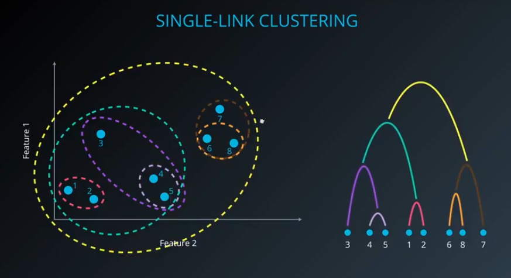
    - 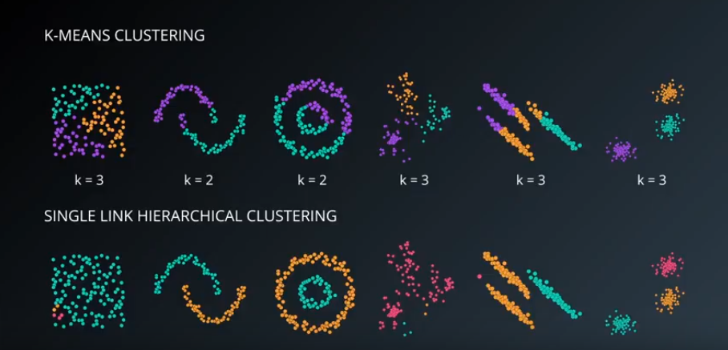
    - 
- 凝聚聚类法
    - COMPLETE LINK 全连接聚类法
    - AVERAGE LINK 组平均聚类法
    - WARDS 离差平方和法
    - 
    - 
    - 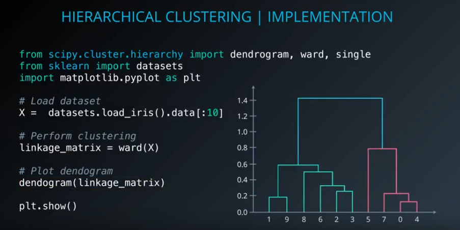
    - 

### DBSCAN 基于密度的空间聚类
- 
- 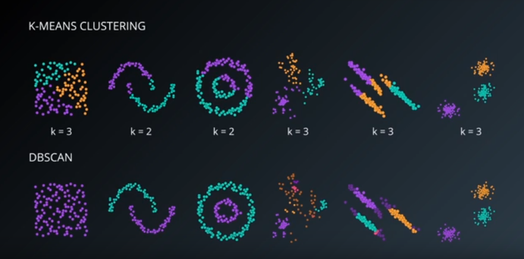
- 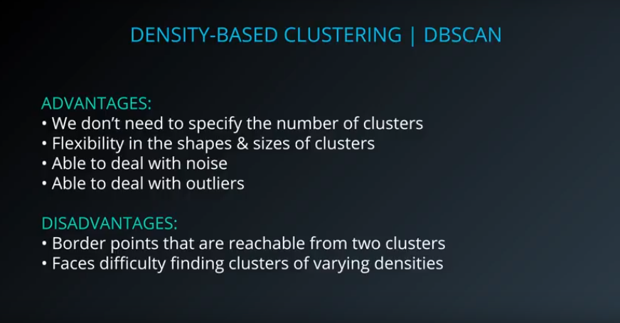
- 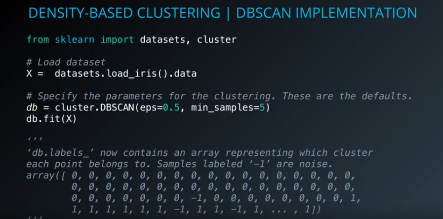
- 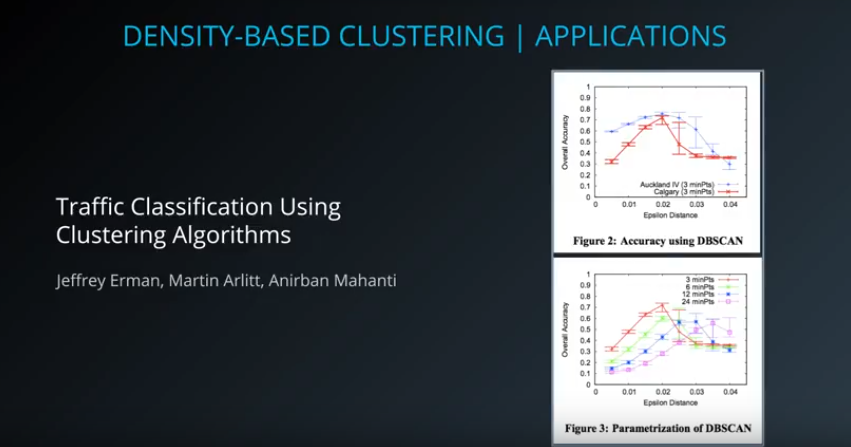

### GMM 高斯混合模型聚类
- 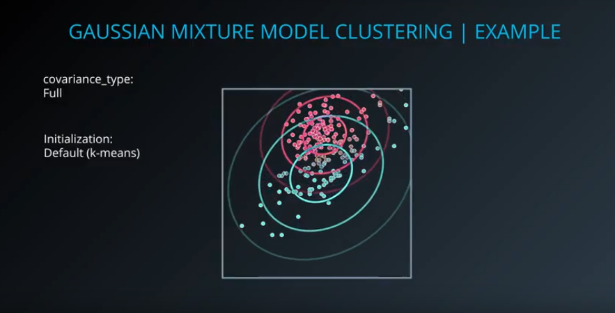
- 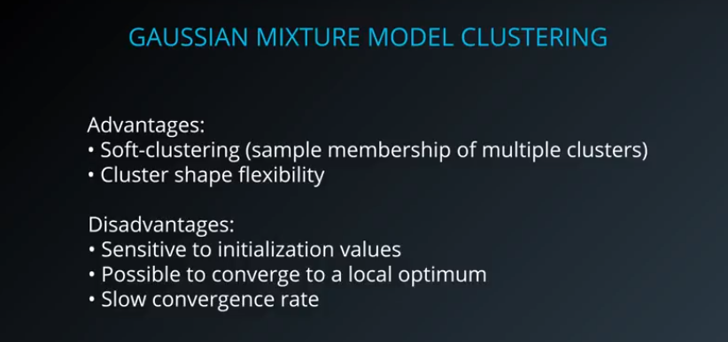
- 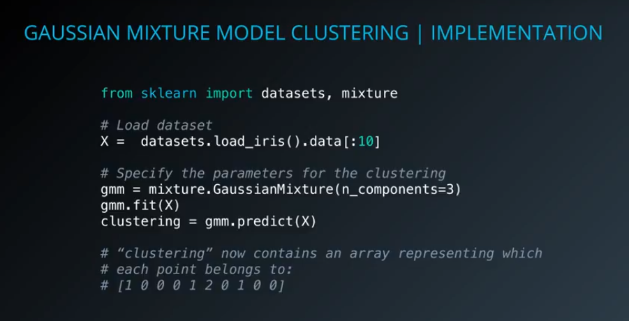
- 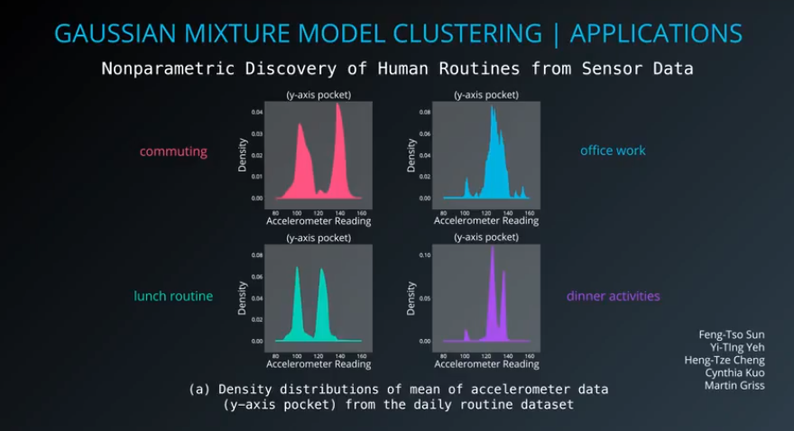
- 

## 评分方式
- 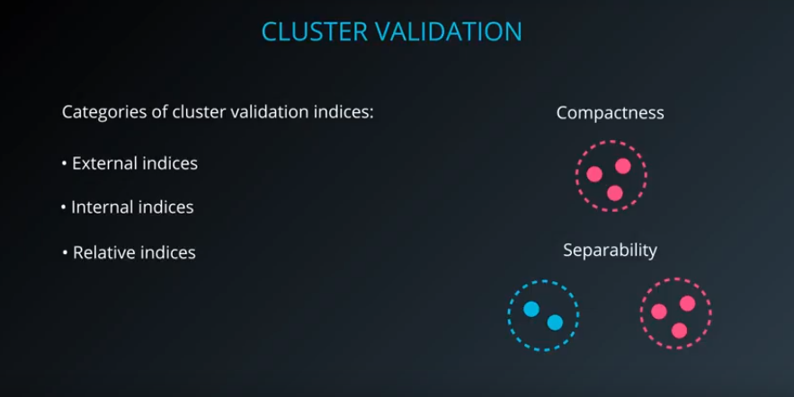

### 外部指标
- 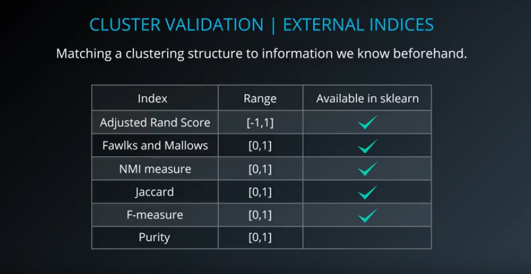
- 

### 内部指标
- 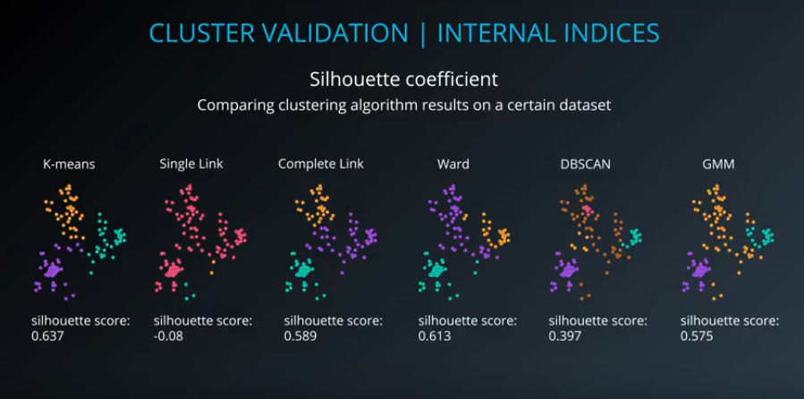
- 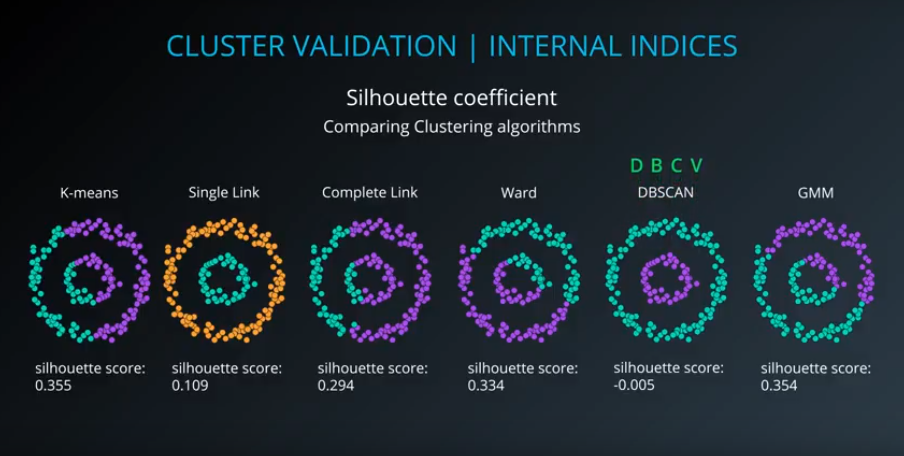

### 相对指标
- skip

## 特征分析
### PCA 主成分分析
- skip

### Random Projection 随机投影
- 
- 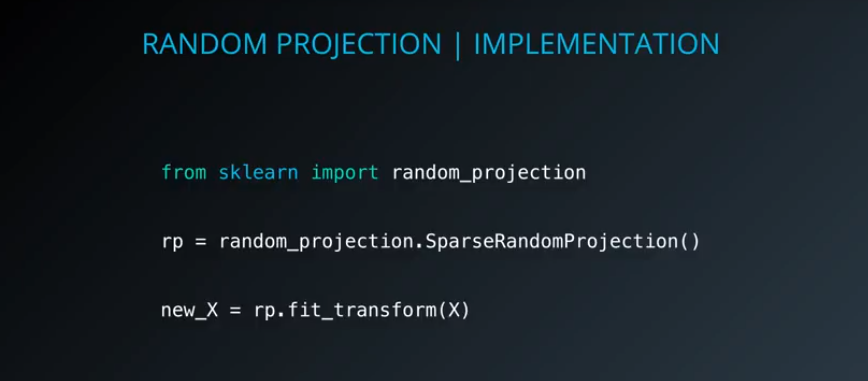

### ICA 独立成分分析
- 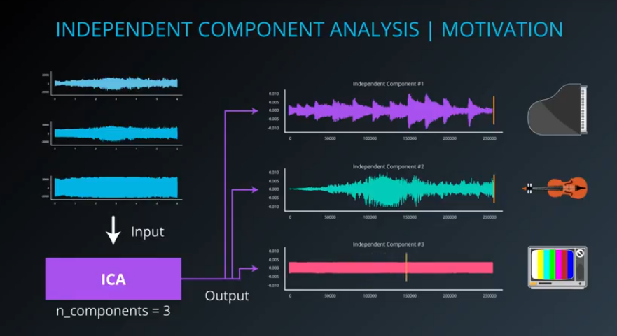
- 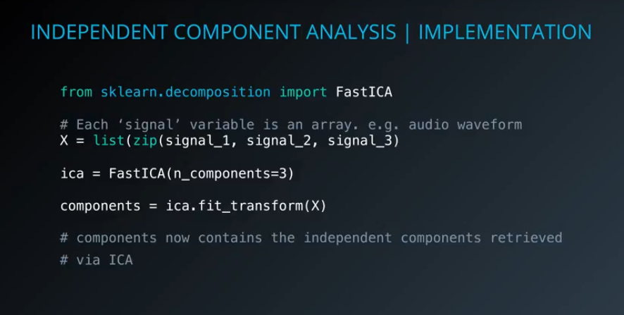
- 

## 分类流程
- 
