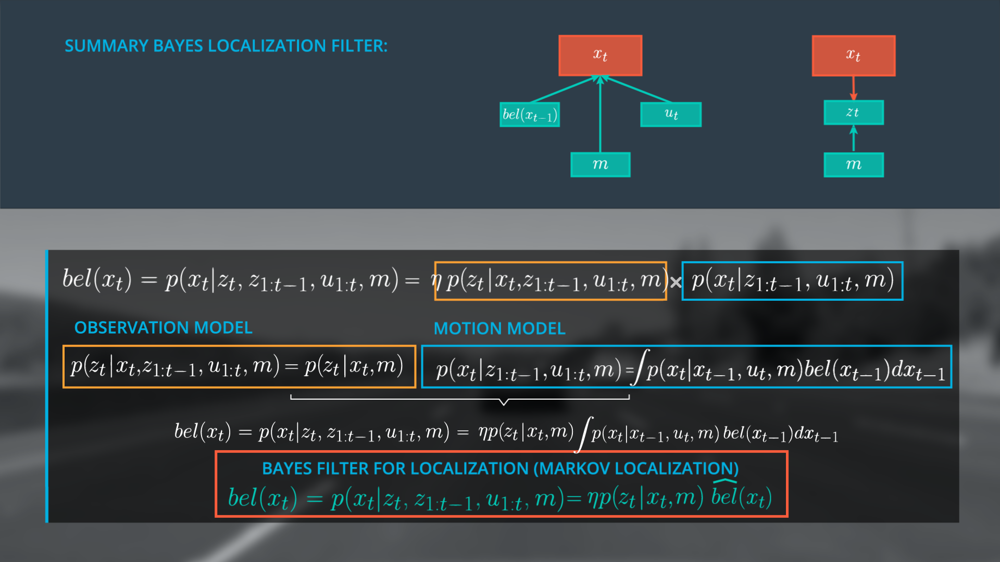

# Markov Localization


- [Markov Localization](#markov-localization)
    - [Localization Posterior](#localization-posterior)
        - [Tools](#tools)
        - [Bayes Rule](#bayes-rule)
        - [Variables](#variables)
        - [Apply Bayes Rule On Localization Posterior](#apply-bayes-rule-on-localization-posterior)
    - [To Simplify Motion Model](#to-simplify-motion-model)
        - [Total Probability for Motion Model](#total-probability-for-motion-model)
        - [Markov Assumption for Motion Model](#markov-assumption-for-motion-model)
        - [Recursive Structure of Motion Model](#recursive-structure-of-motion-model)
        - [Summary of Motion Model](#summary-of-motion-model)
    - [Observation Model](#observation-model)
    - [Summary of Bayes Localization Filter](#summary-of-bayes-localization-filter)
    - [pseudo](#pseudo)


## Localization Posterior
### Tools
- Bayes Rule 
- the Law of Total Probability
- the Markov Assumption

### Bayes Rule
- 
- 

### Variables
- 
- 

### Apply Bayes Rule On Localization Posterior
- 定义后验方程
- Defination of Localization Posterior
    - 
- Observation model & Motion model
    - 
- Normalizer
    - 


## To Simplify Motion Model
### Total Probability for Motion Model
- 使得当前状态与上一状态相关
- 

### Markov Assumption for Motion Model
- 减少当前状态、上一状态的依赖项
- 目标
    - 
- 原理
    - 
- 结果
    - 

### Recursive Structure of Motion Model
- 使得当前状态几乎只与上一状态相关
- Simply bel(x(t-1))
    - 
- Recursive Structure
    - 
- Discrete Case
    - 

### Summary of Motion Model
-  


## Observation Model
- observation_model
    - 
- markov_assumption_for_observation_model
    - 
- define_single_range_measurement
    - 
- cal_observation_model
    - 


## Summary of Bayes Localization Filter
- bayes localization filter
    - 
- combine_subgraphs
    - 


## pseudo 
- extract sensor observations       // 获取观测值
    - for each pseudo-position:         // 计算每个位置
        - get the motion model probability          // 计算 motion model probability
        - determine pseudo ranges                   // 预测观察到的景象
        - get the observation model probability     // 真正观察到的景象概率
        - use the motion and observation model probabilities to calculate the posterior probability         // 计算后验位置概率
    - normalize posteriors (see helpers.h for a normalization function)     // 正则化后验概率
    - update priors (priors --> posteriors)


``` cpp

    // initialize priors    // 初使化先验位置概率
    vector<float> priors = initialize_priors(
                                map_size, 
                                landmark_positions,
                                position_stdev);
    // initialize posteriors    // 初使化后验位置概率
    vector<float> posteriors(map_size, 0.0);

    //cycle through time steps  // 计算每个时间步
    for (unsigned int t = 0; t < time_steps; t++){
        //step through each pseudo position x (i)       // 计算每个位置
        for (unsigned int i = 0; i < map_size; ++i) {
            float pseudo_position = float(i);
            //get the motion model probability for each x position  // 计算 motion probability
            float motion_prob = motion_model(
                                    pseudo_position, 
                                    movement_per_timestep,
                                    priors, 
                                    map_size, 
                                    control_stdev);
            //get pseudo ranges         // 预测观察到的景象
            vector<float> pseudo_ranges = pseudo_range_estimator(
                                            landmark_positions, 
                                            pseudo_position);
            //get observation probability       // 真正观察到的景象概率
            float observation_prob = observation_model(
                                        landmark_positions, 
                                        observations, 
                                        pseudo_ranges,
                                        distance_max, 
                                        observation_stdev);
            //calculate the ith posterior       // 计算后验位置概率
            posteriors[i] = motion_prob * observation_prob;
        } 
        //normalize             // 正则化后验概率
        posteriors = Helpers::normalize_vector(posteriors);

        // update priors (priors --> posteriors)
        priors = posteriors;

        //print posteriors vectors to stdout
        for (unsigned int p = 0; p < posteriors.size(); p++) {
                std::cout << posteriors[p] << endl;  
        } 
    }

```