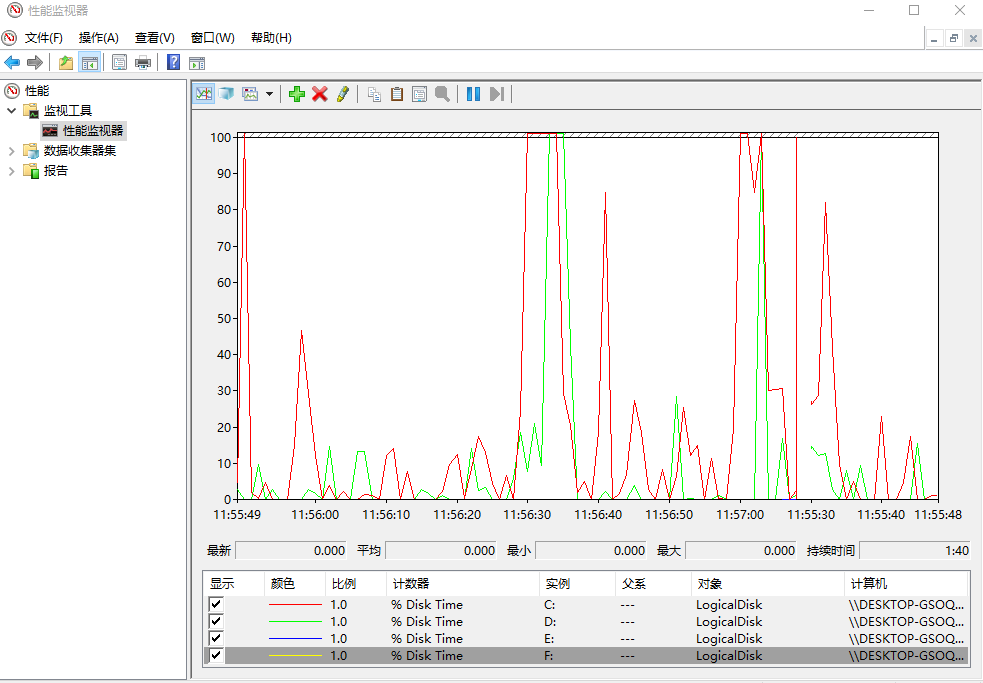
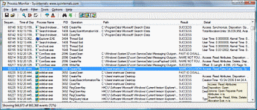

Perfmon in Windows

## perfmon.exe 

- contained in os

## Performance Monitor 

- [download](https://docs.microsoft.com/en-us/sysinternals/downloads/procmon)

## ref
- [WINDOWS性能监控器的监视以及邮件预警配置](https://www.skyarch.cn/blog/windows/monitor-perfmon-tool/) - 创建“警告任务”
- [Performance Monitor1：开始性能监控](https://www.cnblogs.com/ljhdo/p/5061561.html)
- [7 Command Line Utilities to Easily Send Email Using SMTP](https://www.raymond.cc/blog/sending-email-using-command-line-useful-for-downtime-alert-notification/) - 使用“mailsend”发送邮件
- [Collecting Process Monitor Log](https://kb.acronis.com/procmon)

## remaining problems
- how to save logs and check them after alerting e-mail
    - let's try "Performance Monitor"

