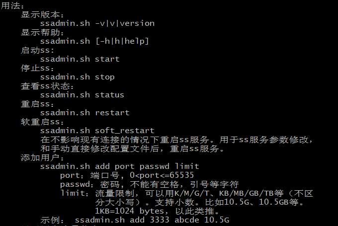

# ss-bash on server

- install 
    - apt install python python-pip
    - git clone [ss-bash](https://github.com/hellofwy/ss-bash)
- run
    - ss-bash create users
    - ./ssadmin start 
- cron
    - clean data monthly
        - [请问怎么设置每月自动重置流量信息？](https://github.com/hellofwy/ss-bash/issues/42)
        - [crontab 定时任务]( https://linuxtools-rst.readthedocs.io/zh_CN/latest/tool/crontab.html)
- problem on ubuntu 18
    - [Kali2.0 update到最新版本后安装shadowsocks服务报错问题](https://blog.csdn.net/blackfrog_unique/article/details/60320737)

## 补充
- 在 `crontab` 中设置自动重置流量的一些问题
  - 由于 `crontab` 运行时不与 `shell`发生关系，不会加载 `.bashrc` 之类的文件，导致无法获取 `PATH` ，便无法启动 `ssserver`
  - 尝试直接引入 `. ~/.bashrc ` 失败，因为文件中使用了 `sh` 中的命令 `shopt`
  - 所以直接加载环境变量 `export PATH=/usr/local/bin:$PATH` ，可行