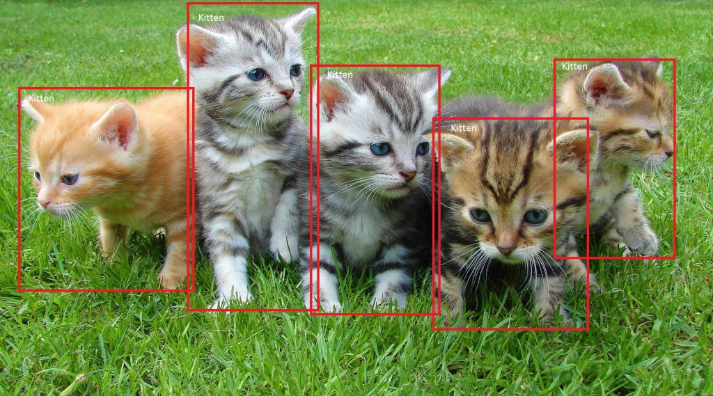

# YOLO like Object Detection

## key
- It is different between anchor boxes and detect boxes.

## ref
- [deeplearning.ai - Detection algorithms](https://www.coursera.org/learn/convolutional-neural-networks/lecture/nEeJM/object-localization)
- [fast.ai - object detection](https://course.fast.ai/lessons/lesson9.html)
- [Hiromi Suenaga's Note of fast.ai](https://medium.com/@hiromi_suenaga/deep-learning-2-part-2-lesson-9-5f0cf9e4bb5b)
- [tf - object detection api](https://github.com/tensorflow/models/blob/master/research/object_detection/README.md)
- [opencv - TensorFlow Object Detection API](https://github.com/opencv/opencv/wiki/TensorFlow-Object-Detection-API)