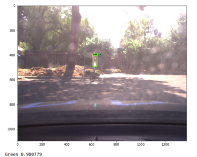

# Traffice Light Detection

## datasets
- [Udacity knowledge - Where can I find proper image to train my traffic light classifier?](https://knowledge.udacity.com/questions/12390)
- [LISA Traffic Light Dataset](https://www.kaggle.com/mbornoe/lisa-traffic-light-dataset/home)
- [VIVA traffic light](http://cvrr.ucsd.edu/vivachallenge/index.php/traffic-light/traffic-light-detection/)

## ref
- [Self Driving Vehicles: Traffic Light Detection and Classification with TensorFlow Object Detection API](https://becominghuman.ai/traffic-light-detection-tensorflow-api-c75fdbadac62)
- [diyjac/SDC-System-Integration](https://libraries.io/github/diyjac/SDC-System-Integration)