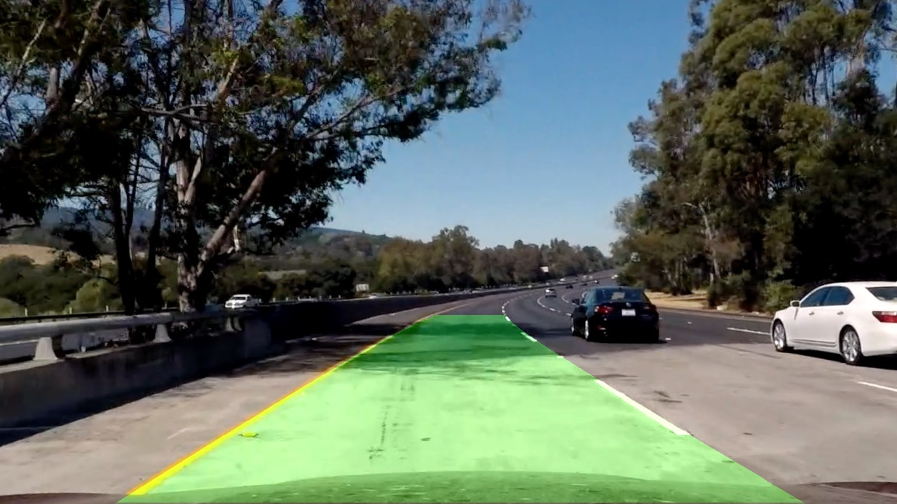

## All Projects

### 计算机视觉
你将学习整合摄像头、软件和机器学习的相关知识，进行多种路况下的车道检测和车辆跟踪。同时，你会着手校正摄像头，处理图像，应用支持向量机和决策树来从视频中提取信息。
- [检测车道线](https://github.com/udacity/CarND-LaneLines-P1)
  - 
- [高级车道检测](https://github.com/udacity/CarND-Advanced-Lane-Lines)
  - 

### 深度学习
深度学习已经成为机器学习和自动化交通发展中至关重要的组成部分！来自 NVIDIA 的专家将会教你利用现实世界和优达学城模拟器中的数据，来进行深度神经网络架构搭建和训练。
- [交通标志识别与分类](https://github.com/udacity/CarND-Traffic-Sign-Classifier-Project)
  - 
- [行为克隆](https://github.com/udacity/CarND-Behavioral-Cloning-P3)
  - 

### 传感器融合
长时间连续追踪对象是了解车辆周围环境的一项重大挑战。来自梅赛德斯-奔驰的传感器融合工程师将向你演示如何编程卡尔曼滤波器这项基本的数学工具。这个滤波器可以准确感知并确定道路上其他车辆的位置。
- EKF - 扩展卡尔曼滤波器
- UKF - 无损卡尔曼滤波器
- 

### 定位
定位是用于确定我们的车辆在世界上的位置。GPS 定位无疑是伟大的，但它只能在方圆几米内保持准确。我们需要精确到厘米级的精度！为了实现这一点，来自梅赛德斯-奔驰的工程师将教你使用马尔科夫定位的原理来编制粒子滤波器，该滤波器能够使用数据和地图来确定车辆的精确位置。
- [被绑架的汽车 - particle filter](https://github.com/udacity/CarND-Kidnapped-Vehicle-Project)
  - 

### 路径规划
梅赛德斯-奔驰的智能汽车团队将带你进行路径规划的三个阶段。首先，你将运用模型驱动和数据驱动的方法来预测道路上其他车辆的行为。然后，你将构建一个有限状态机，以决定你自己的车辆应该执行几次操作。最后，你将设计出一条安全舒适的轨迹来执行该操作。
- [高速公路行驶](https://github.com/udacity/CarND-Path-Planning-Project)
  - 

### 车辆控制
一辆无人驾驶车归根结底是一辆汽车，我们需要发出转向，油门和刹车等指令来运行汽车。Uber ATG 将指导你构建比例积分微分（PID）控制器和模型预测控制器。在学习这些控制算法中，你将熟悉起动车辆的基础和先进技术。
- [PID 控制器](https://github.com/udacity/CarND-PID-Control-Project)
  - 
- [MPC - Model Predictive Contorl](https://github.com/udacity/CarND-MPC-Project)
  - 

### 系统集成
这是整个无人驾驶工程师纳米学位的巅峰压轴之作！我们将介绍 Carla - Udacity 无人驾驶车以及控制她的机器人操作系统。你将与其他同学一起进行团队合作，结合你在整个项目课程中学到的内容，驱动 Carla —— 一辆真正的无人驾驶车，并在 Udacity 测试道路上进行无人驾驶测试！
- 为真正的无人驾驶车编程
- 
- 
- 
