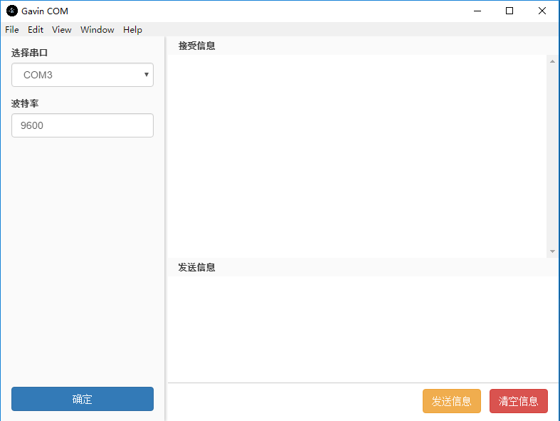

# Mac 串口开发



- [Mac 串口开发](#mac-串口开发)
  - [Socat](#socat)
    - [create a pair](#create-a-pair)
    - [with specified link name](#with-specified-link-name)
  - [node-serialport](#node-serialport)

## Socat
### create a pair
- [MacOSXVirtualSerialPort - Github](https://github.com/clokey/PublicCode/tree/master/MacOSXVirtualSerialPort)
- [Creating a null modem virtual serial port pair connection with socat](https://rabinnankhwa.wordpress.com/2013/12/25/creating-a-null-modem-virtual-serial-port-pair-connection-with-socat/)

### with specified link name 
> Then what I would suggest is to create a dev folder in your home directory and point the links there.
> ```
> socat pty,raw,echo=0,link=/home/user/dev/ttyS20 pty,raw,echo=0,link=/home/user/dev/ttyS21
> ```
- [socat two serial port together - stack overflow](https://stackoverflow.com/questions/33811013/socat-two-serial-port-together)

## node-serialport
- download this:
  - [基于electron的桌面串口工具](https://github.com/PowerDos/electron-serialport)
- update devDependencies & dependencies from this:
  - [electron-serialport](https://github.com/nodebots/electron-serialport)
- update devDependencies & dependencies to newest version
- `npm install && npm start`