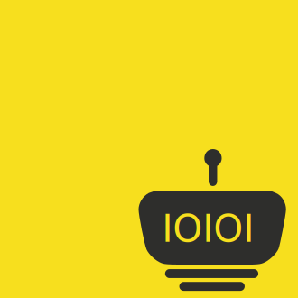

# Serial Port App Dev





- [Serial Port App Dev](#serial-port-app-dev)
  - [Frame Choice](#frame-choice)
    - [dotnet core](#dotnet-core)
    - [javascript](#javascript)
    - [final choice](#final-choice)
  - [Set Virtual Ports on Mac](#set-virtual-ports-on-mac)
  - [Test Frame](#test-frame)
    - [problem on serial port test](#problem-on-serial-port-test)
  - [Conclustion](#conclustion)

## Frame Choice
### dotnet core 
| Frame | Description | Platforms | Start |
|--- | --- | --- | --- |
| [chomely](https://github.com/mattkol/Chromely)| using HTML5, JavaScript, CSS | Win, Linux | 1k+ |
| [Avaloina](https://github.com/AvaloniaUI/Avalonia) | a WPF-inspired cross-platform XAML-based UI framework | Win, macOS, Linux | 5k+ |
| [Electron.NET](https://github.com/ElectronNET/Electron.NET) | Build cross platform desktop apps with ASP.NET Core. | Win, macOS, Linux | 2k+ |

### javascript
| Frame | Description | Platforms | Start |
|--- | --- | --- | --- |
[electron](https://github.com/electron/electron) | Build cross-platform desktop apps with JavaScript, HTML, and CSS | Win, macOS, Linux | 68k+ |

### final choice
- electron
- the reason is `System.IO.Ports.SerialPort` is currently only supported on Windows.


## Set Virtual Ports on Mac
- [serial port on mac](../2019-01-04_Serial_Port_on_Mac/serial_port_on_mac.md)

## Test Frame
- [jest](https://github.com/facebook/jest), star 22k+
### problem on serial port test
- add [electron rebuild on jest](https://github.com/node-hid/node-hid/issues/240)
``` json
  "scripts": {
    "start": "electron .",
    "test": "ELECTRON_RUN_AS_NODE=true ./node_modules/.bin/electron ./node_modules/.bin/jest",
    "build": "tsc",
    "postinstall": "electron-rebuild --force"
  },
```
- kill socat process in test
  - `kill()` method will not kill the child process’s own child processes
  - [How to kill child processes that spawn their own child processes in Node.js](https://azimi.me/2014/12/31/kill-child_process-node-js.html)
``` js
var spawn = require('child_process').spawn;
var child = spawn('my-command', {detached: true});
process.kill(-child.pid);
```
- finally choose the [Mock Bindings](https://serialport.io/docs/en/api-binding-mock)
  - [examples](https://github.com/node-serialport/node-serialport/blob/7cee2020f12c65818ed15e8c1db70033ce86f9ae/packages/serialport/examples/mocking.js)
``` js
port.write(message, () => {
  console.log('Write:\t\t Complete!')
  console.log('Last write:\t', port.binding.lastWrite.toString('utf8'))
})
```
- test ports on [asynchronous](https://jestjs.io/docs/en/asynchronous)
  - called `done`
``` js
test('the data is peanut butter', done => {
  function callback(data) {
    expect(data).toBe('peanut butter');
    done();
  }
  fetchData(callback);
});
```

## Conclustion
- [electron](https://github.com/electron/electron)
- [node-serial](https://github.com/nodebots/electron-serialport)
  - [mock binding](https://serialport.io/docs/en/api-binding-mock)
  - [examples](https://github.com/node-serialport/node-serialport/blob/7cee2020f12c65818ed15e8c1db70033ce86f9ae/packages/serialport/examples/mocking.js)
- [jest](https://github.com/facebook/jest)