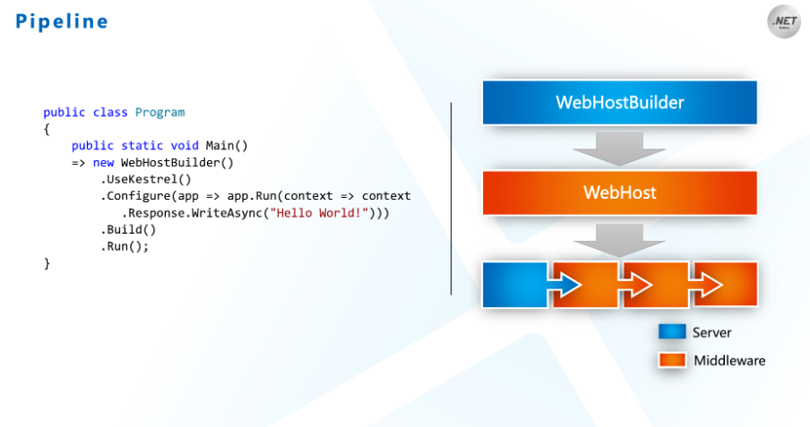

# [ASP.NET Core框架揭密](https://mp.weixin.qq.com/s/ZYpuW2Rdx7KK1EzD9GQ-SQ)

- 200行代码7个对象
  - 第一个对象：HttpContext
  - 第二个对象：RequetDelegate
  - 第三个对象：Middleware
  - 第四个对象：ApplicationBuilder
  - 第五个对象：Server
  - 第六个对象：WebHost
  - 第七个对象：WebHostBuilder
  