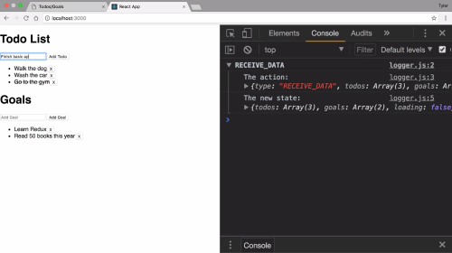
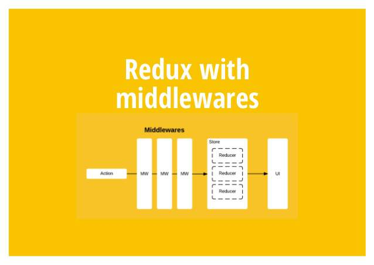

# Redux - Tyler McGinnis

## Projects
- the first project can be found here - [Goals-Todos App](https://github.com/tylermcginnis/redux-course-project)  

- the second can be found here - [Redux Polls](https://github.com/tylermcginnis/redux-polls)  

## ToC
- The Store
  - Welcome
  - What is the Store? (8:43)
  - Quiz: The Store
  - Create Store: Getting the State (2:23)
  - Create Store: Listening to Changes (4:38)
  - Quiz: Listening to Changes
  - Create Store: Updating the State (5:55)
  - Actions
  - Quiz: Actions
  - Pure Functions
  - Quiz: Pure Functions
  - The Reducer Function (7:05)
  - Quiz: The Reducer Function
  - Create Store: Dispatching Changes (14:01)
  - Quiz: Dispatch and Modifying State
  - Handling more Actions (10:09)
  - Combining Reducers (9:04)
  - Reducer Composition
  - Quiz: Reducer Composition and Combine Reducers
  - Leveraging Constants (3:02)
  - Action Creators (5:19)
  - Review: The Store, Actions, and Reducers (4:06)
- Adding UI to our Library
  - App Scaffolding (2:07)
  - Basic UI (2:30)
  - Dispatching New Items (5:55)
  - Subscribing for UI Updates (9:31)
  - Dispatching to Remove Items (5:17)
  - This is Redux (6:39)
  - Review: Adding UI to our Library (6:09)
- Redux MIddleware
  - Customizing Dispatch (4:18)
  - Utilizing Redux Middleware (7:53)
  - Redux Middleware
  - Quiz: Middleware
  - Logger Middleware (4:39)
- Redux and React
  - Adding in React (5:23)
  - Dispatching Todos with React (5:32)
  - Dispatching Goals with React (2:38)
  - Lists with React and Redux (10:19)
  - Toggling UI with Redux (5:04)
- Asynchronous Redux
  - Handling Initial Data (7:45)
  - Loading States with Redux (2:39)
  - Optimistically Deleting Items (6:52)
  - Optimistically Toggling Todos (1:50)
  - Persisting Items (4:22)
  - Custom Thunk (10:55)
  - More on Thunks
  - Quiz: Thunks
  - Thunkify Goals (6:12)
  - Thunkify Todos (3:52)
  - Thunkify Initial Data (1:42)
  - Redux Thunk Middleware (1:38)
  - More Asynchronous Options
- Leveraging the react-redux Library
  - Downsides of React and Redux (3:29)
  - React's Context API (5:15)
  - Utilizing Context (11:32)
  - Quiz: Provider
  - Connecting Components to the Redux Store (12:11)
  - Implementing connect (11:52)
  - Using react-redux (3:25)
  - Quiz: Connecting Components
  - Redux Folder Structure: Create React App (3:49)
  - Redux Folder Structure: Actions (5:39)
  - Redux Folder Structure: Reducers (3:30)
  - Redux Folder Structure: Middleware (2:03)
  - Redux Folder Structure: Components (4:26)
  - Redux Folder Structure: The Store (3:44)
  - Other Folder Structure Patterns
- Real World Redux
  - Introduction to Polls (3:45)
  - Starter Code (6:06)
  - First Actions (8:34)
  - First Reducers (9:56)
  - Adding Middleware (3:45)
  - Getting App Data (2:54)
  - Building the Dashboard (14:35)
  - Loading Reducer (5:35)
  - Leaderboard UI (7:36)
  - Add Poll UI (10:04)
  - Add Poll to Store (13:20)
  - Poll state (10:57)
  - Poll UI (12:49)
  - Add Answer to Store (11:34)
  - React Router (7:12)
  - Bonus: Redux Devtools (4:04)
  - Bonus: State Shape (5:52)
  - Next Steps
- 

## Note
### mini redux

### about states
- FOR STATES STORE (state)
  - Redux.combineReducers:  which stores all states in one store
- FOR STATES PASS (ui)
  - React.createContext: which pass states by .Provider & .Consumer 
  - ReactRedux.Connect: which connect the state to every component

### Redux Folder
- Actions:
  - commands
  - dispatch(commands)
- Reducers:
  - (commands) -> (new states)
- Middleware:
  - validations, logs
- Components:
  - react
- Store:
  - Redux.createStore(reducers)

### Other Folder Structure Patterns
- [Ducks - Redux Reducer Bundles](https://github.com/erikras/ducks-modular-redux): The idea here is that you have a "module" (file) which represents a single reducer along with any action creators or constants that are associated with it. I actually quite enjoy this pattern and I used it in the first version of this course. It breaks down a little when you start to have action types that aren't associated with a single reducer.
- [Domain based Folders](https://marmelab.com/blog/2015/12/17/react-directory-structure.html): The idea here is you group your actions, reducers, etc by the domain they care about, rather than separating them out into generic "actions", "reducers", folders.

### thunk
- for asynchromous
- 
- 

### others
- React's Context:
  - for ref Store more conveniently
  - which is used by react-redux