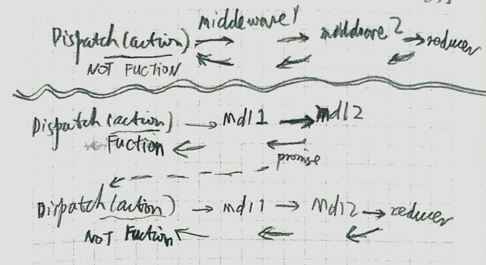

- the first project can be found here - [Goals-Todos App](https://github.com/tylermcginnis/redux-course-project)
- the second can be found here - [Redux Polls](https://github.com/tylermcginnis/redux-polls)

## mini redux

## about states
- FOR STATES STORE (state)
  - Redux.combineReducers:  which stores all states in one store
- FOR STATES PASS (ui)
  - React.createContext: which pass states by .Provider & .Consumer 
  - ReactRedux.Connect: which connect the state to every component

## Redux Folder
- Actions:
  - commands
  - dispatch(commands)
- Reducers:
  - (commands) -> (new states)
- Middleware:
  - validations, logs
- Components:
  - react
- Store:
  - Redux.createStore(reducers)

## Other Folder Structure Patterns
- [Ducks - Redux Reducer Bundles](https://github.com/erikras/ducks-modular-redux): The idea here is that you have a "module" (file) which represents a single reducer along with any action creators or constants that are associated with it. I actually quite enjoy this pattern and I used it in the first version of this course. It breaks down a little when you start to have action types that aren't associated with a single reducer.
- [Domain based Folders](https://marmelab.com/blog/2015/12/17/react-directory-structure.html): The idea here is you group your actions, reducers, etc by the domain they care about, rather than separating them out into generic "actions", "reducers", folders.

## thunk
- for asynchromous
- 
- 

## others
- React's Context:
  - for ref Store more conveniently
  - which is used by react-redux