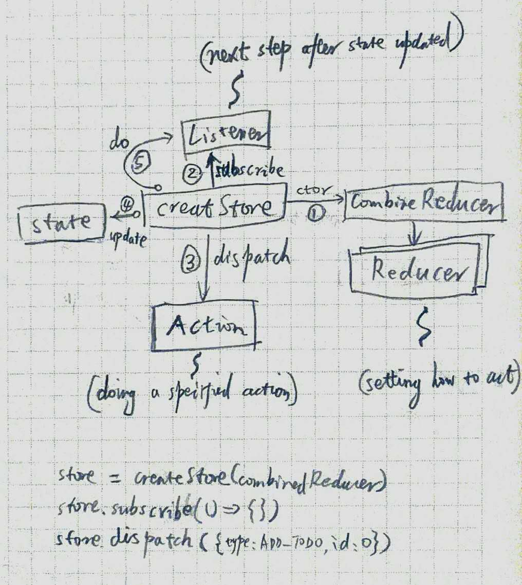

- the first project can be found here - [Goals-Todos App](https://github.com/tylermcginnis/redux-course-project)
- the second can be found here - [Redux Polls](https://github.com/tylermcginnis/redux-polls)

## mini redux

## about states
- FOR STATES STORE (state)
  - Redux.combineReducers:  which stores all states in one store
- FOR STATES PASS (ui)
  - React.Context: which pass states by .Provider & .Consumer 
  - Redux.Connect: which connect the state to every component

## others
- Thunk: for asynchromous
- React's Context: for ref Store more conveniently