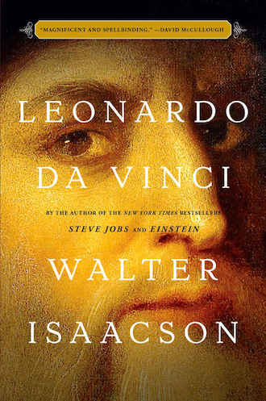

# Leonardo da Vinci

- [Leonardo da Vinci](#leonardo-da-vinci)
  - [I can also paint](#i-can-also-paint)
  - [Childhood](#childhood)
  - [Apprentice](#apprentice)
  - [On his own](#on-his-own)
  - [Milan](#milan)
  - [Leonardo's notebooks](#leonardos-notebooks)
  - [Court entertainer](#court-entertainer)
  - [Personal life](#personal-life)
  - [Vitruvian Man](#vitruvian-man)
  - [The horse monument](#the-horse-monument)
  - [Scientist](#scientist)
  - [Birds and flight](#birds-and-flight)
  - [The mechanical arts](#the-mechanical-arts)
  - [Math](#math)
  - [The nature of man](#the-nature-of-man)
  - [Virgin of the Rocks](#virgin-of-the-rocks)
  - [The Milan portraits](#the-milan-portraits)
  - [The science of art](#the-science-of-art)
  - [The Last Supper](#the-last-supper)
  - [Personal turmoil](#personal-turmoil)
  - [Florence again](#florence-again)
  - [Saint Anne](#saint-anne)
  - [Paintings lost and found](#paintings-lost-and-found)
  - [Cesare Borgia](#cesare-borgia)
  - [Hydraulic engineer](#hydraulic-engineer)
  - [Michelangelo and the lost Battles](#michelangelo-and-the-lost-battles)
  - [Return to Milan](#return-to-milan)
  - [Anatomy, round two](#anatomy-round-two)
  - [The world and its waters](#the-world-and-its-waters)
  - [Rome](#rome)
  - [Pointing the way](#pointing-the-way)
  - [The Mona Lisa](#the-mona-lisa)
  - [France](#france)
  - [Conclusion](#conclusion)

## I can also paint
## Childhood
## Apprentice
## On his own
## Milan
- 未完成修道院的委托项目，实在不是一个讨好他人的作者。太追求完美，又觉得自己无法达到完美。

 - Lorenzo de‘ Medici, eager to navigate the swirling rivalries and alliances among the Italian city-states, saw Florence's artistic culture as a source of influence.
 - In his writings, Rucellai introduced the term 'balance of power' to describe the continuous conflicts and shifting alliances involving Florence, Milan and other Itallian city-states.

## Leonardo's notebooks
## Court entertainer
## Personal life
## Vitruvian Man
## The horse monument
## Scientist
## Birds and flight
## The mechanical arts
## Math
## The nature of man
## Virgin of the Rocks
## The Milan portraits
## The science of art
## The Last Supper
## Personal turmoil
## Florence again
## Saint Anne
## Paintings lost and found
## Cesare Borgia
## Hydraulic engineer
## Michelangelo and the lost Battles
## Return to Milan
## Anatomy, round two
## The world and its waters
## Rome
## Pointing the way
## The Mona Lisa
## France
## Conclusion