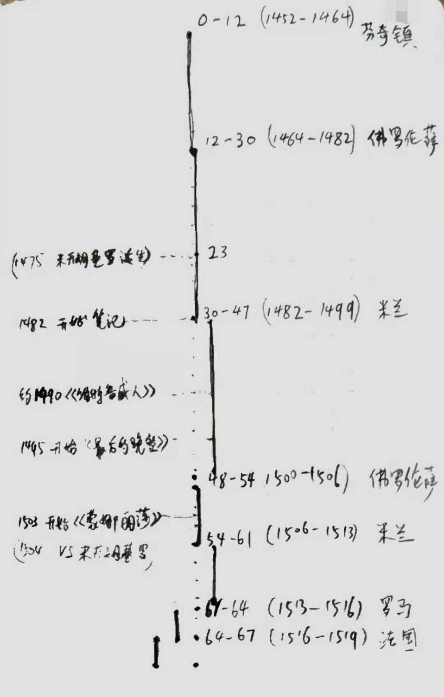

# Leonardo da Vinci

- [Leonardo da Vinci](#leonardo-da-vinci)
  - [Vince](#vince)
    - [Introduction: I can also paint](#introduction-i-can-also-paint)
    - [Chapter 1: Childhood](#chapter-1-childhood)
  - [Florence](#florence)
    - [Chapter 2: Apprentice](#chapter-2-apprentice)
    - [Chapter 3. On his own](#chapter-3-on-his-own)
  - [Milan](#milan)
    - [Chapter 4: Milan](#chapter-4-milan)
    - [Chapter 5: Leonardo's notebooks](#chapter-5-leonardos-notebooks)
    - [Chapter 6: Court entertainer](#chapter-6-court-entertainer)
    - [Chapter 7: Personal life](#chapter-7-personal-life)
    - [Chapter 8: Vitruvian Man](#chapter-8-vitruvian-man)
    - [Chapter 9: The horse monument](#chapter-9-the-horse-monument)
    - [Chapter 10: Scientist](#chapter-10-scientist)
    - [Chapter 11: Birds and flight](#chapter-11-birds-and-flight)
    - [Chapter 12: The mechanical arts](#chapter-12-the-mechanical-arts)
    - [Chapter 13: Math](#chapter-13-math)
    - [Chapter 14: The nature of man](#chapter-14-the-nature-of-man)
    - [Chapter 15: Virgin of the Rocks](#chapter-15-virgin-of-the-rocks)
    - [Chapter 16: The Milan portraits](#chapter-16-the-milan-portraits)
    - [Chapter 17: The science of art](#chapter-17-the-science-of-art)
    - [Chapter 18: The Last Supper](#chapter-18-the-last-supper)
    - [Chapter 19: Personal turmoil](#chapter-19-personal-turmoil)
  - [Florence](#florence-1)
    - [Chapter 20: Florence again](#chapter-20-florence-again)
    - [Chapter 21: Saint Anne](#chapter-21-saint-anne)
    - [Chapter 22: Paintings lost and found](#chapter-22-paintings-lost-and-found)
    - [Chapter 23: Cesare Borgia](#chapter-23-cesare-borgia)
    - [Chapter 24: Hydraulic engineer](#chapter-24-hydraulic-engineer)
    - [Chapter 25: Michelangelo and the lost Battles](#chapter-25-michelangelo-and-the-lost-battles)
  - [Milan](#milan-1)
    - [Chapter 26: Return to Milan](#chapter-26-return-to-milan)
    - [Chapter 27: Anatomy, round two](#chapter-27-anatomy-round-two)
    - [Chapter 28: The world and its waters](#chapter-28-the-world-and-its-waters)
  - [Rome](#rome)
    - [Chapter 29: Rome](#chapter-29-rome)
    - [Chapter 30: Pointing the way](#chapter-30-pointing-the-way)
    - [Chapter 31: The Mona Lisa](#chapter-31-the-mona-lisa)
  - [France](#france)
    - [Chapter 32: France](#chapter-32-france)
    - [Chapter 33: Conclusion](#chapter-33-conclusion)

## Vince
### Introduction: I can also paint
### Chapter 1: Childhood

## Florence
### Chapter 2: Apprentice
### Chapter 3. On his own

## Milan
### Chapter 4: Milan
- 未完成修道院的委托项目，实在不是一个讨好他人的作者。太追求完美，又觉得自己无法达到完美。
- Lorenzo de‘ Medici, eager to navigate the swirling rivalries and alliances among the Italian city-states, saw Florence's artistic culture as a source of influence.
- In his writings, Rucellai introduced the term 'balance of power' to describe the continuous conflicts and shifting alliances involving Florence, Milan and other Itallian city-states.
### Chapter 5: Leonardo's notebooks
### Chapter 6: Court entertainer
### Chapter 7: Personal life
### Chapter 8: Vitruvian Man
### Chapter 9: The horse monument
### Chapter 10: Scientist
### Chapter 11: Birds and flight
### Chapter 12: The mechanical arts
### Chapter 13: Math
### Chapter 14: The nature of man
### Chapter 15: Virgin of the Rocks
### Chapter 16: The Milan portraits
### Chapter 17: The science of art
### Chapter 18: The Last Supper
### Chapter 19: Personal turmoil

## Florence
### Chapter 20: Florence again
### Chapter 21: Saint Anne
### Chapter 22: Paintings lost and found
### Chapter 23: Cesare Borgia
### Chapter 24: Hydraulic engineer
### Chapter 25: Michelangelo and the lost Battles

## Milan
### Chapter 26: Return to Milan
### Chapter 27: Anatomy, round two
### Chapter 28: The world and its waters

## Rome
### Chapter 29: Rome
### Chapter 30: Pointing the way
### Chapter 31: The Mona Lisa

## France
### Chapter 32: France
### Chapter 33: Conclusion