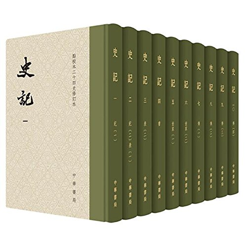

# 史记



- [史记](#史记)
  - [卷一 五帝本纪第一](#卷一-五帝本纪第一)
  - [卷二 夏本纪第二](#卷二-夏本纪第二)
  - [卷三 殷本纪第三](#卷三-殷本纪第三)
  - [卷四 周本纪第四](#卷四-周本纪第四)
  - [卷五 秦本纪第五](#卷五-秦本纪第五)
  - [卷六 秦始皇本纪第六](#卷六-秦始皇本纪第六)
  - [卷七 项羽本纪第七](#卷七-项羽本纪第七)
  - [卷八 高祖本纪第八](#卷八-高祖本纪第八)
  - [卷九 吕太后本纪第九](#卷九-吕太后本纪第九)
  - [卷十 孝文本纪第十](#卷十-孝文本纪第十)
  - [卷十一 孝景本纪第十一](#卷十一-孝景本纪第十一)
  - [卷十二 孝武本纪第十二](#卷十二-孝武本纪第十二)
  - [卷十三 三代世表第一](#卷十三-三代世表第一)
  - [卷十四 十二诸侯年表第二](#卷十四-十二诸侯年表第二)
  - [卷十五 六国年表第三](#卷十五-六国年表第三)
  - [卷十六 秦楚之际月表第四](#卷十六-秦楚之际月表第四)
  - [卷十七 汉兴以来诸侯王年表第五](#卷十七-汉兴以来诸侯王年表第五)
  - [卷十八 高祖功臣侯者年表第六](#卷十八-高祖功臣侯者年表第六)
  - [卷十九 惠景间侯者年表第七](#卷十九-惠景间侯者年表第七)
  - [卷二十 建元以来侯者年表第八](#卷二十-建元以来侯者年表第八)
  - [卷二十一 建元已来王子侯者年表第九](#卷二十一-建元已来王子侯者年表第九)
  - [卷二十二 汉兴以来将相名臣年表第十](#卷二十二-汉兴以来将相名臣年表第十)
  - [卷二十三 礼书第一](#卷二十三-礼书第一)
  - [卷二十四 乐书第二](#卷二十四-乐书第二)
  - [卷二十五 律书第三](#卷二十五-律书第三)
  - [卷二十六 历书第四](#卷二十六-历书第四)
  - [卷二十七 天官书第五](#卷二十七-天官书第五)
  - [卷二十八 封禅书第六](#卷二十八-封禅书第六)
  - [卷二十九 河渠书第七](#卷二十九-河渠书第七)
  - [卷三十 平准书第八](#卷三十-平准书第八)
  - [卷三十一 吴太伯世家第一](#卷三十一-吴太伯世家第一)
  - [卷三十二 齐太公世家第二](#卷三十二-齐太公世家第二)
  - [卷三十三 鲁周公世家第三](#卷三十三-鲁周公世家第三)
  - [卷三十四 燕召公世家第四](#卷三十四-燕召公世家第四)
  - [卷三十五 管蔡世家第五](#卷三十五-管蔡世家第五)
  - [卷三十六 陈杞世家第六](#卷三十六-陈杞世家第六)
  - [卷三十七 卫康叔世家第七](#卷三十七-卫康叔世家第七)
  - [卷三十八 宋微子世家第八](#卷三十八-宋微子世家第八)
  - [卷三十九 晋世家第九](#卷三十九-晋世家第九)
  - [卷四十 楚世家第十](#卷四十-楚世家第十)
  - [卷四十一 越王句践世家第十一](#卷四十一-越王句践世家第十一)
  - [卷四十二 郑世家第十二](#卷四十二-郑世家第十二)
  - [卷四十三 赵世家第十三](#卷四十三-赵世家第十三)
  - [卷四十四 魏世家第十四](#卷四十四-魏世家第十四)
  - [卷四十五 韩世家第十五](#卷四十五-韩世家第十五)
  - [卷四十六 田敬仲完世家第十六](#卷四十六-田敬仲完世家第十六)
  - [卷四十七 孔子世家第十七](#卷四十七-孔子世家第十七)
  - [卷四十八 陈涉世家第十八](#卷四十八-陈涉世家第十八)
  - [卷四十九 外戚世家第十九](#卷四十九-外戚世家第十九)
  - [卷五十 楚元王世家第二十](#卷五十-楚元王世家第二十)
  - [卷五十一 荆燕世家第二十一](#卷五十一-荆燕世家第二十一)
  - [卷五十二 齐悼惠王世家第二十二](#卷五十二-齐悼惠王世家第二十二)
  - [卷五十三 萧相国世家第二十三](#卷五十三-萧相国世家第二十三)
  - [卷五十四 曹相国世家第二十四](#卷五十四-曹相国世家第二十四)
  - [卷五十五 留侯世家第二十五](#卷五十五-留侯世家第二十五)
  - [卷五十六 陈丞相世家第二十六](#卷五十六-陈丞相世家第二十六)
  - [卷五十七 绛侯周勃世家第二十七](#卷五十七-绛侯周勃世家第二十七)
  - [卷五十八 梁孝王世家第二十八](#卷五十八-梁孝王世家第二十八)
  - [卷五十九 五宗世家第二十九](#卷五十九-五宗世家第二十九)
  - [卷六十 三王世家第三十](#卷六十-三王世家第三十)
  - [卷六十一 伯夷列传第一](#卷六十一-伯夷列传第一)
  - [卷六十二 管晏列传第二](#卷六十二-管晏列传第二)
  - [卷六十三 老子韩非列传第三](#卷六十三-老子韩非列传第三)
  - [卷六十四 司马穰苴列传第四](#卷六十四-司马穰苴列传第四)
  - [卷六十五 孙子吴起列传第五](#卷六十五-孙子吴起列传第五)
  - [卷六十六 伍子胥列传第六](#卷六十六-伍子胥列传第六)
  - [卷六十七 仲尼弟子列传第七](#卷六十七-仲尼弟子列传第七)
  - [卷六十八 商君列传第八](#卷六十八-商君列传第八)
  - [卷六十九 苏秦列传第九](#卷六十九-苏秦列传第九)
  - [卷七十 张仪列传第十](#卷七十-张仪列传第十)
  - [卷七十一 樗里子甘茂列传第十一](#卷七十一-樗里子甘茂列传第十一)
  - [卷七十二 穰侯列传第十二](#卷七十二-穰侯列传第十二)
  - [卷七十三 白起王翦列传第十三](#卷七十三-白起王翦列传第十三)
  - [卷七十四 孟子荀卿列传第十四](#卷七十四-孟子荀卿列传第十四)
  - [卷七十五 孟尝君列传第十五](#卷七十五-孟尝君列传第十五)
  - [卷七十六 平原君虞卿列传第十六](#卷七十六-平原君虞卿列传第十六)
  - [卷七十七 魏公子列传第十七](#卷七十七-魏公子列传第十七)
  - [卷七十八 春申君列传第十八](#卷七十八-春申君列传第十八)
  - [卷七十九 范睢蔡泽列传第十九](#卷七十九-范睢蔡泽列传第十九)
  - [卷八十 乐毅列传第二十](#卷八十-乐毅列传第二十)
  - [卷八十一 廉颇蔺相如列传第二十一](#卷八十一-廉颇蔺相如列传第二十一)
  - [卷八十二 田单列传第二十二](#卷八十二-田单列传第二十二)
  - [卷八十三 鲁仲连邹阳列传第二十三](#卷八十三-鲁仲连邹阳列传第二十三)
  - [卷八十四 屈原贾生列传第二十四](#卷八十四-屈原贾生列传第二十四)
  - [卷八十五 吕不韦列传第二十五](#卷八十五-吕不韦列传第二十五)
  - [卷八十六 刺客列传第二十六](#卷八十六-刺客列传第二十六)
  - [卷八十七 李斯列传第二十七](#卷八十七-李斯列传第二十七)
  - [卷八十八 蒙恬列传第二十八](#卷八十八-蒙恬列传第二十八)
  - [卷八十九 张耳陈馀列传第二十九](#卷八十九-张耳陈馀列传第二十九)
  - [卷九十 魏豹彭越列传第三十](#卷九十-魏豹彭越列传第三十)
  - [卷九十一 黥布列传第三十一](#卷九十一-黥布列传第三十一)
  - [卷九十二 淮阴侯列传第三十二](#卷九十二-淮阴侯列传第三十二)
  - [卷九十三 韩信卢绾列传第三十三](#卷九十三-韩信卢绾列传第三十三)
  - [卷九十四 田儋列传第三十四](#卷九十四-田儋列传第三十四)
  - [卷九十五 樊郦滕灌列传第三十五](#卷九十五-樊郦滕灌列传第三十五)
  - [卷九十六 张丞相列传第三十六](#卷九十六-张丞相列传第三十六)
  - [卷九十七 郦生陆贾列传第三十七](#卷九十七-郦生陆贾列传第三十七)
  - [卷九十八 傅靳蒯成列传第三十八](#卷九十八-傅靳蒯成列传第三十八)
  - [卷九十九 刘敬叔孙通列传第三十九](#卷九十九-刘敬叔孙通列传第三十九)
  - [卷一百 季布栾布列传第四十](#卷一百-季布栾布列传第四十)
  - [卷一百一 袁盎晁错列传第四十一](#卷一百一-袁盎晁错列传第四十一)
  - [卷一百二 张释之冯唐列传第四十二](#卷一百二-张释之冯唐列传第四十二)
  - [卷一百三 万石张叔列传第四十三](#卷一百三-万石张叔列传第四十三)
  - [卷一百四 田叔列传第四十四](#卷一百四-田叔列传第四十四)
  - [卷一百五 扁鹊仓公列传第四十五](#卷一百五-扁鹊仓公列传第四十五)
  - [卷一百六 吴王濞列传第四十六](#卷一百六-吴王濞列传第四十六)
  - [卷一百七 魏其武安侯列传第四十七](#卷一百七-魏其武安侯列传第四十七)
  - [卷一百八 韩长孺列传第四十八](#卷一百八-韩长孺列传第四十八)
  - [卷一百九 李将军列传第四十九](#卷一百九-李将军列传第四十九)
  - [卷一百十 匈奴列传第五十](#卷一百十-匈奴列传第五十)
  - [卷一百一十一 卫将军骠骑列传第五十一](#卷一百一十一-卫将军骠骑列传第五十一)
  - [卷一百一十二 平津侯主父列传第五十二](#卷一百一十二-平津侯主父列传第五十二)
  - [卷一百一十三 南越列传第五十三](#卷一百一十三-南越列传第五十三)
  - [卷一百一十四 东越列传第五十四](#卷一百一十四-东越列传第五十四)
  - [卷一百一十五 朝鲜列传第五十五](#卷一百一十五-朝鲜列传第五十五)
  - [卷一百一十六 西南夷列传第五十六](#卷一百一十六-西南夷列传第五十六)
  - [卷一百一十七 司马相如列传第五十七](#卷一百一十七-司马相如列传第五十七)
  - [卷一百一十八 淮南衡山列传第五十八](#卷一百一十八-淮南衡山列传第五十八)
  - [卷一百一十九 循吏列传第五十九](#卷一百一十九-循吏列传第五十九)
  - [卷一百二十 汲郑列传第六十](#卷一百二十-汲郑列传第六十)
  - [卷一百二十一 儒林列传第六十一](#卷一百二十一-儒林列传第六十一)
  - [卷一百二十二 酷吏列传第六十二](#卷一百二十二-酷吏列传第六十二)
  - [卷一百二十三 大宛列传第六十三](#卷一百二十三-大宛列传第六十三)
  - [卷一百二十四 游侠列传第六十四](#卷一百二十四-游侠列传第六十四)
  - [卷一百二十五 佞幸列传第六十五](#卷一百二十五-佞幸列传第六十五)
  - [卷一百二十六 滑稽列传第六十六](#卷一百二十六-滑稽列传第六十六)
  - [卷一百二十七 日者列传第六十七](#卷一百二十七-日者列传第六十七)
  - [卷一百二十八 龟策列传第六十八](#卷一百二十八-龟策列传第六十八)
  - [卷一百二十九 货殖列传第六十九](#卷一百二十九-货殖列传第六十九)
  - [卷一百三十 太史公自序第七十](#卷一百三十-太史公自序第七十)
  - [其他](#其他)

## 卷一 五帝本纪第一
## 卷二 夏本纪第二
## 卷三 殷本纪第三
## 卷四 周本纪第四
## 卷五 秦本纪第五
## 卷六 秦始皇本纪第六
## 卷七 项羽本纪第七
## 卷八 高祖本纪第八
## 卷九 吕太后本纪第九
## 卷十 孝文本纪第十
## 卷十一 孝景本纪第十一
## 卷十二 孝武本纪第十二
## 卷十三 三代世表第一
## 卷十四 十二诸侯年表第二
- [十二诸侯年表](https://docs.google.com/spreadsheets/d/1KrMPR8kWJ7Dusr7dxPydPnZihARbZab-gJAYeO9Xzp4/edit?usp=sharing)

## 卷十五 六国年表第三
- [六国年表](https://docs.google.com/spreadsheets/d/1ijkSHxE91lWgH_m9Yfr_hIL4CYHi5ZveQxg_xibZWGw/edit?usp=sharing)

## 卷十六 秦楚之际月表第四
## 卷十七 汉兴以来诸侯王年表第五
## 卷十八 高祖功臣侯者年表第六
## 卷十九 惠景间侯者年表第七
## 卷二十 建元以来侯者年表第八
## 卷二十一 建元已来王子侯者年表第九
## 卷二十二 汉兴以来将相名臣年表第十
## 卷二十三 礼书第一
## 卷二十四 乐书第二
## 卷二十五 律书第三
## 卷二十六 历书第四
## 卷二十七 天官书第五
## 卷二十八 封禅书第六
## 卷二十九 河渠书第七
## 卷三十 平准书第八
## 卷三十一 吴太伯世家第一
## 卷三十二 齐太公世家第二
## 卷三十三 鲁周公世家第三
## 卷三十四 燕召公世家第四
> 王(燕噲)因收印自三百石吏已上而效之子之。子之南面行王事，而噲老不聽政，顧為臣，國事皆決於子之。  
> (齊)王因令章子將五都之兵，以因北地之眾以伐燕。士卒不戰，城門不閉，燕君噲死，齊大勝。燕子之亡二年，而燕人共立太子平，是為燕昭王。

## 卷三十五 管蔡世家第五
## 卷三十六 陈杞世家第六
## 卷三十七 卫康叔世家第七
## 卷三十八 宋微子世家第八
## 卷三十九 晋世家第九
## 卷四十 楚世家第十
## 卷四十一 越王句践世家第十一
## 卷四十二 郑世家第十二
## 卷四十三 赵世家第十三
## 卷四十四 魏世家第十四
## 卷四十五 韩世家第十五
## 卷四十六 田敬仲完世家第十六
## 卷四十七 孔子世家第十七
## 卷四十八 陈涉世家第十八
## 卷四十九 外戚世家第十九
## 卷五十 楚元王世家第二十
## 卷五十一 荆燕世家第二十一
## 卷五十二 齐悼惠王世家第二十二
## 卷五十三 萧相国世家第二十三
## 卷五十四 曹相国世家第二十四
## 卷五十五 留侯世家第二十五
## 卷五十六 陈丞相世家第二十六
## 卷五十七 绛侯周勃世家第二十七
## 卷五十八 梁孝王世家第二十八
## 卷五十九 五宗世家第二十九
## 卷六十 三王世家第三十
## 卷六十一 伯夷列传第一
## 卷六十二 管晏列传第二
## 卷六十三 老子韩非列传第三
## 卷六十四 司马穰苴列传第四
## 卷六十五 孙子吴起列传第五
## 卷六十六 伍子胥列传第六
## 卷六十七 仲尼弟子列传第七
## 卷六十八 商君列传第八
## 卷六十九 苏秦列传第九
## 卷七十 张仪列传第十
## 卷七十一 樗里子甘茂列传第十一
## 卷七十二 穰侯列传第十二
## 卷七十三 白起王翦列传第十三
## 卷七十四 孟子荀卿列传第十四
## 卷七十五 孟尝君列传第十五
## 卷七十六 平原君虞卿列传第十六
## 卷七十七 魏公子列传第十七
## 卷七十八 春申君列传第十八
## 卷七十九 范睢蔡泽列传第十九
## 卷八十 乐毅列传第二十
> - 於是燕王复以乐毅子乐间为昌国君；而乐毅往来复通燕，燕、赵以为客卿。乐毅卒於赵。
> - 赵使廉颇击之，大破栗腹之军於鄗，禽栗腹、乐乘。乐乘者，乐间之宗也。於是乐间奔赵，赵遂围燕。
> - 其明年，乐乘、廉颇为赵围燕，燕重礼以和，乃解。後五岁，赵孝成王卒。襄王使乐乘代廉颇。廉颇攻乐乘，乐乘走，廉颇亡入魏。其後十六年而秦灭赵。

## 卷八十一 廉颇蔺相如列传第二十一
> - 廉颇闻之，肉袒负荆，因宾客至蔺相如门谢罪。曰：“鄙贱之人，不知将军宽之至此也。”卒相与驩，为刎颈之交。
> - 秦伐韩，军於阏与。王召廉颇而问曰：“可救不？”对曰：“道远险狭，难救。”又召乐乘而问焉，乐乘对如廉颇言。又召问赵奢，奢对曰：“其道远险狭，譬之犹两鼠斗於穴中，将勇者胜。”王乃令赵奢将，救之。
> - 赵括既代廉颇，悉更约束，易置军吏。秦将白起闻之，纵奇兵，详败走，而绝其粮道，分断其军为二，士卒离心。

## 卷八十二 田单列传第二十二
> - 燕引兵东围即墨，即墨大夫出与战，败死。城中相与推田单，曰：“安平之战，田单宗人以铁笼得全，习兵。”立以为将军，以即墨距燕。

## 卷八十三 鲁仲连邹阳列传第二十三
> - 於是新垣衍起，再拜谢曰：“始以先生为庸人，吾乃今日知先生为天下之士也。吾请出，不敢复言帝秦。”秦将闻之，为卻军五十里。適会魏公子无忌夺晋鄙军以救赵，击秦军，秦军遂引而去。於是平原君欲封鲁连，鲁连辞让者三，终不肯受。

## 卷八十四 屈原贾生列传第二十四
## 卷八十五 吕不韦列传第二十五
## 卷八十六 刺客列传第二十六
## 卷八十七 李斯列传第二十七
## 卷八十八 蒙恬列传第二十八
## 卷八十九 张耳陈馀列传第二十九
## 卷九十 魏豹彭越列传第三十
## 卷九十一 黥布列传第三十一
## 卷九十二 淮阴侯列传第三十二
## 卷九十三 韩信卢绾列传第三十三
## 卷九十四 田儋列传第三十四
## 卷九十五 樊郦滕灌列传第三十五
## 卷九十六 张丞相列传第三十六
## 卷九十七 郦生陆贾列传第三十七
## 卷九十八 傅靳蒯成列传第三十八
## 卷九十九 刘敬叔孙通列传第三十九
## 卷一百 季布栾布列传第四十
## 卷一百一 袁盎晁错列传第四十一
## 卷一百二 张释之冯唐列传第四十二
## 卷一百三 万石张叔列传第四十三
## 卷一百四 田叔列传第四十四
## 卷一百五 扁鹊仓公列传第四十五
## 卷一百六 吴王濞列传第四十六
## 卷一百七 魏其武安侯列传第四十七
## 卷一百八 韩长孺列传第四十八
## 卷一百九 李将军列传第四十九
## 卷一百十 匈奴列传第五十
## 卷一百一十一 卫将军骠骑列传第五十一
## 卷一百一十二 平津侯主父列传第五十二
## 卷一百一十三 南越列传第五十三
## 卷一百一十四 东越列传第五十四
## 卷一百一十五 朝鲜列传第五十五
## 卷一百一十六 西南夷列传第五十六
## 卷一百一十七 司马相如列传第五十七
## 卷一百一十八 淮南衡山列传第五十八
## 卷一百一十九 循吏列传第五十九
## 卷一百二十 汲郑列传第六十
## 卷一百二十一 儒林列传第六十一
## 卷一百二十二 酷吏列传第六十二
## 卷一百二十三 大宛列传第六十三
## 卷一百二十四 游侠列传第六十四
## 卷一百二十五 佞幸列传第六十五
## 卷一百二十六 滑稽列传第六十六
## 卷一百二十七 日者列传第六十七
## 卷一百二十八 龟策列传第六十八
## 卷一百二十九 货殖列传第六十九
## 卷一百三十 太史公自序第七十


## 其他
```
乐毅 -> 乐间、乐乘 -> 廉颇 -> 蔺相如
 |-> 田单             |-> 赵奢 -> 平原君
                          |-> 赵括 -> 白起
```
