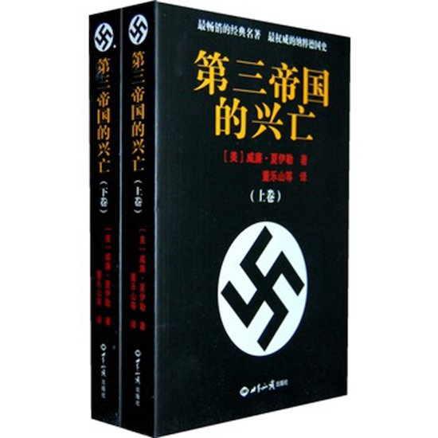

# 第三帝国的兴亡

- [第三帝国的兴亡](#第三帝国的兴亡)
  - [第一编　阿道夫·希特勒的崛起](#第一编阿道夫希特勒的崛起)
    - [第一章　第三帝国的诞生](#第一章第三帝国的诞生)
      - [一 阿道夫·希特勒的出世](#一-阿道夫希特勒的出世)
      - [二 阿道夫·希特勒的早年生活](#二-阿道夫希特勒的早年生活)
      - [三 「我一生最悲哀的时期」](#三-我一生最悲哀的时期)
      - [四 阿道夫·希特勒的萌芽思想](#四-阿道夫希特勒的萌芽思想)
    - [第二章　纳粹党的诞生](#第二章纳粹党的诞生)
      - [一 纳粹党的发端](#一-纳粹党的发端)
      - [二 「元首」的出现](#二-元首的出现)
    - [第三章　凡尔赛、魏玛和啤酒馆政变](#第三章凡尔赛魏玛和啤酒馆政变)
      - [一 凡尔赛的阴影](#一-凡尔赛的阴影)
      - [二 一个不和睦的家庭](#二-一个不和睦的家庭)
      - [三 巴伐利亚发生的反叛](#三-巴伐利亚发生的反叛)
      - [四 啤酒馆政变](#四-啤酒馆政变)
      - [五 邦长官冯·卡尔](#五-邦长官冯卡尔)
      - [六 叛国罪审判](#六-叛国罪审判)
    - [第四章　希特勒的思想和第三帝国的根源](#第四章希特勒的思想和第三帝国的根源)
      - [一 第三帝国的历史根源](#一-第三帝国的历史根源)
      - [二 第三帝国的思想根源](#二-第三帝国的思想根源)
      - [三 豪·斯·张伯伦的奇异的一生和著作](#三-豪斯张伯伦的奇异的一生和著作)
  - [第二编　胜利和巩固](#第二编胜利和巩固)
    - [第五章　取得政权的道路：1925-1931](#第五章取得政权的道路1925-1931)
      - [一 保罗·约瑟夫·戈培尔的出现](#一-保罗约瑟夫戈培尔的出现)
      - [二 阿道夫·希特勒的一段休息和罗曼斯的插曲](#二-阿道夫希特勒的一段休息和罗曼斯的插曲)
      - [三 经济恐慌带来的机会](#三-经济恐慌带来的机会)
    - [第六章　共和国的末日：1931 - 1933](#第六章共和国的末日1931---1933)
      - [一 希持勒与兴登堡对垒](#一-希持勒与兴登堡对垒)
      - [二 弗朗兹·冯·巴本的大失败](#二-弗朗兹冯巴本的大失败)
      - [三 施莱彻尔：共和国的最后一任总理](#三-施莱彻尔共和国的最后一任总理)
    - [第七章　德国的纳粹化：一九三三－一九三四年](#第七章德国的纳粹化一九三三一九三四年)
      - [一 国会纵火案](#一-国会纵火案)
      - [二 Gleichschaltung：国家的「一体化」](#二-gleichschaltung国家的一体化)
      - [三 「不许有第二次革命！」](#三-不许有第二次革命)
      - [四 纳粹外交政策的发端](#四-纳粹外交政策的发端)
      - [五 一九三四年六月三十日的血腥清洗](#五-一九三四年六月三十日的血腥清洗)
      - [六 兴登堡之死](#六-兴登堡之死)
    - [第八章　第三帝国的生活：一九三三－一九三七年](#第八章第三帝国的生活一九三三一九三七年)
      - [一 对基督教会的迫害](#一-对基督教会的迫害)
      - [二 文化的纳粹化](#二-文化的纳粹化)
      - [三 对报刊、广播和电影的控制](#三-对报刊广播和电影的控制)
      - [四 第三帝国的教育](#四-第三帝国的教育)
      - [五 第三帝国的农民](#五-第三帝国的农民)
      - [六 第三帝国的经济](#六-第三帝国的经济)
      - [七 劳工的农奴状态](#七-劳工的农奴状态)
      - [八 第三帝国的司法](#八-第三帝国的司法)
      - [九 第三帝国的政府](#九-第三帝国的政府)
  - [第三编　走向战争的道路](#第三编走向战争的道路)
    - [第九章　开始的步骤：一九三四－一九三七年](#第九章开始的步骤一九三四一九三七年)
      - [一 凡尔赛和约的破坏](#一-凡尔赛和约的破坏)
      - [二 星期六的惊人之举](#二-星期六的惊人之举)
      - [三 莱因兰奇袭](#三-莱因兰奇袭)
      - [四 一九三七年：「没有惊人之举」](#四-一九三七年没有惊人之举)
      - [五 一九三七年十一月五日决定命运的决定](#五-一九三七年十一月五日决定命运的决定)
    - [第十章　决定命运的奇异插曲：勃洛姆堡、弗立契、牛赖特和沙赫特的倒霉](#第十章决定命运的奇异插曲勃洛姆堡弗立契牛赖特和沙赫特的倒霉)
      - [一 冯·勃洛姆堡陆军元帅的倒霉](#一-冯勃洛姆堡陆军元帅的倒霉)
      - [二 男爵瓦尔纳·冯·弗立契将军的倒霉](#二-男爵瓦尔纳冯弗立契将军的倒霉)
    - [第十一章　德奥合并：强夺奥地利](#第十一章德奥合并强夺奥地利)
      - [一 伯希特斯加登会谈：一九三八年二月十二日](#一-伯希特斯加登会谈一九三八年二月十二日)
      - [二 四个星期的痛苦：一九三八年二月十二日－三月十一日](#二-四个星期的痛苦一九三八年二月十二日三月十一日)
      - [三 许士尼格的垮台](#三-许士尼格的垮台)
    - [第十二章　通向慕尼黑的道路](#第十二章通向慕尼黑的道路)
      - [一 第一次危机：一九三八年五月](#一-第一次危机一九三八年五月)
      - [二 将军们的动摇](#二-将军们的动摇)
      - [三 反希特勒的密谋的形成](#三-反希特勒的密谋的形成)
      - [四 张伯伦在伯希特斯加登：一九三八年九月十五日](#四-张伯伦在伯希特斯加登一九三八年九月十五日)
      - [五 张伯伦在戈德斯堡：九月二十二－二十三日](#五-张伯伦在戈德斯堡九月二十二二十三日)
      - [六 最后时刻](#六-最后时刻)
      - [七 「黑色的星期三」和哈尔德反对希特勒的计划](#七-黑色的星期三和哈尔德反对希特勒的计划)
      - [八 慕尼黑的投降：一九三八年九月二十九－三十日](#八-慕尼黑的投降一九三八年九月二十九三十日)
      - [九 慕尼黑的后果](#九-慕尼黑的后果)
    - [第十三章　捷克斯洛伐克再也不存在了](#第十三章捷克斯洛伐克再也不存在了)
      - [一 砸玻璃窗的一周](#一-砸玻璃窗的一周)
      - [二 斯洛伐克「赢得了独立」](#二-斯洛伐克赢得了独立)
      - [三 哈查博士的劫难](#三-哈查博士的劫难)
    - [第十四章　轮到了波兰](#第十四章轮到了波兰)
      - [一 波兰问题炽热化](#一-波兰问题炽热化)
      - [二 白色方案](#二-白色方案)
      - [三 希特勒对罗斯福的答复](#三-希特勒对罗斯福的答复)
      - [四 俄国的插手：一](#四-俄国的插手一)
      - [五 钢铁盟约](#五-钢铁盟约)
      - [六 希特勒破釜沉舟：一九三九年五月二十三日](#六-希特勒破釜沉舟一九三九年五月二十三日)
      - [七 俄国的插手：二](#七-俄国的插手二)
      - [八 计划进行总体战](#八-计划进行总体战)
      - [九 俄国的插手：三](#九-俄国的插手三)
      - [十 德国的盟国的犹豫](#十-德国的盟国的犹豫)
      - [十一 齐亚诺在萨尔斯堡和上萨尔斯堡：八月十一日、十二日、十三日](#十一-齐亚诺在萨尔斯堡和上萨尔斯堡八月十一日十二日十三日)
    - [第十五章　纳粹－苏联条约](#第十五章纳粹苏联条约)
      - [一 上萨尔斯堡的军事会议：八月十四日](#一-上萨尔斯堡的军事会议八月十四日)
      - [二 纳粹一苏联谈判：一九三九年八月十五－二十一日](#二-纳粹一苏联谈判一九三九年八月十五二十一日)
      - [三 一九三九年八月二十二日的军事会议](#三-一九三九年八月二十二日的军事会议)
      - [四 莫斯科盟国谈判的僵局](#四-莫斯科盟国谈判的僵局)
      - [五 里宾特洛甫在莫斯科：一九三九年八月二十三日”](#五-里宾特洛甫在莫斯科一九三九年八月二十三日)
    - [第十六章　最后几天的和平日子](#第十六章最后几天的和平日子)
      - [一 墨索里尼临阵胆怯](#一-墨索里尼临阵胆怯)
      - [二 「密谋分子」的欢欣和混乱](#二-密谋分子的欢欣和混乱)
      - [三 最后六天的和平日子](#三-最后六天的和平日子)
      - [四 最后关头的德英关系](#四-最后关头的德英关系)
      - [五 最后一天的和平日子](#五-最后一天的和平日子)
    - [第十七章　第二次世界大战的开始](#第十七章第二次世界大战的开始)
      - [一 墨索里尼最后一分钟的调停](#一-墨索里尼最后一分钟的调停)
      - [二 波兰战争变成了第二次世界大战](#二-波兰战争变成了第二次世界大战)
      - [三 德国备忘录证明过错在英国](#三-德国备忘录证明过错在英国)
  - [第四编　战争：初期的胜利和转折点](#第四编战争初期的胜利和转折点)
    - [第十八章　波兰的覆亡](#第十八章波兰的覆亡)
      - [一 俄国人侵入波兰](#一-俄国人侵入波兰)
    - [第十九章　西线的静坐战](#第十九章西线的静坐战)
      - [一 「阿西娜」号的沉没](#一-阿西娜号的沉没)
      - [二 希特勒的和平建议](#二-希特勒的和平建议)
      - [三 推翻希特勒的佐森「密谋」](#三-推翻希特勒的佐森密谋)
      - [四 纳粹绑架案和啤酒馆炸弹事件](#四-纳粹绑架案和啤酒馆炸弹事件)
      - [五 希特勒对将领们的训话](#五-希特勒对将领们的训话)
      - [六 纳粹在波兰的暴行：第一阶段](#六-纳粹在波兰的暴行第一阶段)
      - [七 极权主义者之间的摩擦”](#七-极权主义者之间的摩擦)
    - [第二十章　征服丹麦和挪威](#第二十章征服丹麦和挪威)
      - [一 维德孔·吉斯林的出现](#一-维德孔吉斯林的出现)
      - [二 希特勒会晤塞姆纳尔·韦尔斯和墨索里尼](#二-希特勒会晤塞姆纳尔韦尔斯和墨索里尼)
      - [三 密谋分子的又一次失败](#三-密谋分子的又一次失败)
      - [四 攻占丹麦和挪威](#四-攻占丹麦和挪威)
      - [五 挪威人的抵抗](#五-挪威人的抵抗)
      - [六 争夺挪威的几次战役](#六-争夺挪威的几次战役)
    - [第二十一章　西线的胜利](#第二十一章西线的胜利)
      - [一 双方的作战计划](#一-双方的作战计划)
      - [二 六星期战争：一九四○年五月十日－六月二十五日](#二-六星期战争一九四年五月十日六月二十五日)
      - [三 征服荷兰](#三-征服荷兰)
      - [四 比利时的陷落和英法联军的落入陷阱](#四-比利时的陷落和英法联军的落入陷阱)
      - [五 利奥波德国王的投降](#五-利奥波德国王的投降)
      - [六 敦刻尔克的奇迹](#六-敦刻尔克的奇迹)
      - [七 法兰西的崩溃](#七-法兰西的崩溃)
      - [八 墨索里尼在法国背上扎进一小刀](#八-墨索里尼在法国背上扎进一小刀)
      - [九 贡比臬的第二次停战](#九-贡比臬的第二次停战)
      - [十 希特勒玩弄和平](#十-希特勒玩弄和平)
    - [第二十二章　海狮计划：入侵英国的失败](#第二十二章海狮计划入侵英国的失败)
      - [一 不列颠战役](#一-不列颠战役)
      - [二 如果入侵成功](#二-如果入侵成功)
      - [三 附记：纳粹绑架温莎公爵夫妇的阴谋](#三-附记纳粹绑架温莎公爵夫妇的阴谋)
    - [第二十三章　巴巴洛沙：轮到了俄国](#第二十三章巴巴洛沙轮到了俄国)
      - [一 莫洛托夫在柏林](#一-莫洛托夫在柏林)
      - [二 六个月的挫折](#二-六个月的挫折)
      - [三 巴尔干序曲](#三-巴尔干序曲)
      - [四 恐怖统治的策划](#四-恐怖统治的策划)
      - [五 鲁道夫·赫斯的出走](#五-鲁道夫赫斯的出走)
      - [六 克里姆林宫的困境](#六-克里姆林宫的困境)
    - [第二十四章　形势的转变](#第二十四章形势的转变)
      - [一 对莫斯科的大进攻](#一-对莫斯科的大进攻)
    - [第二十五章　轮到了美国](#第二十五章轮到了美国)
      - [一 「避免与美国发生事件！」](#一-避免与美国发生事件)
      - [二 日本自有打算](#二-日本自有打算)
      - [三 珍珠港事件前夕](#三-珍珠港事件前夕)
      - [四 希特勒宣战](#四-希特勒宣战)
      - [五 希特勒在国会里：十二月十一日](#五-希特勒在国会里十二月十一日)
    - [第二十六章　伟大的转折点：一九四二年——斯大林格勒和阿拉曼　密谋分子恢复了活动](#第二十六章伟大的转折点一九四二年斯大林格勒和阿拉曼密谋分子恢复了活动)
      - [一 德军在战争中的最后一次大攻势](#一-德军在战争中的最后一次大攻势)
      - [二 德军在俄国的夏季攻势：一九四二年](#二-德军在俄国的夏季攻势一九四二年)
      - [三 第一个打击：阿拉曼之役和英美军队的登陆](#三-第一个打击阿拉曼之役和英美军队的登陆)
      - [四 在斯大林格勒的惨败](#四-在斯大林格勒的惨败)
  - [第五编　末日的开始](#第五编末日的开始)
    - [第二十七章　新秩序](#第二十七章新秩序)
      - [一 纳粹对欧洲的掠夺](#一-纳粹对欧洲的掠夺)
      - [二 新秩序下的奴隶劳动](#二-新秩序下的奴隶劳动)
      - [三 战俘](#三-战俘)
      - [四 纳粹在占领区的恐怖统治](#四-纳粹在占领区的恐怖统治)
      - [五 「最后解决」](#五-最后解决)
      - [六 灭绝营](#六-灭绝营)
      - [七 「华沙犹太人隔离区已不再存在」](#七-华沙犹太人隔离区已不再存在)
      - [八 医学试验](#八-医学试验)
      - [九 海德里希之死和利迪斯村的末日](#九-海德里希之死和利迪斯村的末日)
    - [第二十八章　墨索里尼的垮台”](#第二十八章墨索里尼的垮台)
    - [第二十九章　盟军对西欧的进攻和德国内部杀害希特勒的尝试](#第二十九章盟军对西欧的进攻和德国内部杀害希特勒的尝试)
      - [一 「闪电计划」](#一-闪电计划)
      - [二 冯·施道芬堡伯爵的使命](#二-冯施道芬堡伯爵的使命)
      - [三 英美的进攻：一九四四年六月六日](#三-英美的进攻一九四四年六月六日)
      - [四 最后关头的密谋活动](#四-最后关头的密谋活动)
      - [五 一九四四年七月二十日的政变](#五-一九四四年七月二十日的政变)
      - [六 一九四四年七月二十日](#六-一九四四年七月二十日)
      - [七 血腥的报复](#七-血腥的报复)
  - [第六编　第三帝国的覆亡](#第六编第三帝国的覆亡)
    - [第三十章　德国的征服](#第三十章德国的征服)
      - [一 希特勒垂死的孤注一掷](#一-希特勒垂死的孤注一掷)
      - [二 德国军队的崩溃](#二-德国军队的崩溃)
    - [第三十一章　众神的末日：第三帝国的末日](#第三十一章众神的末日第三帝国的末日)
      - [一 希特勒的最后重大决定](#一-希特勒的最后重大决定)
      - [二 戈林和希姆莱试图取而代之](#二-戈林和希姆莱试图取而代之)
      - [三 到地下避弹室来的两位最后客人](#三-到地下避弹室来的两位最后客人)
      - [四 希特勒的遗嘱](#四-希特勒的遗嘱)
      - [五 希特勒和他的新妇之死](#五-希特勒和他的新妇之死)
      - [六 第三帝国的结束”](#六-第三帝国的结束)
  - [X-RAY](#x-ray)

## 第一编　阿道夫·希特勒的崛起

### 第一章　第三帝国的诞生
#### 一 阿道夫·希特勒的出世
#### 二 阿道夫·希特勒的早年生活
#### 三 「我一生最悲哀的时期」
#### 四 阿道夫·希特勒的萌芽思想

### 第二章　纳粹党的诞生
#### 一 纳粹党的发端
#### 二 「元首」的出现

### 第三章　凡尔赛、魏玛和啤酒馆政变
#### 一 凡尔赛的阴影
#### 二 一个不和睦的家庭
#### 三 巴伐利亚发生的反叛
#### 四 啤酒馆政变
#### 五 邦长官冯·卡尔
#### 六 叛国罪审判

### 第四章　希特勒的思想和第三帝国的根源
#### 一 第三帝国的历史根源
#### 二 第三帝国的思想根源
#### 三 豪·斯·张伯伦的奇异的一生和著作

## 第二编　胜利和巩固

### 第五章　取得政权的道路：1925-1931
#### 一 保罗·约瑟夫·戈培尔的出现
#### 二 阿道夫·希特勒的一段休息和罗曼斯的插曲

#### 三 经济恐慌带来的机会

### 第六章　共和国的末日：1931 - 1933
#### 一 希持勒与兴登堡对垒
#### 二 弗朗兹·冯·巴本的大失败
#### 三 施莱彻尔：共和国的最后一任总理
- 施特拉塞要求纳粹党至少“容忍”施莱彻尔政府，提出辞去党内一切职务。希特勒还击，施特拉塞建立起来的政治组织由元首亲自接管。党内各级领导人物都被召到柏林，宣誓效忠元首。希特勒为了取得政权，同巴本合作，又同小兴登堡取得合作。施莱彻尔政策失败，兴登堡未支持其建立独裁政府。巴本任副总理、希特勒任总理成立内阁，双方人员对比 8:3。

### 第七章　德国的纳粹化：一九三三－一九三四年
#### 一 国会纵火案
- 为激起民众反对共产党，无赖其为国会纵火案的主谋
#### 二 Gleichschaltung：国家的「一体化」
- 希特勒内阁以诡计取得所的国会的权力，国会被架空。进一步解散各党、各联邦、各工会，企业国有化。
#### 三 「不许有第二次革命！」
- 继续讨好陆军以获得必要的支持，抑制冲锋队。
#### 四 纳粹外交政策的发端
- 在国际上又掌握了所有他领导人的秉性，表面迎和罗斯福的裁军政策，实则不久便以他国遵守裁军条约为由，实行扩军。
#### 五 一九三四年六月三十日的血腥清洗
- 为获得陆军的支持，血洗冲锋队
#### 六 兴登堡之死
- 兴登堡死后，希特勒成为集元首与总理于一身，陆军向其个人宣誓效忠

### 第八章　第三帝国的生活：一九三三－一九三七年
#### 一 对基督教会的迫害
- 教会同陆军一样向希特勒各个宣誓效忠
#### 二 文化的纳粹化
- 一切为纳粹服务
#### 三 对报刊、广播和电影的控制
#### 四 第三帝国的教育
#### 五 第三帝国的农民
#### 六 第三帝国的经济
#### 七 劳工的农奴状态
#### 八 第三帝国的司法
#### 九 第三帝国的政府

## 第三编　走向战争的道路

### 第九章　开始的步骤：一九三四－一九三七年
#### 一 凡尔赛和约的破坏
#### 二 星期六的惊人之举
#### 三 莱因兰奇袭
- 占领莱因兰，法国不敢反击
#### 四 一九三七年：「没有惊人之举」
#### 五 一九三七年十一月五日决定命运的决定

### 第十章　决定命运的奇异插曲：勃洛姆堡、弗立契、牛赖特和沙赫特的倒霉
- 陆军一批将领被撤换，以后希特勒完全掌控
#### 一 冯·勃洛姆堡陆军元帅的倒霉
#### 二 男爵瓦尔纳·冯·弗立契将军的倒霉

### 第十一章　德奥合并：强夺奥地利
#### 一 伯希特斯加登会谈：一九三八年二月十二日
#### 二 四个星期的痛苦：一九三八年二月十二日－三月十一日
#### 三 许士尼格的垮台
- 不知何原因，奥地利总理许士尼屈服于希特勒的协议，虽签字但，告之希特勒只有总统签字才有效。回国后，又想进行公民投票决定是否接受合并，但最终屈服于希特勒的武力。奥地利被吞并。

### 第十二章　通向慕尼黑的道路
#### 一 第一次危机：一九三八年五月
#### 二 将军们的动摇
#### 三 反希特勒的密谋的形成
#### 四 张伯伦在伯希特斯加登：一九三八年九月十五日
#### 五 张伯伦在戈德斯堡：九月二十二－二十三日
#### 六 最后时刻
#### 七 「黑色的星期三」和哈尔德反对希特勒的计划
#### 八 慕尼黑的投降：一九三八年九月二十九－三十日
#### 九 慕尼黑的后果

### 第十三章　捷克斯洛伐克再也不存在了
#### 一 砸玻璃窗的一周
- 首先要求苏台德地区归入德国
#### 二 斯洛伐克「赢得了独立」
#### 三 哈查博士的劫难

### 第十四章　轮到了波兰
#### 一 波兰问题炽热化
#### 二 白色方案
#### 三 希特勒对罗斯福的答复
#### 四 俄国的插手：一
#### 五 钢铁盟约
#### 六 希特勒破釜沉舟：一九三九年五月二十三日
#### 七 俄国的插手：二
#### 八 计划进行总体战
#### 九 俄国的插手：三
#### 十 德国的盟国的犹豫
#### 十一 齐亚诺在萨尔斯堡和上萨尔斯堡：八月十一日、十二日、十三日

### 第十五章　纳粹－苏联条约
#### 一 上萨尔斯堡的军事会议：八月十四日
#### 二 纳粹一苏联谈判：一九三九年八月十五－二十一日
#### 三 一九三九年八月二十二日的军事会议
#### 四 莫斯科盟国谈判的僵局
- 英国与俄国不紧不慢的谈判给了德国机会
#### 五 里宾特洛甫在莫斯科：一九三九年八月二十三日”

### 第十六章　最后几天的和平日子
#### 一 墨索里尼临阵胆怯
#### 二 「密谋分子」的欢欣和混乱
#### 三 最后六天的和平日子
#### 四 最后关头的德英关系
#### 五 最后一天的和平日子

### 第十七章　第二次世界大战的开始
#### 一 墨索里尼最后一分钟的调停
#### 二 波兰战争变成了第二次世界大战
#### 三 德国备忘录证明过错在英国

## 第四编　战争：初期的胜利和转折点

### 第十八章　波兰的覆亡
#### 一 俄国人侵入波兰

### 第十九章　西线的静坐战
#### 一 「阿西娜」号的沉没
#### 二 希特勒的和平建议
#### 三 推翻希特勒的佐森「密谋」
- 战争爆发以来，他们已经遭到过一次挫折。在进攻波兰前夕，早已退休的“冯·哈麦施但因”将军又暂时被起用，在西线担任一个司令官的职务，战争开始的第一个星期，他曾经竭力邀请希特勒到他的司令部去视察一下，以表示在进攻波兰的时候他并没忽视那条战线。实际上，哈麦施但因将军，这个希特勒的死对头，是想要把他抓起来。费边·冯·施拉勃伦道夫早在9 月3 日英国政府宣战的那一天，就在柏林阿德隆饭店匆忙会见奥吉尔维·福比斯的时候，把这个阴谋悄悄地告诉了他。但是那位元首已经嗅出气味不对，谢绝了那位前陆军总司令的邀请，并且过了不久就把他撤掉了。

#### 四 纳粹绑架案和啤酒馆炸弹事件
#### 五 希特勒对将领们的训话
#### 六 纳粹在波兰的暴行：第一阶段
#### 七 极权主义者之间的摩擦”

### 第二十章　征服丹麦和挪威
#### 一 维德孔·吉斯林的出现
#### 二 希特勒会晤塞姆纳尔·韦尔斯和墨索里尼
#### 三 密谋分子的又一次失败
#### 四 攻占丹麦和挪威
#### 五 挪威人的抵抗
#### 六 争夺挪威的几次战役

### 第二十一章　西线的胜利
#### 一 双方的作战计划
#### 二 六星期战争：一九四○年五月十日－六月二十五日
#### 三 征服荷兰
#### 四 比利时的陷落和英法联军的落入陷阱
#### 五 利奥波德国王的投降
#### 六 敦刻尔克的奇迹
- 希特勒突然停止坦克部队的进攻，给了英国辙退的机会，理由是
  - 不能让陆军独大
  - 给英国留的实力，为了和谈
#### 七 法兰西的崩溃
#### 八 墨索里尼在法国背上扎进一小刀
#### 九 贡比臬的第二次停战
#### 十 希特勒玩弄和平

### 第二十二章　海狮计划：入侵英国的失败
- 根本没有提前计划，原本只想和谈
#### 一 不列颠战役
#### 二 如果入侵成功
- 为了报复英国的夜袭，停止了对英国空军的打击，也改为夜袭。给了英国空军回血的机会。
#### 三 附记：纳粹绑架温莎公爵夫妇的阴谋

### 第二十三章　巴巴洛沙：轮到了俄国
- 只因对保加利亚进行军事进攻，导致对俄国的进攻推迟一个月，预示着最后的失败。
#### 一 莫洛托夫在柏林
#### 二 六个月的挫折
#### 三 巴尔干序曲
#### 四 恐怖统治的策划
#### 五 鲁道夫·赫斯的出走
#### 六 克里姆林宫的困境

### 第二十四章　形势的转变
#### 一 对莫斯科的大进攻

### 第二十五章　轮到了美国
#### 一 「避免与美国发生事件！」
#### 二 日本自有打算
#### 三 珍珠港事件前夕
#### 四 希特勒宣战
#### 五 希特勒在国会里：十二月十一日

### 第二十六章　伟大的转折点：一九四二年——斯大林格勒和阿拉曼　密谋分子恢复了活动
#### 一 德军在战争中的最后一次大攻势
#### 二 德军在俄国的夏季攻势：一九四二年
#### 三 第一个打击：阿拉曼之役和英美军队的登陆
#### 四 在斯大林格勒的惨败

## 第五编　末日的开始

### 第二十七章　新秩序
#### 一 纳粹对欧洲的掠夺
#### 二 新秩序下的奴隶劳动
#### 三 战俘
#### 四 纳粹在占领区的恐怖统治
#### 五 「最后解决」
#### 六 灭绝营
#### 七 「华沙犹太人隔离区已不再存在」
#### 八 医学试验
#### 九 海德里希之死和利迪斯村的末日

### 第二十八章　墨索里尼的垮台”

### 第二十九章　盟军对西欧的进攻和德国内部杀害希特勒的尝试
#### 一 「闪电计划」
#### 二 冯·施道芬堡伯爵的使命
#### 三 英美的进攻：一九四四年六月六日
#### 四 最后关头的密谋活动
#### 五 一九四四年七月二十日的政变
#### 六 一九四四年七月二十日
#### 七 血腥的报复

## 第六编　第三帝国的覆亡

### 第三十章　德国的征服
#### 一 希特勒垂死的孤注一掷
#### 二 德国军队的崩溃

### 第三十一章　众神的末日：第三帝国的末日
#### 一 希特勒的最后重大决定
#### 二 戈林和希姆莱试图取而代之
#### 三 到地下避弹室来的两位最后客人
#### 四 希特勒的遗嘱
#### 五 希特勒和他的新妇之死
#### 六 第三帝国的结束”

## X-RAY
- 库尔特·冯·施莱谢尔 
  - (德语：Kurt von Schleicher 1882年4月4日－1934年6月30日) 魏玛共和国的最后一任总理。
- 奥托·斯特拉瑟
  - （德语：Otto Strasser；1897年9月10日－1974年8月27日），纳粹党左翼领导人。后来改派与希特勒一派人发生冲突，导致纳粹党分裂，其成员在长刀之夜遭到清洗。
- 休根堡
  - Alfred Ernst Christian Alexander Hugenberg (19 June 1865 – 12 March 1951) was an influential German businessman and politician. As leader of the German National People's Party he was instrumental in helping Adolf Hitler become Chancellor of Germany and served in his first cabinet in 1933.
- 冯·哈麦施但因
  - Kurt Gebhard Adolf Philipp Freiherr von Hammerstein-Equord (26 September 1878 – 24 April 1943) 是一名德国将军，曾担任过帝国威尔士总司令。他因反对希特勒和纳粹政权的热情而闻名。曾试图邀请希特勒到他的司令部，并乘机把他抓起来，但希特勒并未去。