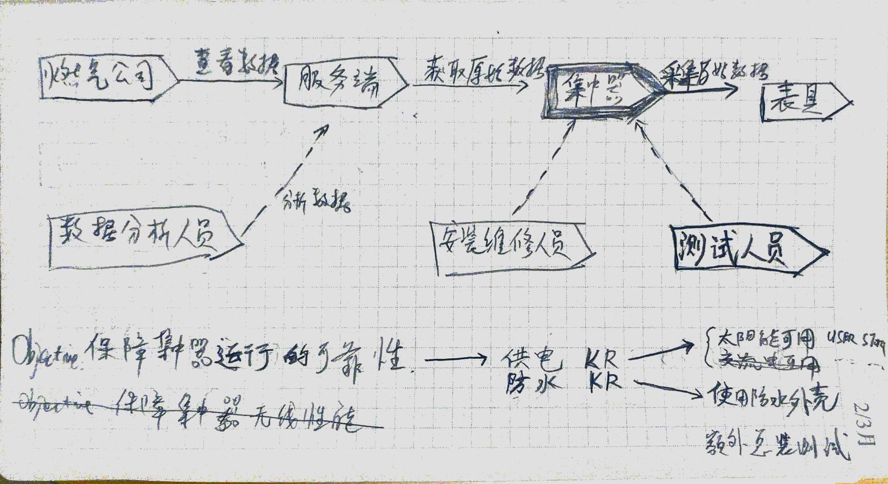

# Sprint Design & OKR & Scrum

## 参考点
- Sprint Design
- OKR
- Scrum

## 步骤
- 分析项目地图（Sprint Design）
- 指定目标点 (Objective)
- 分析必需点 (Key Result)
- 确定任务 (Task)
- 规划时长 (Scrum)

## 分析时的注意点
- 关注现有问题和已解决问题，
- 主要用户是谁？
- 需求是什么？
- 哪些己完成？
- 哪些需完成?
- 次要用户呢？

## 以开发集中器为例：
- 画出如上地图 (Sprint Design)
- 确认当前目标为：
  - 目标属：改进型
  - 目标为：保障集中器云行的可靠性 (Object)
- 确认 Key Result:
  - 保证供电（需指出具体指标）
  - 保证防水（需指出具体指标）
- 确认 Task
  - 保障太阳能电池方案的可靠性
    - 使用太阳能
    - 使用充电宝
    - 线路板更新
  - 保障防水性
    - 使用防水外壳
  - 总装测试
- 使用 Scrum 规划时间
  - 待续
