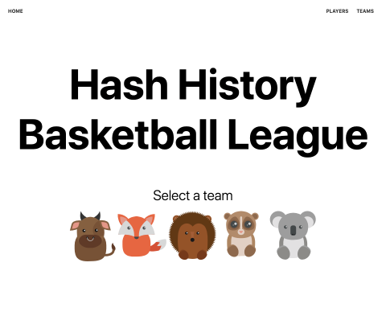

# React Router

## Project
- [Hash Hisotry Basketball League](https://github.com/tylermcginnis/React-Router-Course-Project)



## TOC
- Course Introduction
  - What to expect
- Introduction and Philosophy behind React Router
  - Video (22:27)
  - Text
- URL Parameters with React Router
  - Video (5:08)
  - Text
- Nested routes with React Router
  - Video (19:35)
  - Text
- Pass props to a component rendered by React Router
  - Video (4:15)
  - Text
- Programmatically navigate using React Router
  - Video (7:05)
  - Text
- Query Strings support with React Router
  - Video (5:55)
  - Text
- Handling 404 pages (catch all routes) with React Router
  - Video (6:40)
  - Text
- Ambiguous Matches with React Router
  - Video (5:45)
  - Text
- Pass props to React Router's Link component
  - Video (4:20)
  - Text
- Rendering a Sidebar or Breadcrumbs with React Router
  - Video (7:06)
  - Text
- Customizing your own Link component with React Router
  - Video (6:36)
  - Text
- Project - Introduction and starter files with Create React App
  - Video (4:48)
- Project - Given code for Project
  - Video (5:15)
- Project - Setting up the initial routes
  - Video (5:13)
- Project - Setting up a catch-all (404) route
  - Video (1:48)
- Project - Setting up the Home route
  - Video (4:04)
- Project - Fetching the players
  - Video (14:24)
- Project - Rendering the players
  - Video (7:29)
- Project - Fetching the teams
  - Video (3:10)
- Project - Rendering the teams
  - Video (11:25)
- Project - Setting up the team's page
  - Video (15:45)
- Project - Fetching the team's articles
  - Video (5:49)
- Project - Rendering the team's articles
  - Video (8:07)
- Project - Creating a Loading component
  - Video (5:19)
- Animated Transitions with React Router
  - Video (22:53)
  - Text
- Project - Adding in Animated Transitions
  - Video (4:56)
- Code Splitting with React Router
  - Video (15:55)
  - Text
- Project - Code Splitting
  - Video (7:07)
- Protected routes and authentication/authorization with React Router
  - Video (18:40)
  - Text
- Preventing transitions with React Router
  - Video (8:48)
  - Text
- Recursive paths with React Router
  - Video (10:45)
  - Text
- Route Config with React Router
  - Video (10:20)
  - Text
- Server Rendering with React and React Router
  - Video (52:41)
  - Text
- Fixing the "cannot GET *url*" error in React Router
  - Text
- Outro
  - Outro


## Note
- version > 4.0 more react like
- [`Route.children`](https://reacttraining.com/react-router/web/api/Route/children-func)
  - Sometimes you need to render whether the path matches the location or not.
``` jsx
<ul>
  <ListItemLink to="/somewhere" />
  <ListItemLink to="/somewhere-else" />
</ul>;

const ListItemLink = ({ to, ...rest }) => (
  <Route
    path={to}
    children={({ match }) => (
      <li className={match ? "active" : ""}>
        <Link to={to} {...rest} />
      </li>
    )}
  />
);
```
  