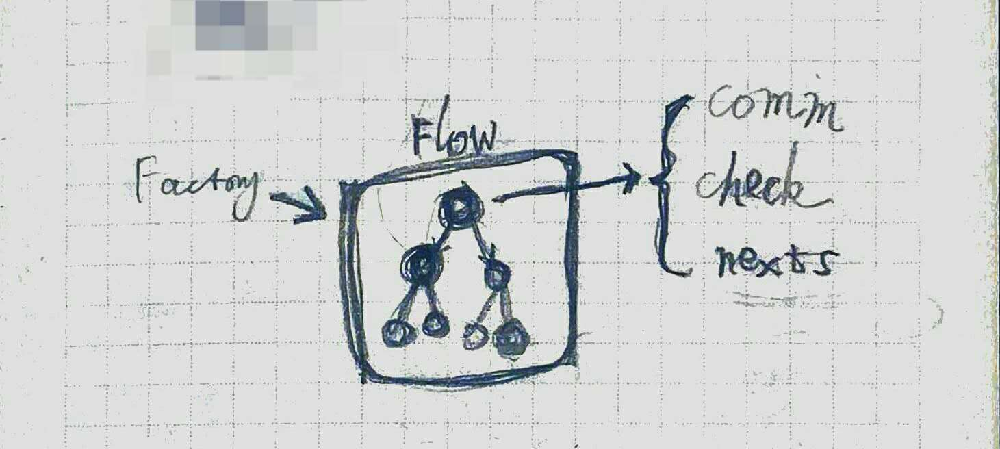

# 关于协议通信的模版开发

- 
- 拥有 7 个结点的伪代码
``` js
// 0 开始结点：写 ID
node_write_id = new WriteId();
// 0 写 ID -> 00 成功：读 ID，01 失败：再写 ID
[node_read_id, node_write_id_again] = 
  node_write_id.pass(new NodeReadId()).fail(new NodeWriteIdAgain());
// 00 读 ID -> 000 成功结束，001 失败结束
node_read_id.pass(new NodePassed()).fail(new NodeFailed());
// 01 再写 ID -> 010 成功结束，011失败结束
node_write_id_again.pass(new NodePassed()).fail(new NodeFailed());
```
- 结点代码
``` js
class WriteSwitch extends FlowNode {
  async run() {
    this.timeout = this.timeoutSetting();
    this.comm.onReadLine(this.readListener);
    this.write();
  }

  write() {
    this.comm.write(this.sendMsg);
  }

  roundFailed() {
    this.failNode.run();
  }

  roundPass() {
    this.passNode.run();
  }

  timeoutSetting() {
    return setTimeout(() => {
      this.comm.removeReadLine(this.readListener);
      this.roundFailed();
    }, 1000);
  }

  readListener(buf) {
    this.comm.removeReadLine(this.readListener);
    clearTimeout(this.timeout);
    if (checkPassed()) {
      this.roundPass();
    } else {
      this.roundFailed();
    }
  }
}
```

- 过往总结
  - 同一总体协议上，均为大量单次来回传递信息
  - tcp, udp, serialport, blue tooth 本质相同
- 问题
  - 与通信方式过于耦合
  - 难以重复利用
- 目标
  - 解耦单次信息
  - 易于测试
  - 易于组合
- 解决方案
  - 单独结点开发
    - 可参考 tensorflow 结点
  - 树状拼接
  - 共用内容使用 context
    - 如 context.comm 为通信手段
    - 可参考 aps.net core pipline 相关内容

ref:
- tensorflow
- aps.net core pipline
