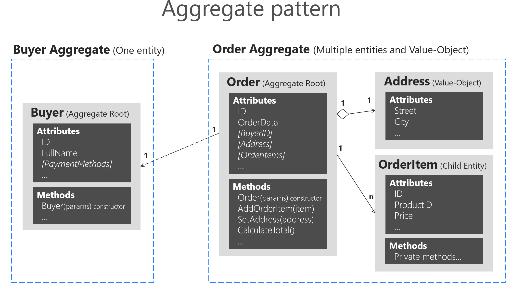
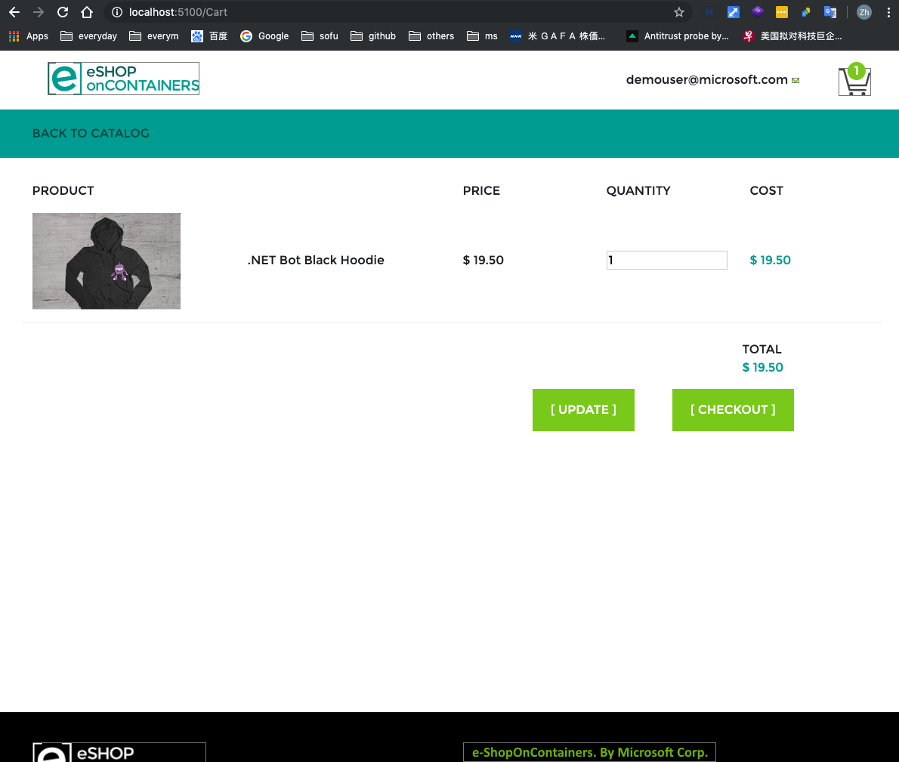
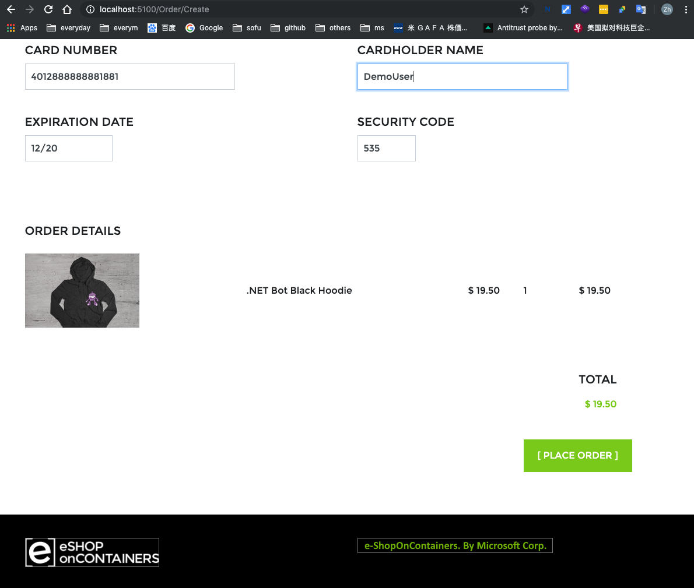
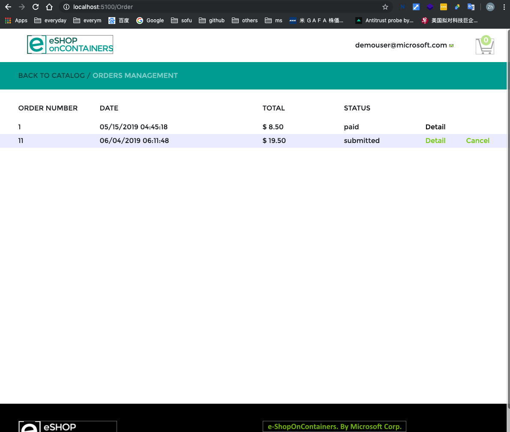
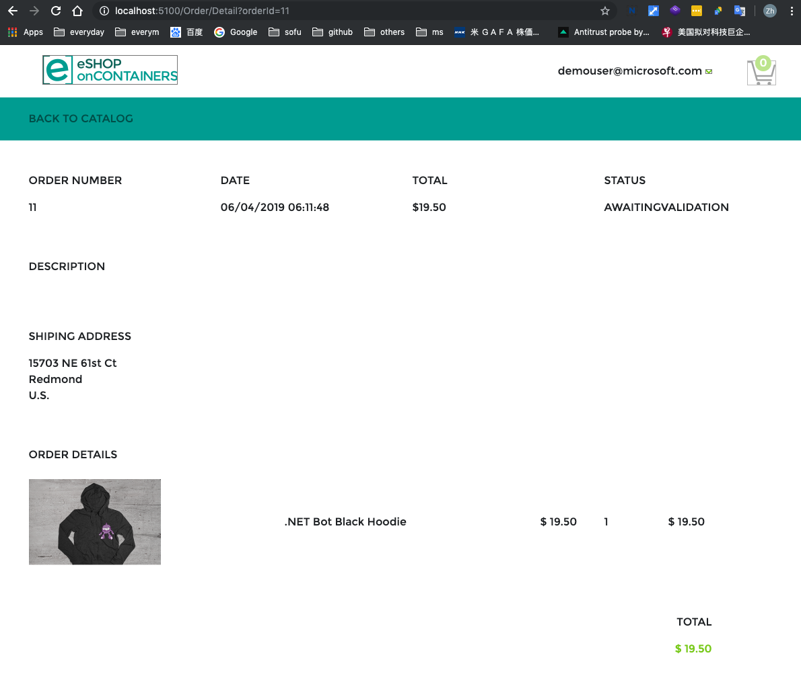
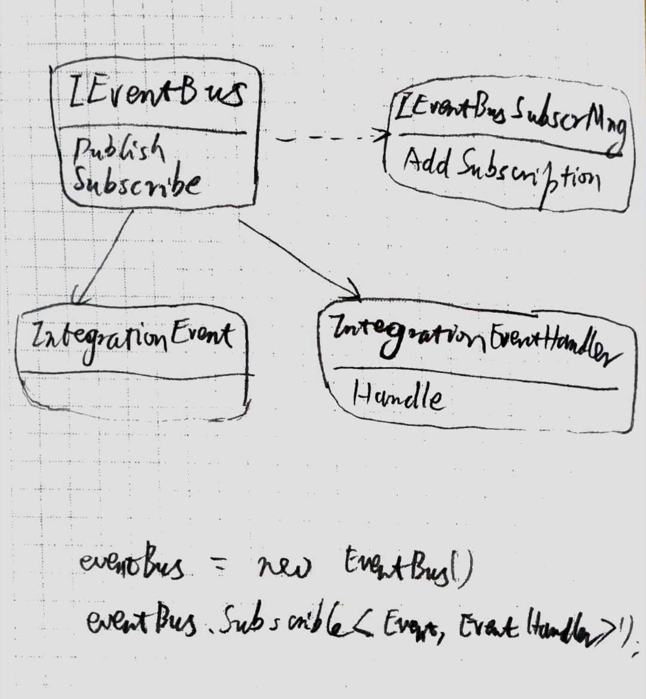

# eShopContainer Learning
### learning examples form micosoft

## Preparing
### set up
- if on mac, please set `IdentityUrl` in `docker-compose.override.yml`
``` yml
IdentityUrl=http://docker.for.mac.localhost:5105
# Local Mac: Use http://docker.for.mac.localhost:5105
# || Local Windows:  Use 10.0.75.1 in a "Docker for Windows" environment, if using "localhost" from browser.
# || Remote access: Use ${ESHOP_EXTERNAL_DNS_NAME_OR_IP} if using external IP or DNS name from browser.
```
- While `microsoft/mssql-server-linux` is not inited correctly after `docker-compose up`, please rm it and `docker-compose` again.

### compare with commits to understand the dev process
- `git log --skip 3000` to get the commits list needed
- `git checkout 8cc57c25421d9` to check out the node for clean comparing by vs code git history tools

## Learning
### Day 1 - Aggrgate & SeedWork
- DDD only found in Ordering Service



### Day 2 - procession on order

```
webmvc

1
  -> cart.controller.index
  -> cart.view.index [checkout]

2
  -> cart.controller.index.post
  -> order.controller.create
  -> basket.service.getOrderDraft
    ->> api.purchase.getOrderDraft
      ->>> orderClient.GetOrderDraft
  -> order.view.create [place order]

3
  -> order.controller.checkout
  -> basket.service.checkout
    ->> api.basket.CheckoutBasket
      ->>> eventBus.publish(checkoutEvent)
  -> order.view.index [detail]
```

  
  
  
  

### Day 3
- Domain Event 在 context.save 中 publish
- CQRS 是 await 到 query 或 command 结果
- 以上两者，均采用 mediatR

### Day 4
- add buyer
```
Order

-> ValidateOrAddBuyerAggregateWhenOrderStartedDomainEventHandler
  -> buyer.VerifyOrAddPaymentMethod
  -> buyerRepo.Save
  -> orderingIntegrationEventService.AddAndSaveEventAsync
```

### Day 5
- about EventBus



- unusual `AutoFac` Interface Setting on eventBus in `Ordering.API` project

``` cs
// ApplicationModule.cs

builder
  .RegisterAssemblyTypes(typeof(CreateOrderCommandHandler).GetTypeInfo().Assembly)
  .AsClosedTypesOf(typeof(IIntegrationEventHandler<>))
```

``` cs
// Startup.cs

private void ConfigureEventBus(IApplicationBuilder app)
{
    var eventBus = app.ApplicationServices.GetRequiredService<IEventBus>();

    eventBus.Subscribe<OrderStatusChangedToAwaitingValidationIntegrationEvent, OrderStatusChangedToAwaitingValidationIntegrationEventHandler>();
    eventBus.Subscribe<OrderStatusChangedToPaidIntegrationEvent, OrderStatusChangedToPaidIntegrationEventHandler>();

    ......
}
```

- about init in `Startup.cs`
  - `EventBusRabbitMQ`: AddSingleton
  - `MediatR`: registered in MediatorModule, not need to set singleton


### Day 6
- 从购物车中 checkout
```
UserCheckoutAcceptedIntegrationEventHandler
  -> mediator.send CreateOrderCommand

CreateOrderCommandHander.Handle
  -> orderingIntegrationEventService.AddAndSaveEventAsync
  -> orderReposity.Add

In TransactionBehaviour
    -> ordringIntegrationEventService.PulishEventsThroughEventBusAsync
```


### Day 7
- DDD layers


- Services Are in Gateway

### Day 8
- generating api controller for ef context
  - [Scaffolding ASP.NET Core API Controllers](https://mattmillican.com/blog/aspnetcore-controller-scaffolding)
  - [Add a model to a Razor Pages app in ASP.NET Core](https://docs.microsoft.com/en-us/aspnet/core/tutorials/razor-pages/model?view=aspnetcore-2.2&tabs=visual-studio-code)
  - [Add a model to an ASP.NET Core MVC app](https://docs.microsoft.com/en-us/aspnet/core/tutorials/first-mvc-app/adding-model?view=aspnetcore-2.2&tabs=visual-studio-code)
- set config by service.configure
``` cs
// in startup.cs
services.Configure<CatalogSettings>(configuration);
```
``` cs
// in controller 
public CatalogController(IOptionsSnapshot<CatalogSettings> settings, ......)
```
- set api attributes by service.configure
``` cs
// in startup.cs
services.Configure<ApiBehaviorOptions>(options => {......});
```
``` cs
// in controller
[ApiController]
public class CatalogController : ControllerBase
```

### day 9
- 神奇的 docker-compose.yml
  - 如果一个 service 同时包含 image 和 build 参数，先后顺序是完全不同的两种用法，如下
``` yml
# 先从远程获取 image，行就结束。不行再新建 image
services:
 ordering-api-unit-test:
  image: ${REGISTRY:-eshop}/ordering-api-test:${TAG:-latest}
  build:
    dockerfile: src/Services/Ordering/Ordering.API/Dockerfile
```
``` yml
# 新建 image，并进行命名
services:
 ordering-api-unit-test:
  build:
    dockerfile: src/Services/Ordering/Ordering.API/Dockerfile
  image: ${REGISTRY:-eshop}/ordering-api-test:${TAG:-latest}
```


## ref
- [eShopOnContainers 知多少](https://www.jianshu.com/c/78c71ddcaeea)
- [领域驱动设计实践（战略篇）](https://gitbook.cn/gitchat/column/5b3235082ab5224deb750e02)
- [Writing Multitenant ASP.NET Core Applications](https://stackify.com/writing-multitenant-asp-net-core-applications/amp/)