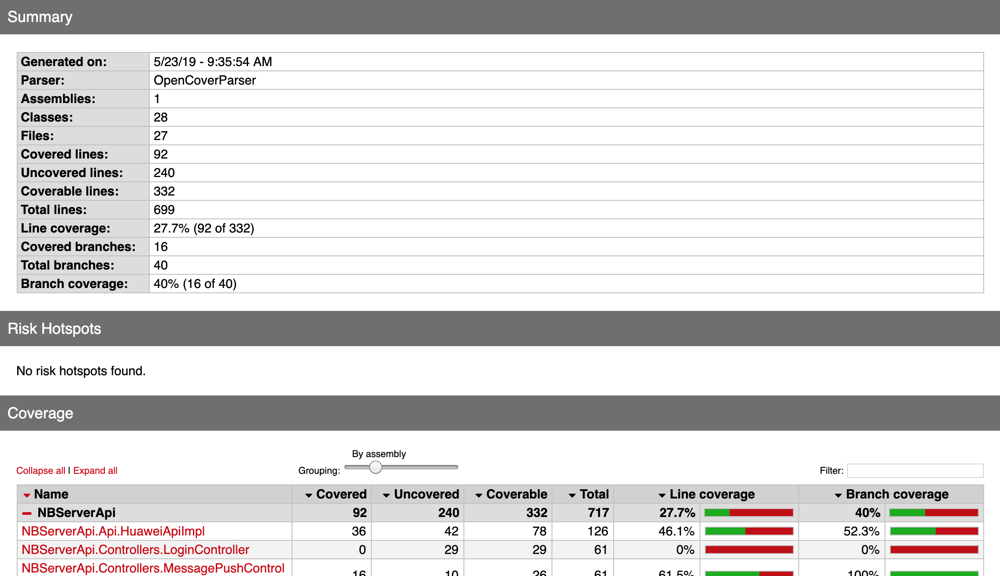

# Code Coverage on CSharp



## Init
- install [coverlet](https://github.com/tonerdo/coverlet)
- install [ReportGenerator](https://github.com/danielpalme/ReportGenerator)

## run
- gen opencover
``` bash
coverlet /path/to/test-assembly.dll --target "dotnet" --targetargs "test /path/to/test-project --no-build"  --exclude "[*]xunit.*"
```
- gen html
``` bash
reportgenerator "-reports:OpenCover.xml" "-targetdir:coveragereport"
```

## others
[Coverage report is not generated if there are any failing tests in the run scopes](https://github.com/tonerdo/coverlet/issues/37)