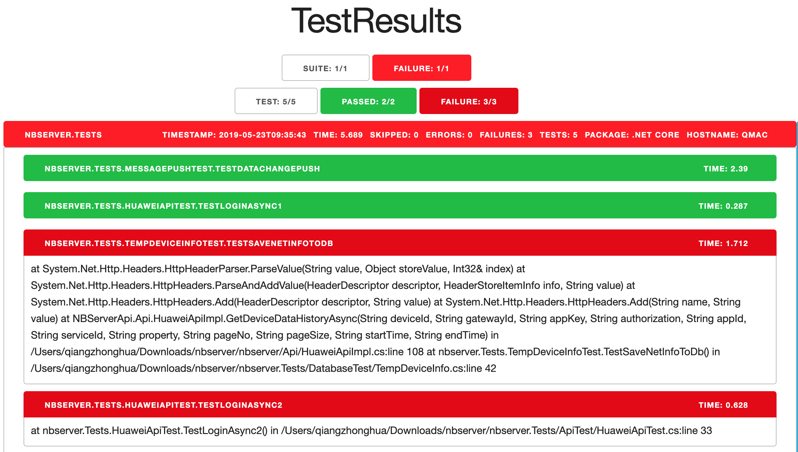

# Test Report on CSharp



## Problem
- can not get html test reports from `dotnet test --logger` directly

## Solution
- `trx -> junit -> html`
``` bash
dotnet test \
  -l "trx;LogFileName=testResult.trx"

trx2junit TestResults/TestResult.trx

junit-viewer \
  --results=TestResults \
  --saveFile=TestResults/TestResults.html
```

## Try and Failed
- `xunit.xml -> html`
- why failed
  - xuint-viewer only supports xunit.xml v1

## ref
- solution
  - [trx2junit](https://github.com/gfoidl/trx2junit)
  - [junit-viewer](https://www.npmjs.com/package/junit-viewer)
- try & failed
  - [Reporting test results - dotnet test](https://github.com/Microsoft/vstest-docs/blob/master/docs/report.md)
  - [xunit test logger](https://github.com/spekt/xunit.testlogger)
  - [xunit-viewer](https://github.com/lukejpreston/xunit-viewer)
