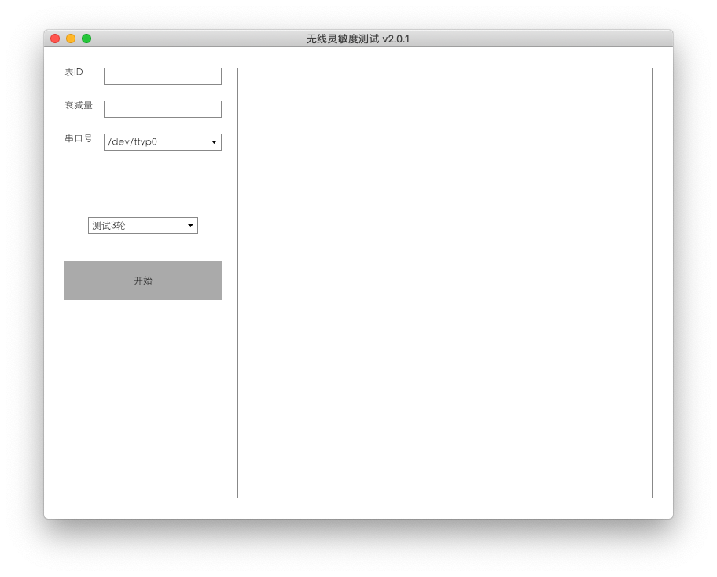

# AvaloniaUI SerialPort WinExe



- [AvaloniaUI SerialPort WinExe](#AvaloniaUI-SerialPort-WinExe)
  - [Avalonia UI](#Avalonia-UI)
    - [Get Control](#Get-Control)
    - [Font Family](#Font-Family)
    - [Window Size](#Window-Size)
    - [No sroll api for textbox to scroll](#No-sroll-api-for-textbox-to-scroll)
    - [Message Box](#Message-Box)
    - [Publish WinExe](#Publish-WinExe)
    - [Not easy to add a loading image](#Not-easy-to-add-a-loading-image)
  - [SerialPort](#SerialPort)
    - [Mono Ports classes](#Mono-Ports-classes)
    - [No virtual ports on Mac](#No-virtual-ports-on-Mac)
  - [Pack in one Exe file](#Pack-in-one-Exe-file)
    - [warp-packer](#warp-packer)
    - [editbin to hide console](#editbin-to-hide-console)
  - [Others](#Others)

## Avalonia UI
### Get Control
``` cs
// MainWidows.xaml.cs

_portsCombo = this.Get<ComboBox>("PortsCombo");
```

### Font Family
``` xml
<!-- MainWindow.xaml -->

<Window xmlns="https://github.com/avaloniaui"
        ......
        FontFamily="Heiti SC"
        ...... >
```
- 如不设置 Mac 上中文乱码
  - [苹果默认字体是什么？](https://blog.csdn.net/u010850094/article/details/51525144)

### Window Size
- 有效设置
``` cs
// MainWidows.xaml.cs

public MainWindow()
{
    InitializeComponent();
    #if DEBUG
        this.AttachDevTools();
    #endif
    this.Width = 800;
    this.Height = 600;
}
```
- 不知为何以下设置无效
``` xml
<!-- MainWindow.xaml -->

<Window xmlns="https://github.com/avaloniaui"
        ......
        mc:Ignorable="d" d:DesignWidth="800" d:DesignHeight="450"
        ...... >
```

### No sroll api for textbox to scroll
- [Is there any api for textbox to scroll to bottom in multi lines?](https://github.com/AvaloniaUI/Avalonia/issues/2722)

### Message Box
- 无官方，使用第三方
    - [MessageBox.Avalonia](https://gitlab.com/maindlab/messagebox.avalonia)
    - [Add WindowStartupLocation.CenterOwner](https://gitlab.com/maindlab/messagebox.avalonia/merge_requests/3/diffs)

### Publish WinExe
``` xml
<!-- xxx.csproj -->

<Project Sdk="Microsoft.NET.Sdk">
  <PropertyGroup>
    <OutputType>WinExe</OutputType>
    ......
  </PropertyGroup>
......
```

### Not easy to add a loading image
- not easy

## SerialPort
### Mono Ports classes
- System.IO.Ports only supports on window, which supports linux in dotnet core 3.0 as well. No Mac.
- Luckily, We can copy the mono System.IO.Ports classes, which base on Mono.Posix.NETStandard, to our dotnet standard project.
- It works.
    - [.NET Core - Use System.IO.Ports.SerialPort in visual studio code](https://stackoverflow.com/questions/42711396/net-core-use-system-io-ports-serialport-in-visual-studio-code?rq=1)
    - [Serial Port support on Unix/OSX](https://github.com/dotnet/corefx/issues/18012)
    - [mono/mcs/class/System/System.IO.Ports/](https://github.com/mono/mono/tree/master/mcs/class/System/System.IO.Ports)
    - [Mono.Posix.NETStandard](https://www.nuget.org/packages/Mono.Posix.NETStandard/)

### No virtual ports on Mac
- no

## Pack in one Exe file
### warp-packer
- [warp](https://github.com/dgiagio/warp#windows-1) worked
  - [Creating a small single self-contained executable out of a .NET Core application](https://www.hanselman.com/blog/BrainstormingCreatingASmallSingleSelfcontainedExecutableOutOfANETCoreApplication.aspx)
- [CoreRT](https://blog.miniasp.com/post/2019/01/30/How-to-use-CoreRT-SCD-compile-your-NET-Core-App) did not work
  - [Publish .NET Core App As Portable Executable](https://stackoverflow.com/questions/50703578/publish-net-core-app-as-portable-executable)

### editbin to hide console
- `editbin` worked which is in `"C:\Program Files (x86)\Microsoft Visual Studio\2017\BuildTools\VC\Tools\MSVC\14.16.27023\bin\Hostx64\x64"` on my pc.
- [Hide console window for self contained .NET Core application](https://github.com/AvaloniaUI/Avalonia/wiki/Hide-console-window-for-self-contained-.NET-Core-application)

## Others
- [The Story About .NET Cross Platform UI Frameworks](https://blog.lextudio.com/the-story-about-net-cross-platform-ui-frameworks-dd4a9433d0ea)


