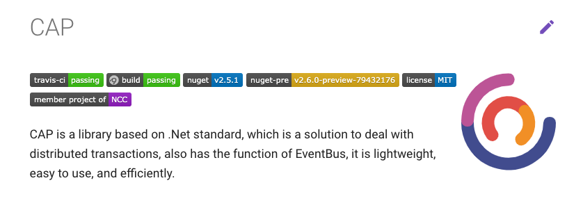

# Cap Integration Test


## Use in MemoryWebApplicationFactory
``` cs
// MemoryWebApplicationFactory.cs

public class MemoryWebApplicationFactory :
        WebApplicationFactory<MemoryStartup>
{
    protected override IWebHostBuilder CreateWebHostBuilder()
    {
        return WebHost.CreateDefaultBuilder()
            .UseStartup<MemoryStartup>();
    }

    protected override void ConfigureWebHost(IWebHostBuilder builder)
    {
        builder.UseContentRoot(".");
        base.ConfigureWebHost(builder)
        ......
    }
}
```

## Use in Memory Queue in a memory start up file
``` cs
// MemeoryStartup.cs

public void ConfigureServices(IServiceCollection services)
{
    services.AddCap(x =>
    {
        x.UseInMemoryStorage();
        x.UseInMemoryMessageQueue();
    });
}
```

## run publish from services in test
``` cs
// MeterDataTest.cs

public MeterDataTest(MemoryWebApplicationFactory factory)
{
    _factory = factory;
    _client = factory.CreateClient();
    _capBus = factory.Server.Host.Services
        .GetService(typeof(ICapPublisher)) as ICapPublisher;
    ......
}

[Fact]
public async Task MeterDataArrivedIntegrationEvent()
{
    // arrange
    var @event = new NBMeterDataArrivedIntegrationEvent();
    // action
    await _capBus.PublishAsync(
        nameof(NBMeterDataArrivedIntegrationEvent), @event);
    Thread.Sleep(300);
    // assert
    Assert.Equal(1, _context.Datas.Count());
}
```

## ref
- [快速开始 - CAP](http://cap.dotnetcore.xyz/user-guide/zh/getting-started/quick-start/)
- [Integration tests in ASP.NET Core](https://docs.microsoft.com/en-us/aspnet/core/test/integration-tests?view=aspnetcore-2.2)
- [Set a New Startup File](https://github.com/aspnet/AspNetCore.Docs/issues/7063#issuecomment-414661566)