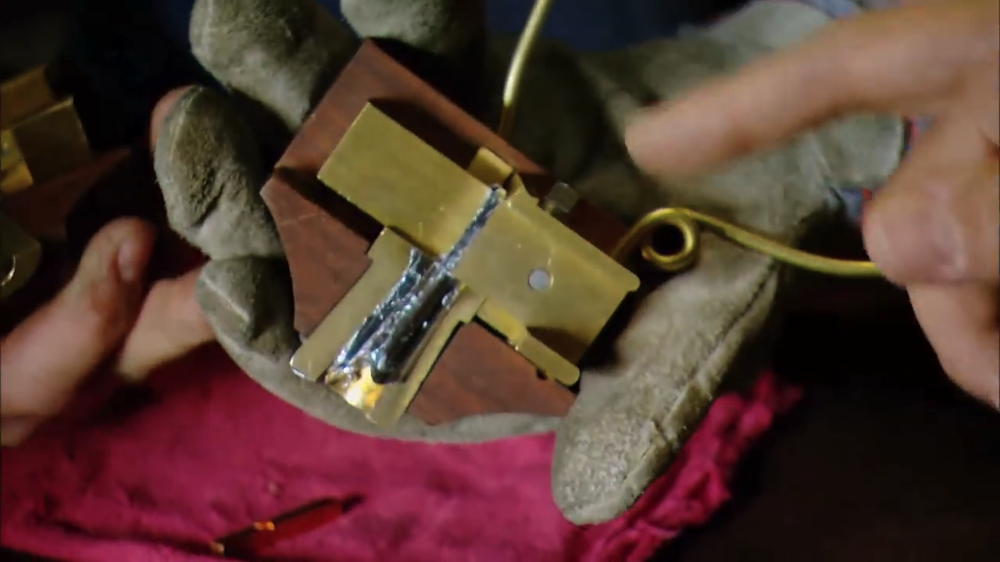
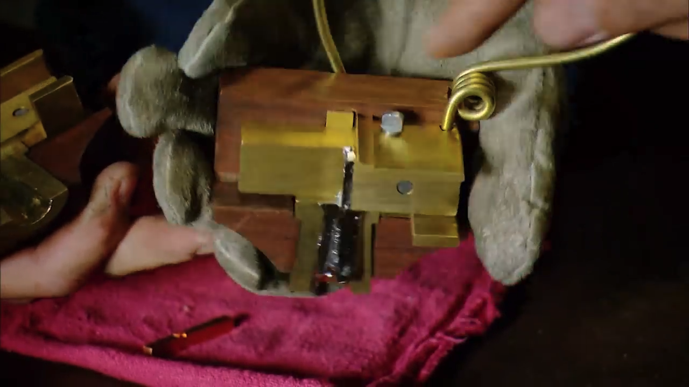
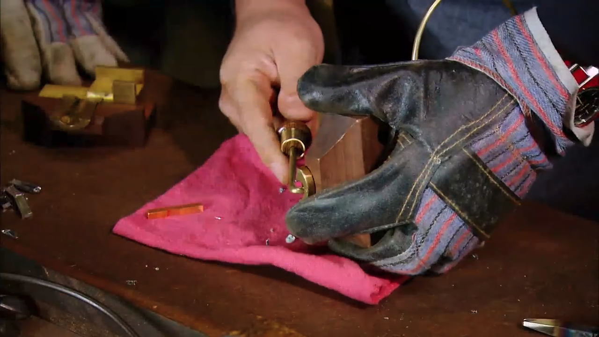
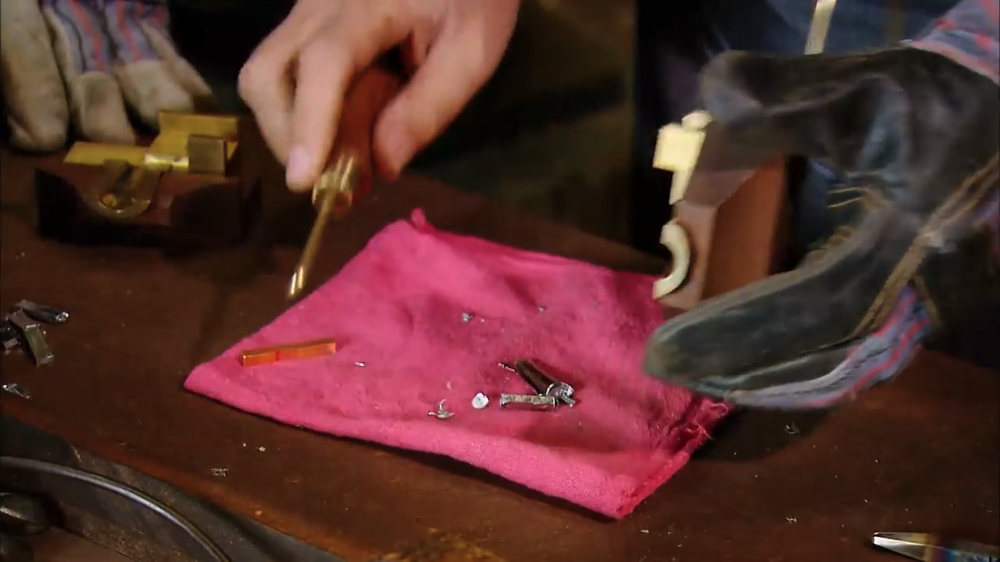
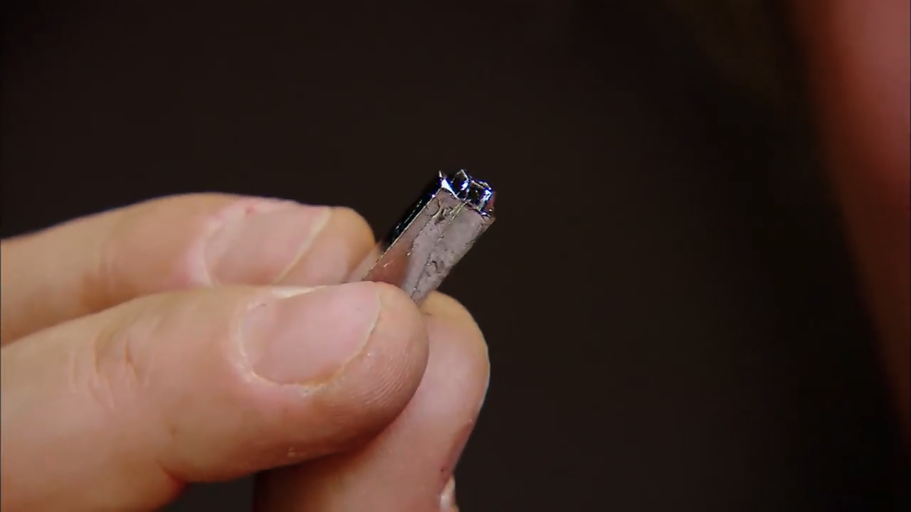
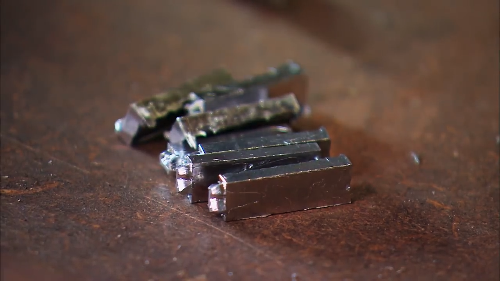
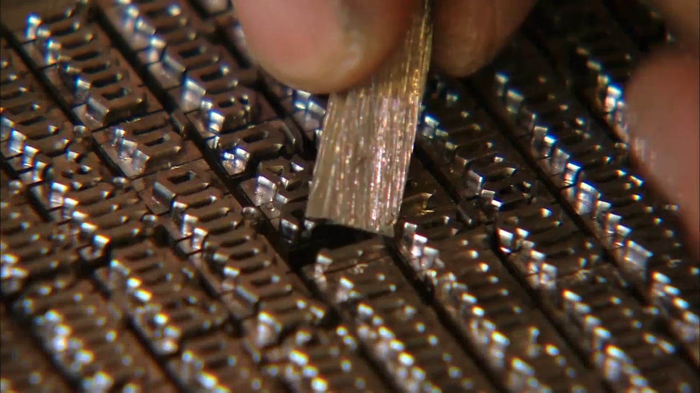
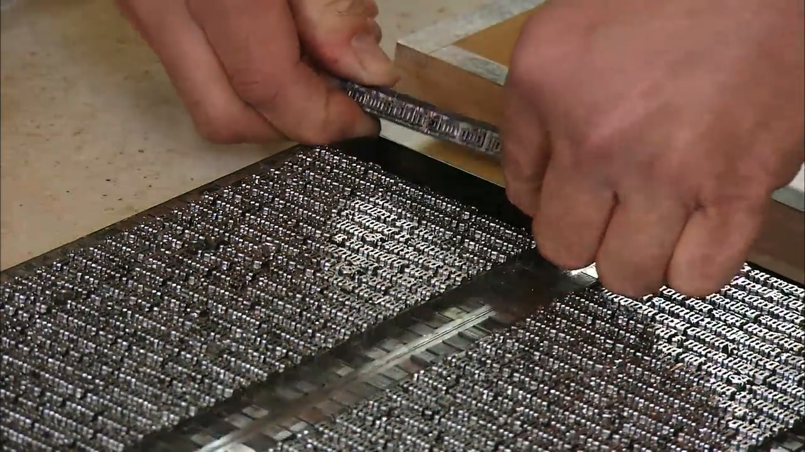
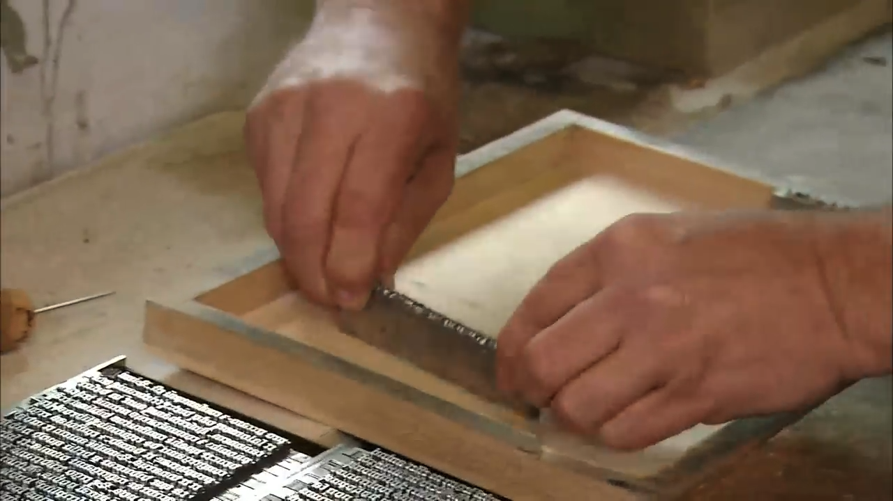
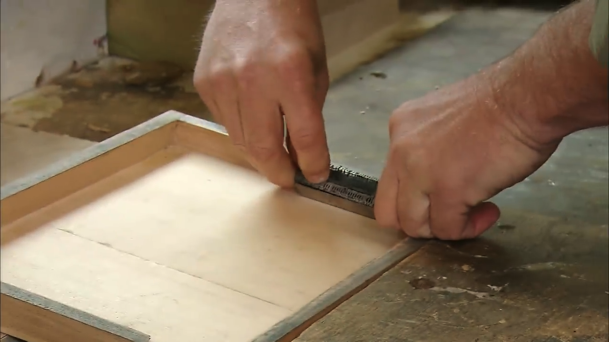

## [我看中國古代的活字印刷 - 辛德勇](https://mp.weixin.qq.com/s/ELFOexvCrWzbEaHeCqAJ8g)

> 一般來說，雕版印刷和活字印刷這兩者比較的結果是：
> 
> （1）合理而且成熟的活字印刷，譬如西夏和王禎的木活字印刷，其出版速度是一定要高於雕版印刷的。王禎講他用木活字試印旌德縣的志書，“約計六萬餘字，不一月而百部齊成”，這顯然是在誇耀其印刷效率之高，而與之對比的衹能是世所通行的雕版印刷。
> 
> （2）合理而且成熟的木活字印刷，其成本應明顯低於雕版印刷，故明後期至清朝在一定範圍內行用木活字印刷時，一些人往往會因缺乏財力雕版印行，不得已而會姑且以活字排印。如嘉道間人李兆洛即自言“所輯《古今地名通釋》已略就緒，而卷帙煩重，寫之苦艱。又成《通釋編韻》一書，雖少减省，字尙五六十萬，寫之不易，刻之又無此力。擬爲活字板印五六十部，以為傳留之地。現在雕刻活字尙未施手，冬底當可卒業”。其無可奈何的心境是顯而易見的。而欲以擺印書籍的活字，寫信時“尚未施手”，到年底就可以刻成，也反映出當時雕鐫木活字的速度是很快的。
> 
> （3）在讀者和作者對書籍質量的要求這一方面，當然總是質量越高越受歡迎。若是不考慮印書用紙和裝幀形式，書籍的質量，大體可以劃分爲兩個方面。其中一個方面是文字內容的準確性，另一個方面是頁面文字的美觀性。
> 
> 在這兩方面，一般來說，就中國傳統的技術而言，活字印刷的質量都不如雕版印刷，而且往往會有很大差距。
> 
> 排印文字錯譌率很高，校對的難度比雕版印刷要大很多，是由於漢字排版的困難性所決定的。理想的排版印刷，要求排版工人具有相當的識字能力和文化水平，而這一點在中國古代社會是很難達到理想要求的。
> 
> 活字排印，要想充分保證人們期望於它的快捷性，就必然要犧牲掉頁面的美觀性，包括版面的平展和字行的齊整。畢昇以至王禎之前中原王朝控制區域所進行的活字印刷試驗，爲追求與雕版印刷近似的效果，不得不犧牲效率，從而實現不了活字印刷應有的作用，一直處於探索的狀態，未能真正進入實用階段。西夏和元代王禎的木活字印刷，因放棄對這種對頁面美觀性不切實際的追求，纔使活字印刷發揮實用的價值。
> 
> 進入這一階段以後，中國的活字印刷，在頁面美觀性這一方面，也已大大遜色於雕版印刷。
> 
> （4）前面第五節已經談到，整版雕鐫的書版能夠長期多次使用，隨時刷印新的書本，而活字印刷通常衹刷印一次拆散書版，若想重印就需要重排。中國古代印刷的書籍，其中有很大一部分是各個領域經典性的著述，特別是前代經典，重印的需求很普遍，也比較強烈；即使是一些當代流行面較小的著述，一般作者或出版者也希望能夠在日後有需求時能夠重刷再印。因此，在這方面，雕版印刷比活字印刷具有非常明顯的優勢。這實質上也可以看作是一種質量因素。黃永年先生認爲，“這就是在封建社會活字本取代不了刻本的唯一的原因”。
> 
> 中國古代的活字印刷，就是在這幾項因素的平衡作用下，進行着多種形式的探索和實際的應用。

## [The Machine That Made Us (Gutenberg Printing Press Documentary) | Timeline - youtube](https://www.youtube.com/watch?v=uQ88yC35NjI)

- 
- 
- 
- 
- 
- 
- 
- 
- 
- 
- 