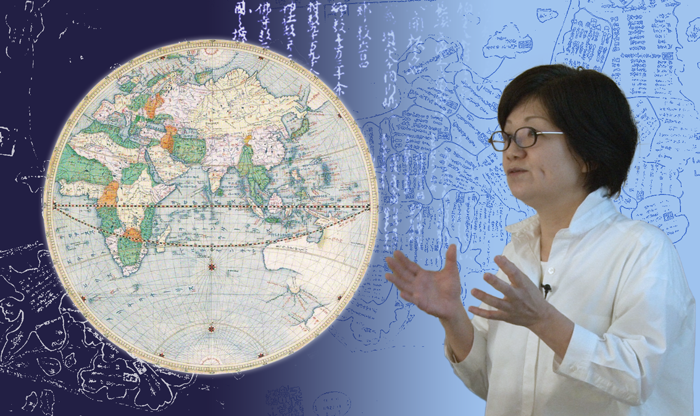
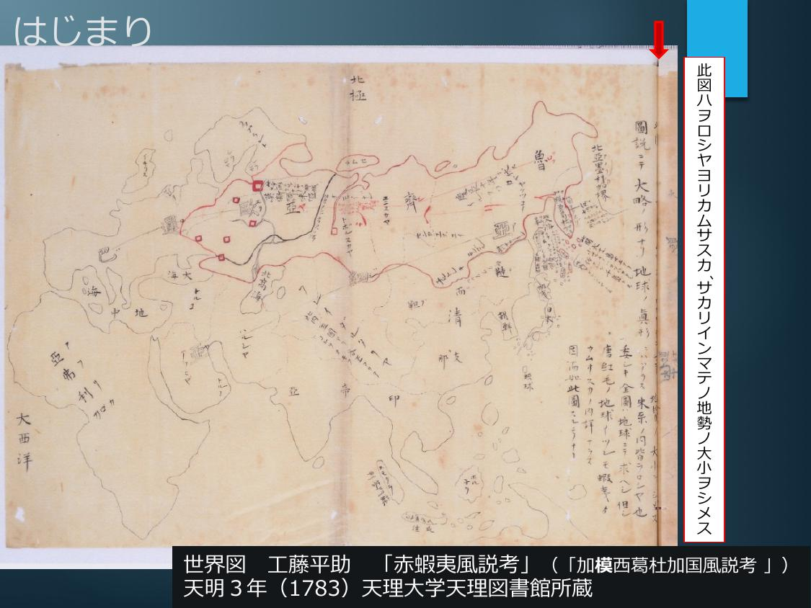
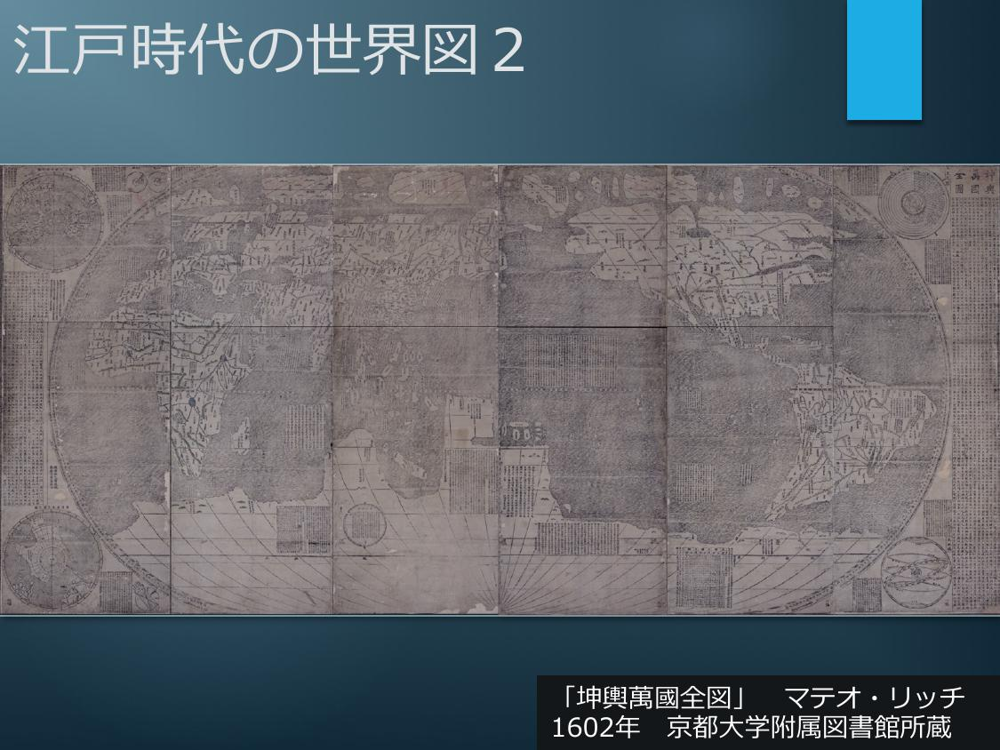
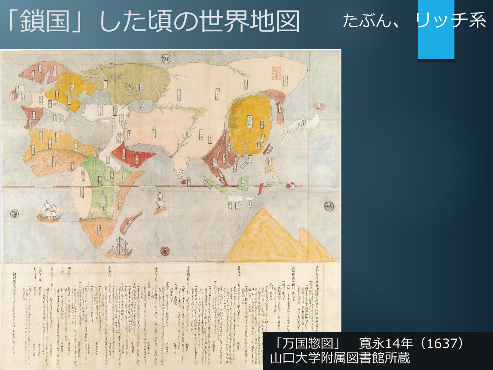
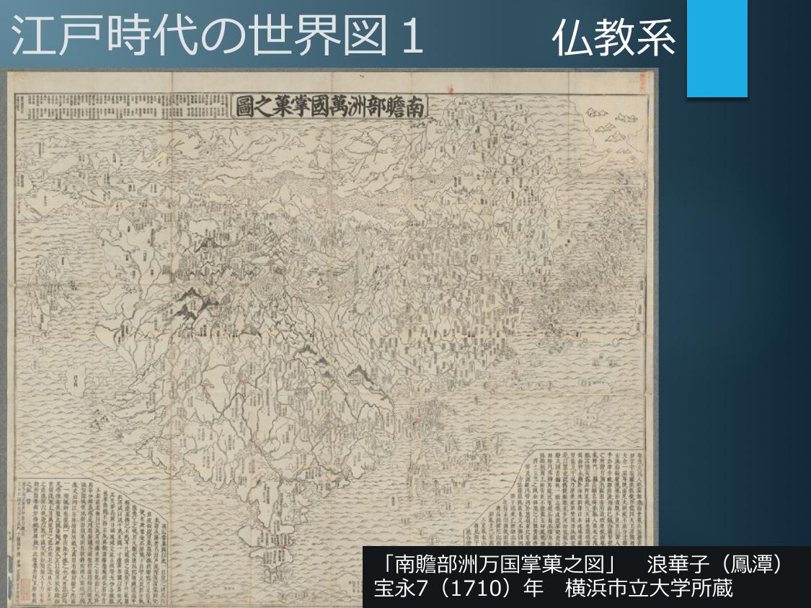
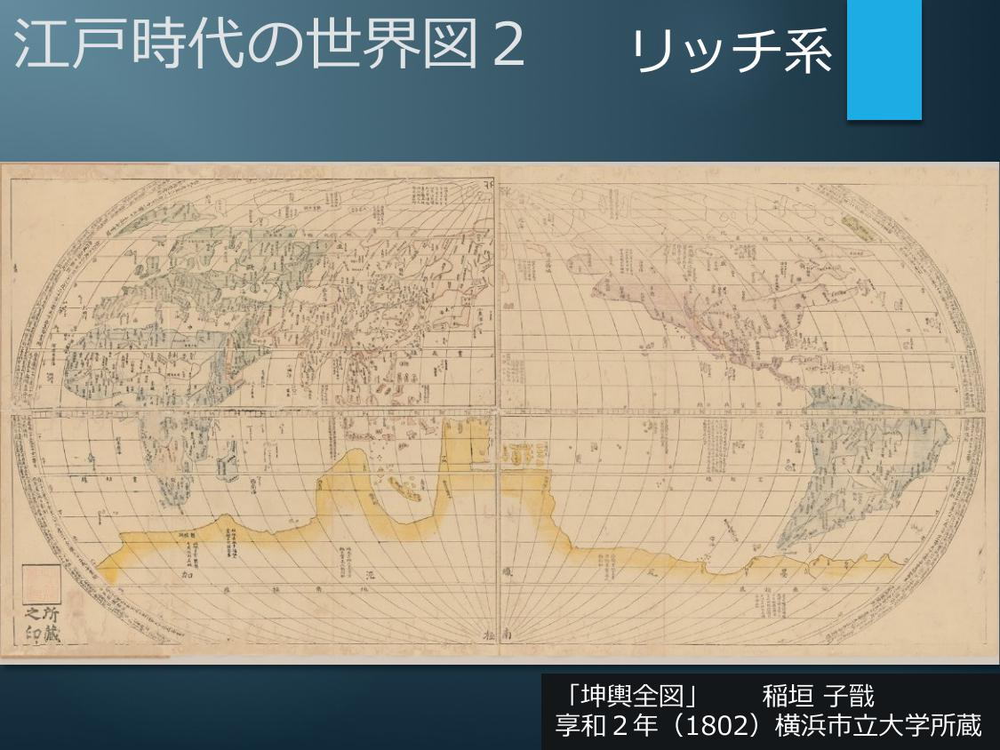
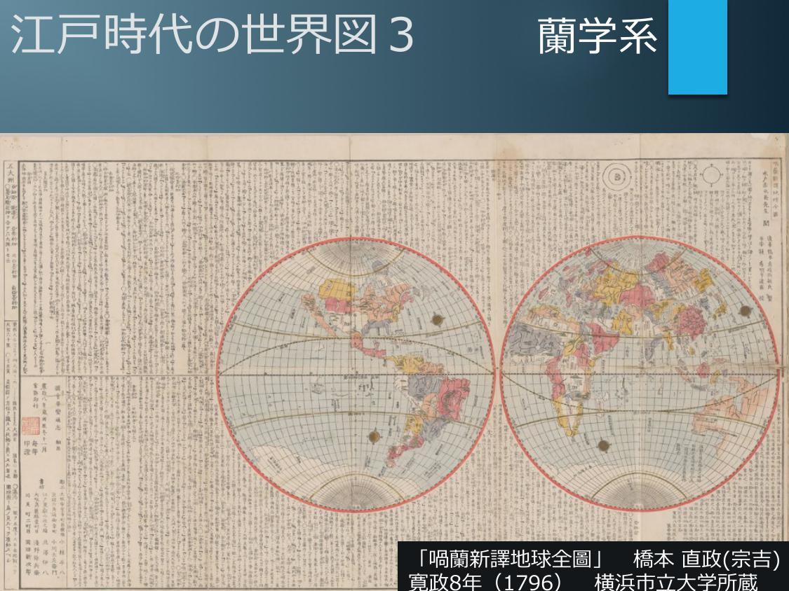

# 江戸時代の人びとは世界をどのように見ていたのだろうか

[KoALA - JAH001](https://koala.highedu.kyoto-u.ac.jp/courses/course-v1:KoALA+JAH001+2018_3T)

- [江戸時代の人びとは世界をどのように見ていたのだろうか](#江戸時代の人びとは世界をどのように見ていたのだろうか)
  - [Time Line](#time-line)
  - [はじまり](#はじまり)
  - [江戸時代の世界図 1& 2](#江戸時代の世界図-1-2)
  - [江戸時代の世界図 3](#江戸時代の世界図-3)
  - [ロシアを描いた日本初の地図](#ロシアを描いた日本初の地図)
  - [ロシアはなぜ巨大化したのか](#ロシアはなぜ巨大化したのか)
  - [ロシア出現の影響 ヨーロッパ概念の成熟：文明と未開](#ロシア出現の影響-ヨーロッパ概念の成熟文明と未開)
  - [ロシア出現の影響 中華的世界観の相対](#ロシア出現の影響-中華的世界観の相対)
  - [総合](#総合)

## Time Line
- 鎖国政策（1633-1854年）
    - 「万国惣図」（1637年）
    - 江戸時代の日本に存在した「仏教系」、「リッチ系」、「蘭学系」の世界地図（1700-1800年代）
- カムチャツカ半島でロシアに抑留されていたハンガリー人が、逃げて途中で日本に寄る（1770年代）
    - 工藤平助著『赤蝦夷風説考』（1783年）
    - 山村才助「訂正増訳采覧異言」（1802年）
    - 松平定信「秘録大要」（1808年）
    - 平田篤胤「古道大意」（1811年）
- ペリーが来航する（1853年）

## はじまり

- 天理大学附属天理図書館蔵の工藤平助著『赤蝦夷風説考』（1783年）に収められた世界地図に関して
  - 工藤平助の説明では、この世界地図以前に、ロシアやカムチャッカ半島、サハリンを詳細に描いた中国やヨーロッパの地図は、存在しなかった。
  - この世界地図は、工藤平助が描いたオリジナルの図を模写したものである。

## 江戸時代の世界図 1& 2

- マテオ・リッチ作の「坤輿萬國全図」に関して
  - 「坤輿萬國全図」は、1602年に出版された世界地図であり、その初版のうちの一つ（オリジナル）が、京都大学附属図書館に所蔵されている。
  - 「坤輿萬國全図」は、イタリア人宣教師であるマテオ・リッチが作った世界地図ではあるが、その構図には、中華思想が反映されていると考えられている。
  - 「坤輿萬國全図」は、出版直後に中国から日本に伝来しており、江戸時代の日本で作成された他の世界地図に対して、極めて大きな影響を与えた。

## 江戸時代の世界図 3

- 「万国惣図」（1637年）に関する説明として
  - 長崎で描かれ、将軍にも献上されたとされる。
  - 徳川家光が鎖国政策（1633-1854年）を検討する上で、参照された可能性があるとされている。
  - 地図の下部に、日本と関係の深い諸地域に関する情報が記されている。

- 江戸時代の日本に存在した「仏教系」、「リッチ系」、「蘭学系」の世界地図、それぞれを説明した文章として
  - 仏教系の世界地図は、インドを中心に、中国、日本という3つの国から世界が成り立っているという思想のもと描かれている。
  - リッチ系の世界地図では、太平洋が地図の中心に置かれている。
  - 蘭学系の世界地図は、18世紀初頭に書かれたのは、当時のロシア帝国の全容が描かれていなった。

## ロシアを描いた日本初の地図
- 工藤平助がロシアを描いた地図を作った背景にあった出来事として
  - カムチャッカ半島から逃れ、日本に立ち寄ったハンガリー人ベニョフスキーは、ロシアの脅威について警鐘を鳴らしたが、当時の蘭学者たちは、その警鐘を理解するための前提となる知識を持ち合わせていなかった。
  - それまで、蘭学者がいうところの「ルス」あるいは「ルッシャ」と、松前藩の住人がいう「ヲロシヤ」が同じ対象を指すと思われてはいなかった。
  - ロシアの拡張政策に備えようにも、それまでの地図には、ロシア、とりわけその極東地域に関する情報が欠けていた。

## ロシアはなぜ巨大化したのか
- 動画内で紹介された、工藤平助『赤蝦夷風説考』（1783年）におけるロシアに関する説明として
  - 交通網を整備し、物資の流通を促すことで富を築いた。
  - 元々ヨーロッパで興った国であるが、今ではヨーロッパからシベリア、樺太に至る地域を支配している。
  - シベリアでの反乱を収めただけでなく、同地の政治秩序を正しいものとしたため、同地の住民はロシアに服従することとなった。

## ロシア出現の影響 ヨーロッパ概念の成熟：文明と未開
- 山村才助に関する説明として
  - 新井白石の『采覧異言』を増補・改訂した人物。
  - 日本で初めて、ヨーロッパによる世界支配を指摘した人物
  - 世界各国との比較のなかで、日本の特異性を主張した人物

## ロシア出現の影響 中華的世界観の相対
- 動画内で説明されている内容として
  - 松平定信は「秘録大要」の中で、ロシアの強大さを指摘し、そのロシアを軽んじる態度に対して警鐘を鳴らしている。
  - 国学者である平田篤胤は、清に支配されている中国を指して「腰抜け」と評したが、これは、中華思想にもとづく世界観が変わってきたことの証左として捉えられる。
  - ロシアが「出現」する中で、日本人の世界観は、国外に対してのみならず、自国に対してもまた変化した。

## 総合
- 以下の記述のうち、本コース内で説明されたこととして
  - 過去を振り返ったとき、日本人のものの見方（価値観）は、世界からの刺激を受けて絶えず変わり続けてきたし、今後も変わり続けていくだろう。
  - ペリーが来航する（1853年）以前から、日本人が世界に目を向けるきっかけは存在しており、そのきっかけの一つがロシアの「出現」であった。
  - 多文化共生社会を生きる上で、価値観が常に変化するものであると意識することは、重要である。
