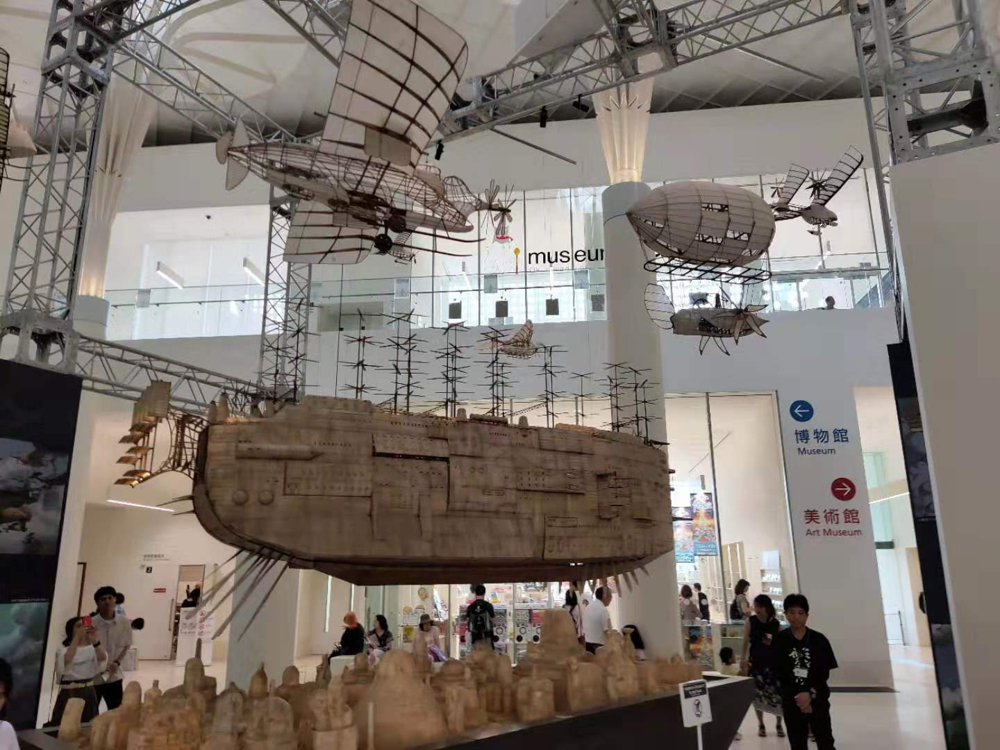
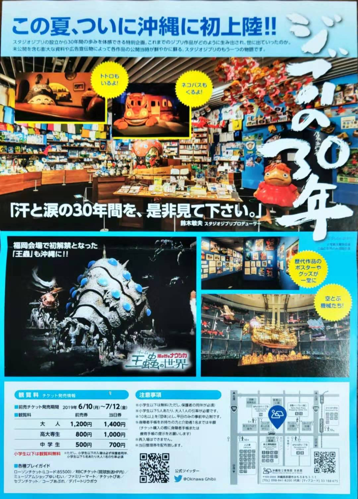
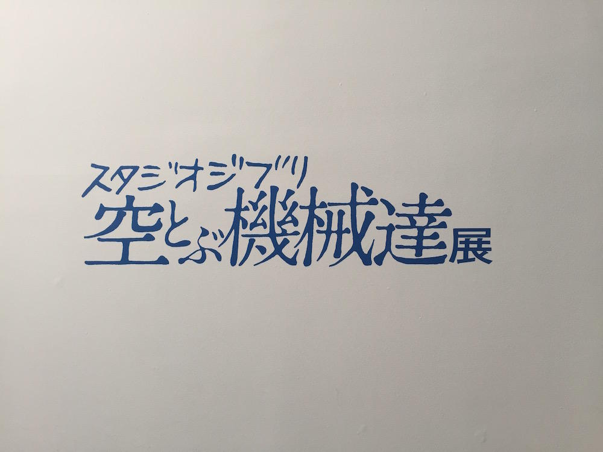
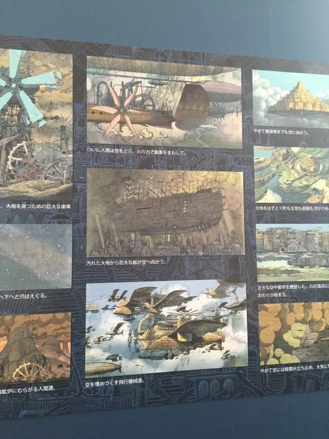
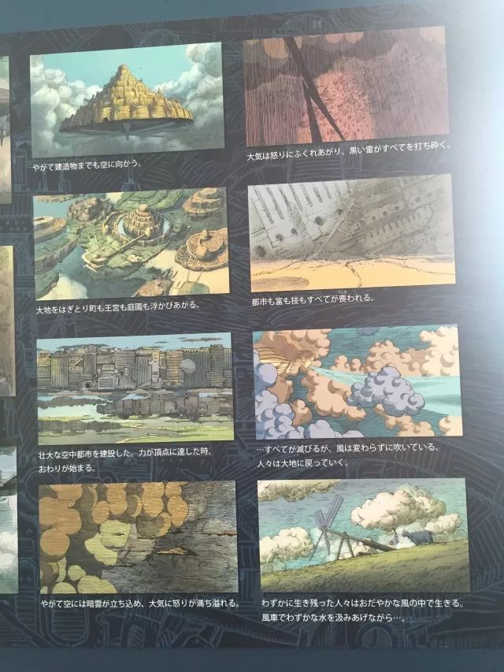
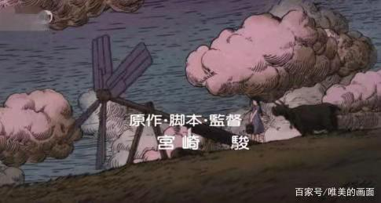
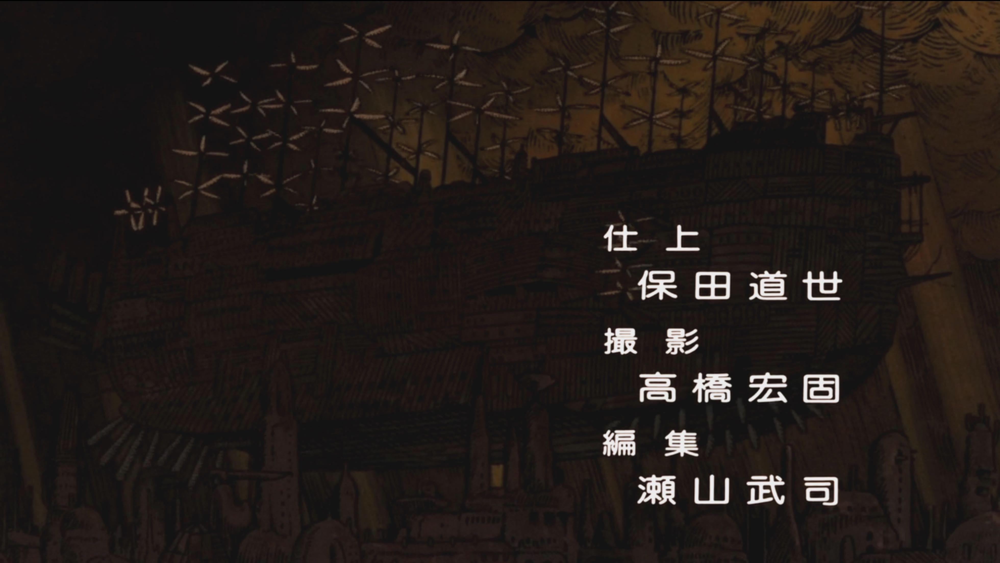

# 天空之船来自何处

- [天空之船来自何处](#天空之船来自何处)
  - [起](#起)
    - [巨大的飞船](#巨大的飞船)
  - [承](#承)
    - [三动画](#三动画)
    - [多地展出](#多地展出)
    - [宫崎骏的飞行器](#宫崎骏的飞行器)
    - [主题号](#主题号)
    - [无力的官方](#无力的官方)
    - [只是概念](#只是概念)
  - [转](#转)
    - [开头](#开头)
  - [合](#合)
    - [出现了](#出现了)

## 起

### 巨大的飞船

之前在冲绳县立博物馆举办的《吉卜力大博览会》参观，看到了这个，心想这是《天空之城》中的标致性的飞船吧。我根本没看过动画，所以回去要恶补一下。

## 承

### 三动画

一晃几个月过去了，终于有时间看一遍《天空之城》了，等看完了，又奇怪起来了，怎么没有发现这个飞船呢？想，当时也没看到会场对这个飞船的说明，可能是其他动画中的。

所以，按图索骥，又看了《风之谷》和《哈尔的移动城堡》，结果还是没有能找到这个飞船。奇了怪了，怎么回事。再用加速、快进、跳场景等等方法，再浏览一遍三部，还是一无所获。 现在只好求助，度娘了。

### 多地展出

发现这个博览会在，日本多地举办过，上海居然也举办过，《[带你逛上海吉卜力大展!《天空之城》巨大飞船漂浮在环球金融中心! ](https://www.sohu.com/a/238837244_523024)》。那就看看这些新闻和博客中都是怎么记载的吧。几乎无一例外的，都说这是天空之城中的飞船。但没一个能给出船名，或具体出处。

### 宫崎骏的飞行器

澎湃新闻的一片文章，有了一些暗示。《[宫崎骏的童年和幻想，都藏在这些飞行器中](https://www.thepaper.cn/newsDetail_forward_2349850)》认真的说明了宫崎骏的动画中的各种飞行器，还出给了具体名称和出自哪一部动画。但依然没有给出这个飞船的出处。这时，最合理的解释就是，这会不会是专为展出而设计的飞船呢。

> 一年后，《天空之城》上映。宫崎骏将城市放入了空中，大篇幅的故事都在飞行中发生，包括片中出现的“虎蛾号侦查风筝”、“泰格摩斯号侦查风筝”、“扑翼机”、 “空中战舰歌莉娅号”等，都是宫崎骏对其飞行梦想的描绘。

> 后来，他又根据自己的漫画作品《飞行艇时代》，改编为剧场动画《红猪》，其中出现的更为“专业“的飞行器”“卡地士R3C-0水上战斗机”、“萨我亚S-1试制战斗飞行艇”等。

### 主题号

《[吉卜力三十周年回顾展 快乘上“天空之城”号畅游宫崎骏的梦幻世界](http://art.ifeng.com/2016/0715/2976924.shtml)》，称其为“主题号”，度娘“主题号”，无解。

### 无力的官方

再看当时的海报，我居然还留着，hoho，上面也没有名字的。上[スタジオジブリ](http://www.ghibli.jp/)的官网，虽然有大博览会的相关信息，但是对搜索飞船而言，无帮助。

### 只是概念

继续度娘，《[吉卜力大展在六本木的上空召开](http://www.52toys.com/post/detail?id=1006781)》中称飞行展为：

继续乱搜，有了巨大的突破，终于看到了，这个飞船了。《[龙猫上映30周年纪念！吉卜力工作室中国首展来了！](http://sohu.com/a/236246849_502878)》

但这些场景，是那个动画？好像都没有啊。我想是概念图吧。那一部部动画搜搜看，说不定会有概念图

## 转

### 开头

度娘厉害了，[《天空之城》影评：宫崎骏创造的奇迹，无法超越的经典](https://baijiahao.baidu.com/s?id=1615195437551869631)

赶紧打开动画片头

## 合

### 出现了

一闪而过

哈哈，我是多无聊啊