# From Nand to Tetris

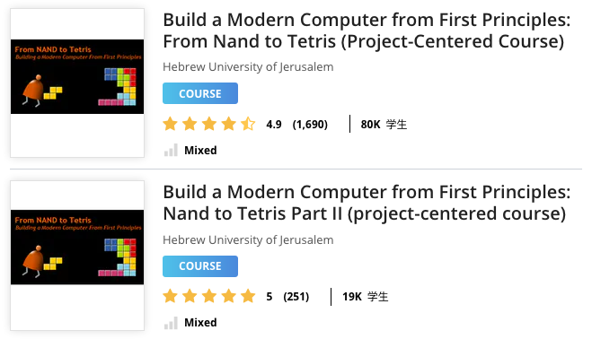

[From Nand to Tetris - Building a Modern Computer From First Principles](https://www.nand2tetris.org/)

- [From Nand to Tetris](#from-nand-to-tetris)
  - [Project 1: Boolean Logic](#project-1-boolean-logic)
  - [Project 2: Boolean Arithmetic - ALU](#project-2-boolean-arithmetic---alu)
  - [Project 3: Sequential Logic - Memory](#project-3-sequential-logic---memory)
  - [Project 4: Machine Language](#project-4-machine-language)
  - [Project 5: Computer Architecture](#project-5-computer-architecture)
  - [Project 6: Assembler](#project-6-assembler)
  - [Project 7: VM I: Stack Arithmetic](#project-7-vm-i-stack-arithmetic)
  - [Project 8: VM II: Program Control](#project-8-vm-ii-program-control)
  - [Project 9: High-Level Language](#project-9-high-level-language)
  - [Project 10: Compiler I: Syntax Analysis](#project-10-compiler-i-syntax-analysis)
  - [Project 11: Compiler II: Code Generation](#project-11-compiler-ii-code-generation)
  - [Project 12: Operating System](#project-12-operating-system)

## Project 1: Boolean Logic

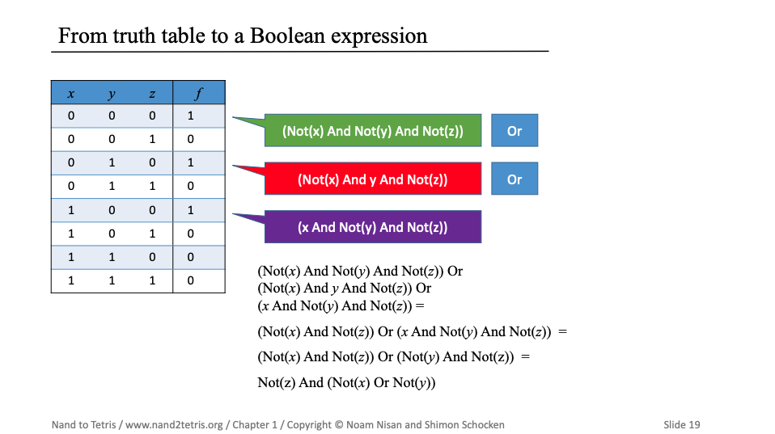

## Project 2: Boolean Arithmetic - ALU

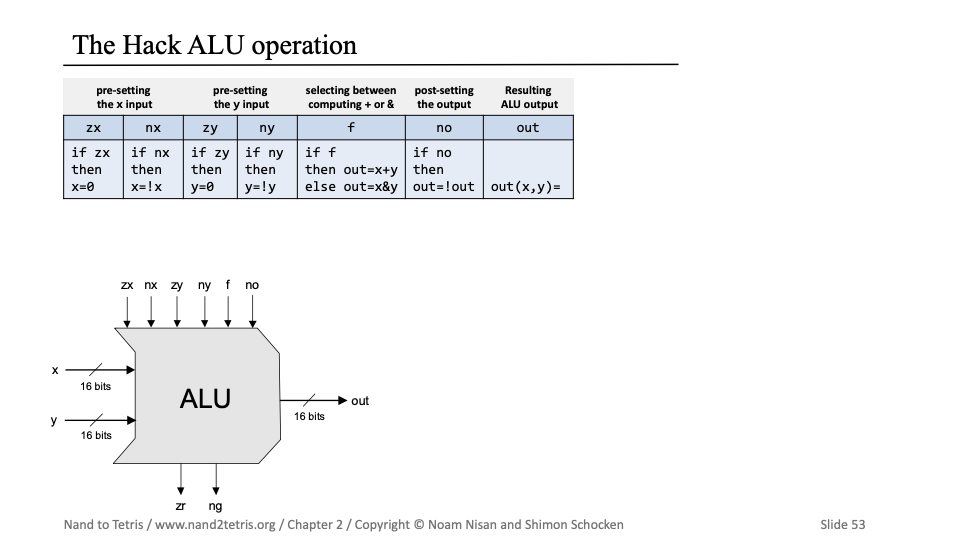  
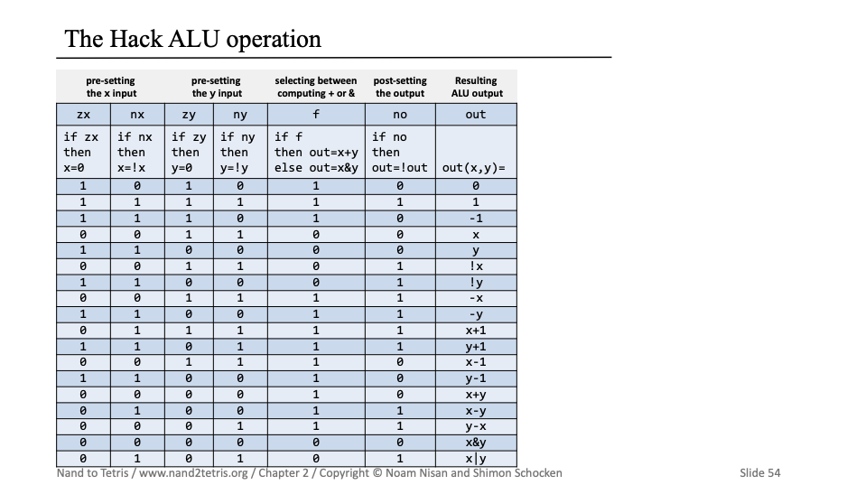  
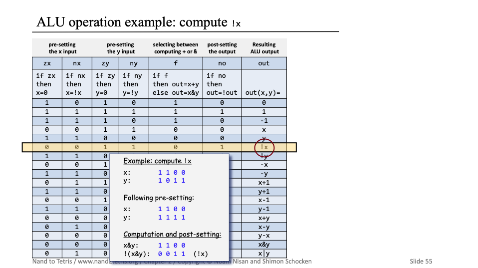  
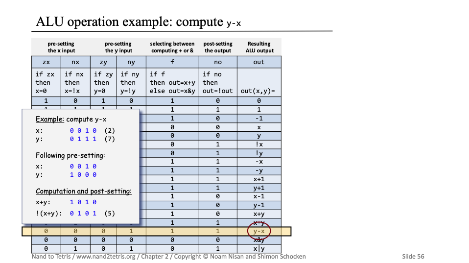  

## Project 3: Sequential Logic - Memory

- flip-flop -  触发器（延时器）
- 1-bit register - 寄存器
- Multi-bit register
- Random Access Memory (RAM) - 内存
- Counter - 计数器

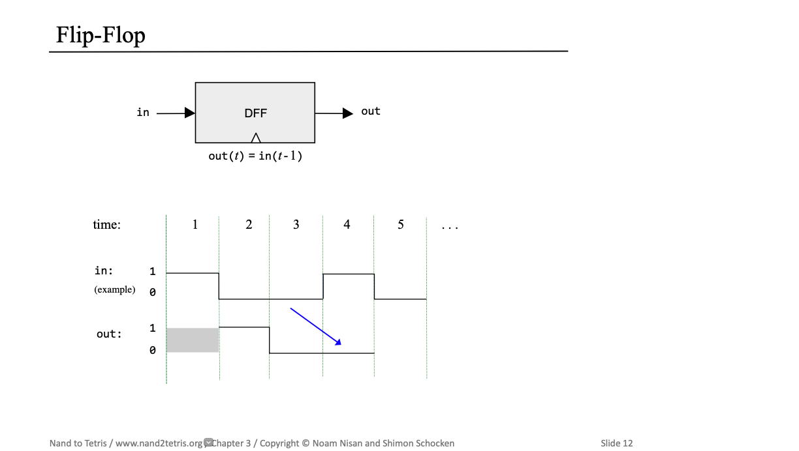  
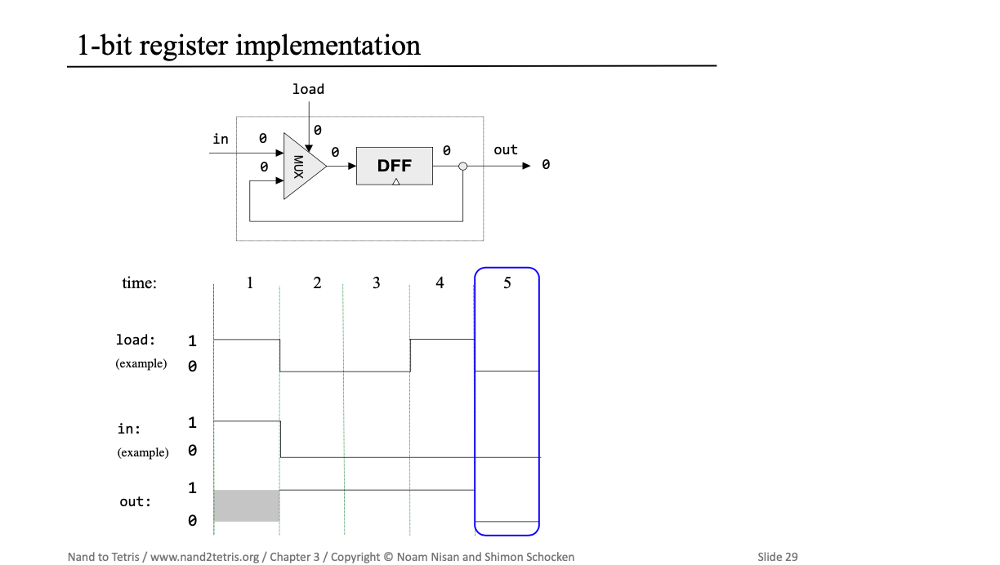  
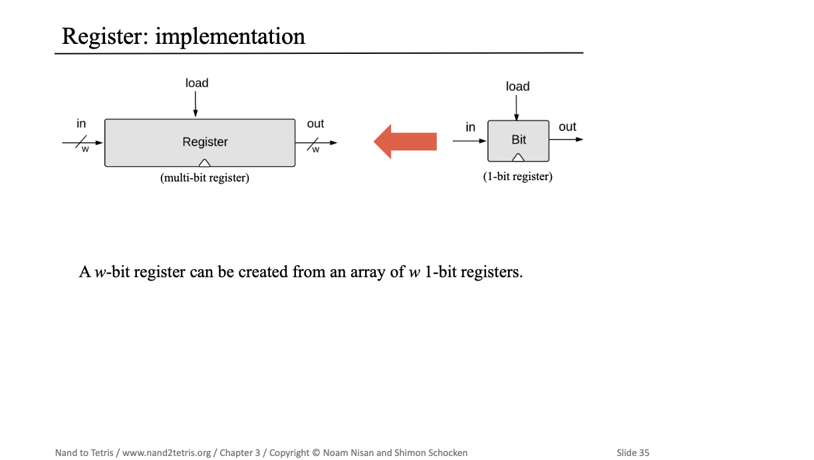  
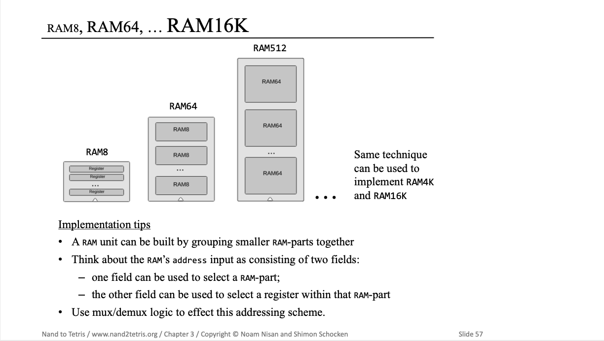  
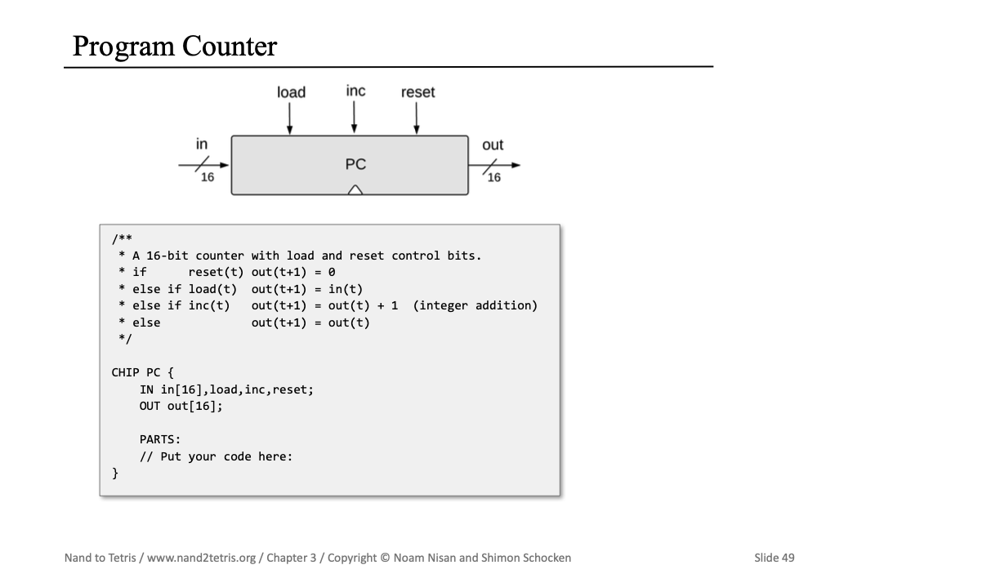  

## Project 4: Machine Language
## Project 5: Computer Architecture
## Project 6: Assembler
## Project 7: VM I: Stack Arithmetic
## Project 8: VM II: Program Control
## Project 9: High-Level Language
## Project 10: Compiler I: Syntax Analysis
## Project 11: Compiler II: Code Generation
## Project 12: Operating System