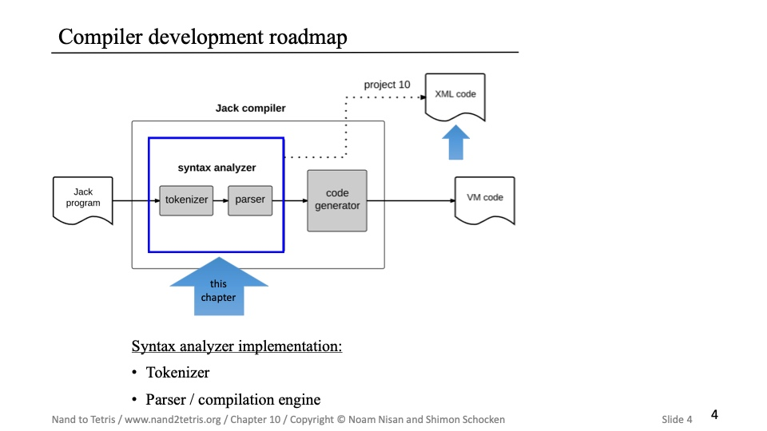
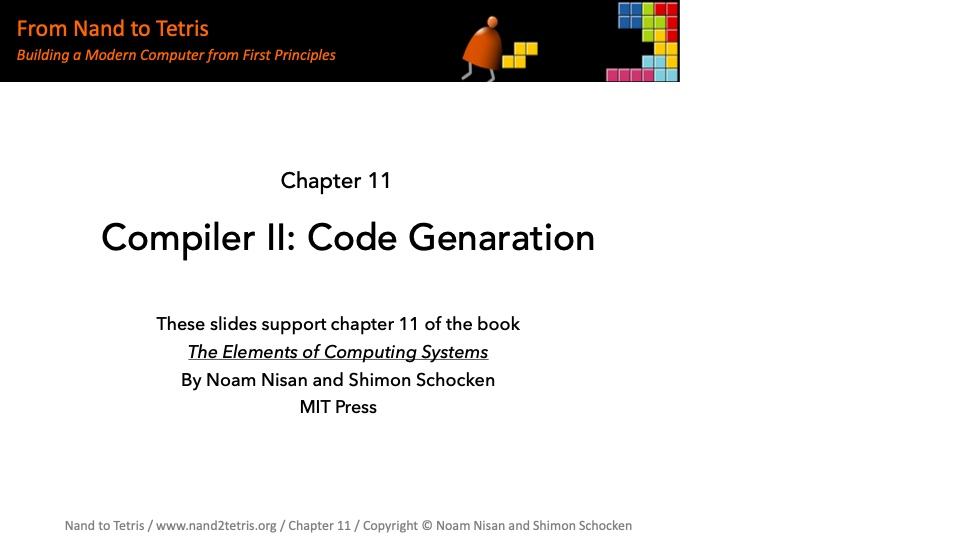

# From Nand to Tetris

[From Nand to Tetris - Building a Modern Computer From First Principles](https://www.nand2tetris.org/)

- [From Nand to Tetris](#from-nand-to-tetris)
  - [Part 1](#part-1)
  - [Project 1: Boolean Logic](#project-1-boolean-logic)
  - [Project 2: Boolean Arithmetic - ALU](#project-2-boolean-arithmetic---alu)
  - [Project 3: Sequential Logic - Memory](#project-3-sequential-logic---memory)
  - [Project 4: Machine Language](#project-4-machine-language)
  - [Project 5: Computer Architecture](#project-5-computer-architecture)
  - [Project 6: Assembler](#project-6-assembler)
  - [Part 2](#part-2)
  - [Project 7: VM I: Stack Arithmetic](#project-7-vm-i-stack-arithmetic)
  - [Project 8: VM II: Program Control](#project-8-vm-ii-program-control)
  - [Project 9: High-Level Language](#project-9-high-level-language)
  - [Project 10: Compiler I: Syntax Analysis](#project-10-compiler-i-syntax-analysis)
  - [Project 11: Compiler II: Code Generation](#project-11-compiler-ii-code-generation)
  - [Project 12: Operating System](#project-12-operating-system)
  - [refs](#refs)

## Part 1

## Project 1: Boolean Logic

## Project 2: Boolean Arithmetic - ALU

  
  
  

## Project 3: Sequential Logic - Memory

- flip-flop -  触发器（延时器）
- 1-bit register - 寄存器
- Multi-bit register
- Random Access Memory (RAM) - 内存
- Counter - 计数器

  
  
  
  
  

## Project 4: Machine Language

  
  
  
  
  
  
  

## Project 5: Computer Architecture

- von Neumann Architecture

- Harvard Architecture

- Hack Computer

- CPU

- `instruction`
  - `A-instruction`: an address value, that should be recorded in A-register
  - `C-instruction`: a command, that controls the procession
- `A-register`: recording the address value
- `D-register`: storing the calculated value
- `ALU`: calculating

next, examples for handling instructions

- a-instructions

- c-instructions

- pc - control

we've built Hack Computer

- Hardware projects

## Project 6: Assembler

- Assembly process

- Symbol table

- Translating A-instructions

- Translating C-instructions

## Part 2

## Project 7: VM I: Stack Arithmetic

## Project 8: VM II: Program Control

- Branching
  - goto label
  - if-goto label
  - label

- Function View

- Function
  - call
  - function
  - return

- vm done

- global

## Project 9: High-Level Language

## Project 10: Compiler I: Syntax Analysis

## Project 11: Compiler II: Code Generation

- example

- 挑战内容

- this & that
  - pointer 0 代表了 this，何时被重新写入
    - method 中间代码第一步为 push pointer 0 即把当前对象指针放入 pointer 0
    - 结束后回复原 pointer 0 值
    - this 的 heap 中其实仅包含了 field

    

  - pointer 1 代表了 that，数组

    

## Project 12: Operating System

## refs
- [Richard Feynman: Computer Heuristics](https://sites.google.com/site/principiascientifica/lecture/richard-feynman-computer-heuristics)