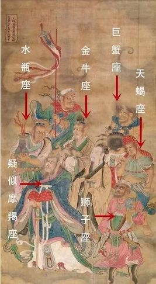
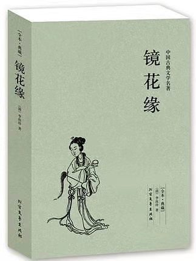

# 读书 听书 2019

- [读书 听书 2019](#读书-听书-2019)
  - [序](#序)
  - [书](#书)
  - [记](#记)
  - [辛神线](#辛神线)
    - [辛神公众号 - “辛德勇自述”](#辛神公众号---辛德勇自述)
    - [《古代天文历法讲座》](#古代天文历法讲座)
    - [《古人玩星座玩得比我们high多了》](#古人玩星座玩得比我们high多了)
  - [黄一农线](#黄一农线)
    - [《二重奏：红学与清史的对话》](#二重奏红学与清史的对话)
    - [《红楼梦》广播剧](#红楼梦广播剧)
    - [《西游记》](#西游记)
    - [《镜花缘》](#镜花缘)
    - [《格列佛游记》漫画](#格列佛游记漫画)
  - [附](#附)

## 序

回想工作了十多年，几乎没怎么读过书，今年却读了几本。想想再忙，能有比尔盖茨、扎克伯格、奥巴马忙？他们在最忙的时候也还在读书。另外一个是，家里的小朋友，慢慢长大了。以后如果你想要他多读书，而自己又根本不读书，那凭什么要他读书呢？

随手记下今年读的书，当然其中大部分是没有读完的。说我是读了这些书也是不准确的，原因如下：
- 大多是听来的，主要贡献来自各类听书APP，当然这种听书方式是我的偶像辛神最看不上的。
- 第二大贡献来自微信的公众号，重中之重是“辛德勇自述“。
- 第三是电子书，有买有下，但作为一个码农，还是要尽量买正版。
- 最后才是纸制书。

## 书

- 辛德勇
    - 公众号文
    - 《生死秦始皇》
- 张闻玉
    - 《古代天文历法讲座》
- 黄一农
    - 《二重奏》 
    - 《社会天文学十讲》
- 周振鹤
    - 《藏书不乐》
- 葛剑雄
    - 《谭其骧传》
- 刘统
    - 《红军长征记》
    - 《北上》
- 张宏杰
    - 《饥饿的盛世》
- 艾萨克森
    - 《达芬奇传》
    - 《乔布斯传》
    - 《创新者》
- 夏伊勒
    - 《第三帝国的兴亡》
- 四大之
    - 《红楼梦》
    - 《西游记》
- 马伯庸
    - 《长安十二时辰》
    - 《古人玩星座玩得比我们high多了》
- 刘慈欣
    - 《三体》
    - 《流浪地球》
- 凡尔纳
    - 《地心游记》
    - 《格兰特船长的儿女》
    - 《海底两万里》
- 软件
    - 《黑客与画家》
    - 《软件随想录》
    - 《人月神话》

## 记

有时，看书和迷路一样，当看完成一本书时，不是走到了终点，而是来到了一个十字路口，它会引导你去探索更多的主题。所以，随记按两个不同的起点出发，看看都能走到些什么鬼地方。

- 辛神线
- 黄一农线

## 辛神线

看得最多的，辛神肯定是排第一了，如果不出意外，明年还是一样。辛神一年出了多少书，数也数不过来了，本本过硬，实在是五体投地。但我大多是读他的公众号。

### 辛神公众号 - “辛德勇自述”

其中一部分，考证了时令、天文等相关问题。想知道二十四节气怎么来，一年和一岁有什么区别吗？来上辛神公众号吧。

### 《古代天文历法讲座》

按着辛神的推荐，看了张闻玉的《古代天文历法讲座》，让你了解了解啥是“二月二龙抬头”，二十八宿是啥，十二时辰又是啥。说起十二时辰，就想到马亲王的小说了。可是他居然还有个神奇的讲座。

### 《古人玩星座玩得比我们high多了》

你以为就你们会玩十二星座吗，看看咱们的老祖宗玩得可 high 了。

## 黄一农线

这也是一位大神，一位天体物理学博士，成功上位台湾中研院文科院士。和辛神一样，不停地杀入别人的领地，让人无路可走。自称别人读书是一本一本读的，他是一书架一书架读的。起初被他吸引是看了他的火炮相关文章，后来也是爱屋及乌，想看其他系列，比如关于红楼梦的。

### 《二重奏：红学与清史的对话》

扎实的大数据考据学，不想看书的朋友，也可以去看看他的相关讲座视频，建议上油管搜。为了看这个书，那要先看红楼梦啊。所以，入坑。

### 《红楼梦》广播剧

这我听过的最好的广播剧，没有之一。当初是为了看黄一农书才听的，结果广播剧乐呵呵地听完了，书还没看完。听完红楼梦觉得不过瘾啊，所以继续四大了。

### 《西游记》

本来是打算随便听听的，但正巧家里的小朋友到了给他讲故事的年龄了，那就讲这个了。但也没那么简单，又不可能给他读原著，所以为了能讲的像个样。买了一套绘本，两套漫画，又听了一套少儿广播剧，才算有点准备，可以混过去。

### 《镜花缘》

随着《西游记》又听了《镜花缘》，里面各种奇奇怪怪的人和物，还是很有趣的。又说这书被叫作中国版的《格列佛游记》，我也就这么一听过去了，没想找这书来看。但就是这么巧。

### 《格列佛游记》漫画

这天，陈老师要为登登姐姐出黑板报，老婆去帮忙，我去打酱油。结果在教室的书架上发现了这个漫画，一看就喜欢了。回家马上搞了一本。小朋友会喜欢的吧。

## 附

最后附上，马亲王今年和去年的小朋友书单

- [马小烦的2019年书单](https://mp.weixin.qq.com/s/r1GO_5EB4_NWPa1unbkrWg)
- [昂扬与烦躁：马小烦的2018年阅读书单](https://mp.weixin.qq.com/s/8uXZDLCWHjV6RxOWn2XnqA)