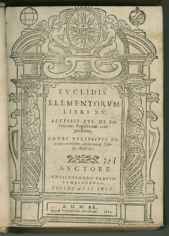

# 幾何，是geometry的音譯嗎？

幾何的中文原是「若干」之意，會成為形學的專用譯名，有一段曲折的歷史因緣。

撰文／李國偉
- 

在英漢字典裡，geometry這個字的第一個釋義必定是「幾何」。為什麼我們會把geometry翻譯成「幾何」呢？一種相當普遍的說法認為「幾何」讀音近似geo，因而可看成是音譯。geometry源於拉丁文geometria，字首geo的意思是「地球、土地」，字尾metria的意思是「丈量、度量」。然而「幾何」的中文原義與「丈量土地」毫不相干，譬如「對酒當歌，人生幾何？」是曹操《短歌行》中膾炙人口的名句，「幾何」是在感嘆歲月苦短。明朝程大位所寫的著名數學書《算法統宗》也明確地說：「幾何與若干相同。」在這樣的中文脈絡裡，用「幾何」音譯geometry難道不會產生牛頭不對馬嘴的混淆嗎？

1607年，利瑪竇（Matteo Ricci）與徐光啟把歐幾里得巨著Elements的前六卷中譯為《幾何原本》，是「幾何」與geometry在中國首次發生聯繫。他們以利瑪竇的老師「丁先生」（Christopher Clavius）所編輯的Euclidis Elementorum Libri XV為翻譯底本，然而書名裡根本不曾出現geometria這個字，音譯之說實在很難成立。

《幾何原本》卷首〈界說三十六則〉第二句話說：「凡立法、地理、樂律、算章、技藝、工巧諸事，有度有數者皆依賴十府中幾何府屬。」由此可推知，因為書裡講的是「有度有數者」，屬於「十府」中涉及「若干、多少」的「幾何府」，所以書名才使用了「幾何」二字。

那麼「十府」又是什麼呢？亞里斯多德在邏輯學著作〈範疇篇〉裡，把人所能理解的事項劃分為十類：實體、數量、性質、關係、地點、時間、位置、狀態、主動、被動。利、徐兩人的用語「十府」，便是現在所謂的十範疇。與利、徐同時代的傅汎際（Francisco Furtado）和李之藻在翻譯亞里斯多德著作時，稱十範疇為「十倫」。他們編譯的《明理探》裡，便稱「數量」那一倫為「幾何」，而另外音譯geometria為「日阿默第亞」。

雖然利、徐兩人翻譯的六卷只討論平面圖形，但他們知道歐幾里得的原書涵蓋了古希臘數學有關數與量的核心知識，是一本集大成的書，而非專講圖形性質的入門教科書。利瑪竇在《譯幾何原本引》中解釋道：「幾何家者，專察物之分限者也，其分者若截以數，則顯物幾何眾也；若完以為度，則指物幾何大也。其數與度，或脫于物體而空論之，則數者立演算法家，度者立量法家也。」

所以當時「幾何」的意義其實泛指整個數學。同篇文章中，利瑪竇又說：「曰『原本』者，明幾何之所以然，凡為其說者，無不由此出也。」因此如果用現代白話解釋書名《幾何原本》，稱為《數學的根源》也許還算恰當。

為了專門指稱「幾何」裡相當於geometry的部份，到清朝時出現了「形學」這個名詞。例如1885年鄒立文與傳教士狄考文（Calvin Wilson Mateer）編譯的《形學備旨》中說：「其所以不名『幾何』而名『形學』者，誠以幾何之名所概過廣，不第包形學之理，舉凡算學各類，悉括於其中。」可見「形學」只是「幾何」的一部份。然而「形學」這個看似更為恰當的譯名，不到20世紀中葉就全面敗給「幾何」，這也許反映了利、徐譯本的影響實在深遠，不僅造成「幾何」一詞與「形」的緊密連結，也使「幾何」逐漸狹義化成geometry的專用譯名了。

【欲閱讀更豐富內容，請參閱科學人2009年第93期11月號】 - [原链接](https://sa.ylib.com/MagArticle.aspx?Unit=columns&id=1482)