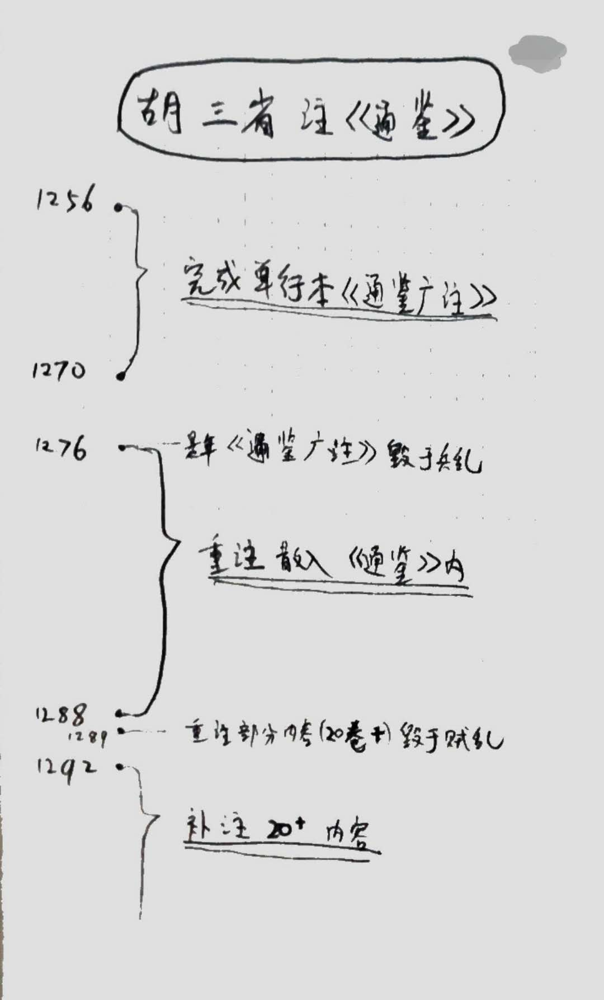

# 所謂興文署本胡注《通鑑》的真相及其他

- [所謂興文署本胡注《通鑑》的真相及其他](#所謂興文署本胡注通鑑的真相及其他)
  - [原文](#原文)
  - [原文摘要](#原文摘要)
  - [原文目录](#原文目录)
  - [感概](#感概)
  - [笔记](#笔记)
    - [两条重要资料](#两条重要资料)
    - [写定的三个阶段](#写定的三个阶段)
## 原文
- [所謂興文署本胡注《通鑑》的真相及其他（上）](https://mp.weixin.qq.com/s/sHROqN4PaPFfJ137Vz8E5w)
- [所謂興文署本胡注《通鑑》的真相及其他（中）](https://mp.weixin.qq.com/s/k8jzVoPS895zYxosLHuqrA)
- [所謂興文署本胡注《通鑑》的真相及其他（下）](https://mp.weixin.qq.com/s/6EjCSMcAb1R59HJxpF-JgA)

## 原文摘要
 > 元人胡三省注《資治通鑑》，對理解《通鑑》原文，助益良多。胡注《通鑑》在元朝僅有一個刻本，關於這個刻本的基本版刻情況，一向不甚清楚；特別是因其卷首刊有元翰林學士王磐的一篇序文，其中談到蒙元興文署刊刻《通鑑》事宜，故從清代中期以來，一直有人認爲此本爲興文署所刻。民國時王國維對王磐此序做出不同的解釋，但有很多基本問題，還是不甚明瞭。

 > 本文研究得出如下幾點看法：
 > 1. 從元代各地版刻的總體特徵出發，判斷元刻本胡注《通鑑》絕非興文署刻本。
 > 2. 通過考察興文署的淵源，認定並不存在興文署本胡注《通鑑》與興文署刻書。
 > 3. 利用初印本元刻胡注《通鑑》附鐫的胡三省注記，全面梳理胡注的寫定過程，並藉此辨析清楚它與所謂興文署本《資治通鑑》毫無關係。
 > 4. 憑藉此本的版刻特徵並基於元代雕版印刷的一些規律性特徵，推定此本爲元台州路儒學刻本。此外，文中還對王磐序文的來源做出了解釋，同時還講述了清嘉慶年間胡克家仿刊此元刻本胡注《通鑑》的基本版刻狀況。

## 原文目录
- 一、元代版刻體系的確立與胡刻底本的真實形態
- 二、並不存在的興文署本胡注《通鑑》與興文署刻書
- 三、《通鑑》胡注的寫定過程以及它與所謂興文署本《資治通鑑》的關係
- 四、元刻本胡注《通鑑》的版刻性質及其刊刻時間
- 五、王磐序文的由來
- 六、胡克家仿元刻本述略

## 感概
> 全書篇末胡三省寫下的這樣一首抒發自己情懷的詩：“
> 
> 通鑑相隨四十秋，黑頭吾移到白頭。  
> 夜眠欲睡不得睡，晝坐似愁還悲愁。  
> 經濟滿懷無用處，興亡過眼欻如流。  
> 手編留與兒孫讀，如得兒孫會得否？  
> 
> ”由於生怕後人不明白這詩是誰寫的，在這篇詩後，還寫有題名：“右胡三省作。”

## 笔记

### 两条重要资料
- 胡克家仿刻元本胡注《通鑑》卷首胡氏《新註資治通鑑序》
- 上海圖書館藏元刻初印本胡注《通鑑》書中，刻在第一百七十一卷篇末的注記

### 写定的三个阶段
- 第一阶段
  - 时间：1256 - 1270
    - 從宋理宗寶祐四年（1256年）到度宗咸淳六年（1270年）這最多十四年間
  - 事项：
    - 胡氏完成了他注釋《通鑑》的第一階段工作，乃“依陸德明《經典釋文》，釐爲《廣注》九十七卷，著論十篇，自周訖五代，略敘興亡”依照古人通行的慣例，這部《廣注》，全名顯然應該是王國維所說的《通鑑廣注》。遺憾的是，這部書稿在王國維所說丙子宋亡之歲（1276年），毀失於兵亂之中。
- 第二阶段
  - 时间：1276 - 1288
    - 從王國維所說丙子宋亡之歲起（1276年），到胡三省在序文中所說寫定《通鑑注》的乙酉年、亦即元世祖至元二十二年（1285年），約前後九年期間，
    - 胡三省在至元二十二年（1285）冬至寫成的序文，衹是就此書初稿、也就是“藁本”而言，而這條注記中記述的至元二十五年（1288）七月纔是其定本“脫藁本”寫成的時間。
  - 事项：
    - 胡三省又“購得他本爲之註，始以《考異》及所註者散入《通鑑》各文之下，曆法、天文則隨《目錄》所書而附註焉”這是胡三省在《通鑑廣注》書稿業已毀失的情況下，不得不重頭做起，再注《通鑑》。
  - 说明：
    - 胡三省在《通鑑廣注》書稿毀失後重做的注釋，曾存有兩部稿本，一曰“藁本”，一名“脫藁本”。綜合考慮相關因素，我認爲，所謂“藁本”是指胡氏《通鑑注》的工作草稿，而“脫藁本”則是胡氏在此基礎上修補潤色再寫錄謄清的定稿。
    - 至元二十六年（1289）的二月，有“妖賊楊鎮龍起玉山，焚天台、新昌、嵊縣，犯獵諸暨、東昜、金華，進薄婺城而敗。餘黨潰歸吾鄉者復嘯聚，焚奉化、寧海。大兵來討之，逸德之烈，不分玉石，燒蕩室廬，係累屠殺者什七八”。胡氏衹好“携家入深山，篋藁本、櫝脱藁本授二僕，一寘古塚叢棘中，一瘗地中。兵退余歸，瘗諸地者倖存；寘叢棘者唯空篋在”。
- 第三阶段
  - 时间：1292 - ?
    - 至元二十九年四月始
  - 事项：
    - 胡三省從鄞縣回到寧海家中，動手補撰闕稿，乃“先務博採旁搜而後著筆”。
  - 说明：
    - 經歷至元二十六年這次兵匪之禍以後，倖存下來的“脫藁本”實際上是有闕失的，並不完整。因爲此前在至元二十五年十月，袁桷打發僕人來借走了其中的“自一百七十一卷至一百九十卷凡廿卷”。這二十卷書稿就在鄞縣的一場大火中燒毀掉了。除此之外，剩存的“脫藁本”中還有不少因戰亂而造成的“脱簡間編”，需要修補。
    - 胡三省注記中“五月辛丑起寫，乙巳畢卷”這兩句話，針對的衹能是寫定謄清剛剛補撰的這第一百七十一卷的內容。實際上我們在上海圖書館收藏的元刻初印本上，可以看到胡三省還另有注記，說明其補撰的第一百七十五卷、一百七十六卷和一百七十七卷，是分別寫定於這一年的六月初四、初八和七月初一，足以清楚證實上述判斷。
