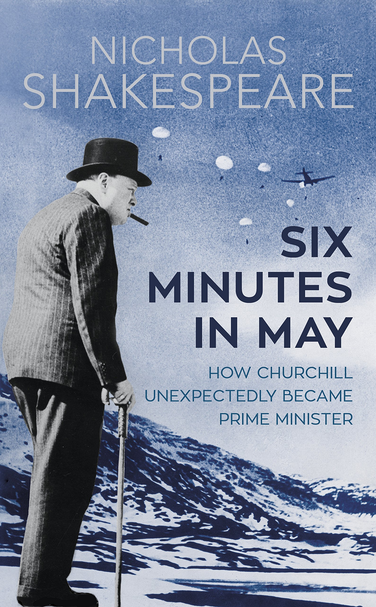

# SIX MINUTES IN MAY

CONTENTS

- [SIX MINUTES IN MAY](#six-minutes-in-may)
  - [PART ONE: SIX MINUTES IN MAY - 五月的六分钟](#part-one-six-minutes-in-may---五月的六分钟)
    - [1. Perfect Blackout - 绝对黑暗时刻](#1-perfect-blackout---绝对黑暗时刻)
  - [PART TWO: THE CAMPAIGN - 挪威战役](#part-two-the-campaign---挪威战役)
    - [2. ‘NAR-vik’ - 纳尔维克（挪威城市）](#2-nar-vik---纳尔维克挪威城市)
    - [3. Operation ‘Wilfred’ - 维尔弗雷德行动](#3-operation-wilfred---维尔弗雷德行动)
    - [4. The First Crunch](#4-the-first-crunch)
    - [5. In Great Strength](#5-in-great-strength)
    - [6. Flea and Louse](#6-flea-and-louse)
    - [7. The First Land Battle](#7-the-first-land-battle)
    - [8. Worst of All Experiences](#8-worst-of-all-experiences)
    - [9.  The Winston Impasse](#9--the-winston-impasse)
    - [10. Evacuation PART - 挪威撤退](#10-evacuation-part---挪威撤退)
  - [THREE: THE WEEKEND BEFORE](#three-the-weekend-before)
    - [11. Monsieur J’aimeberlin - 张伯伦先生](#11-monsieur-jaimeberlin---张伯伦先生)
    - [12. The Master of Garrowby - 哈利法克斯勋爵](#12-the-master-of-garrowby---哈利法克斯勋爵)
    - [13. The Wild Man](#13-the-wild-man)
    - [14. The Rebels](#14-the-rebels)
  - [PART FOUR: THE DEBATE](#part-four-the-debate)
    - [15. Tuesday 7 May](#15-tuesday-7-may)
    - [16. Wednesday 8 May](#16-wednesday-8-may)
    - [17. The Division](#17-the-division)
  - [PART FIVE: THE AFTERMATH](#part-five-the-aftermath)
    - [18. A Terrific Buzz](#18-a-terrific-buzz)
    - [19.  The Obvious Man](#19--the-obvious-man)
    - [20. The Limpet](#20-the-limpet)
    - [21. A Great Tide Flowing](#21-a-great-tide-flowing)
    - [22. The Silence](#22-the-silence)
    - [23. Hinge of Fate](#23-hinge-of-fate)
  - [TimeLine](#timeline)

## PART ONE: SIX MINUTES IN MAY - 五月的六分钟
### 1. Perfect Blackout - 绝对黑暗时刻

## PART TWO: THE CAMPAIGN - 挪威战役
### 2. ‘NAR-vik’ - 纳尔维克（挪威城市）
### 3. Operation ‘Wilfred’ - 维尔弗雷德行动
### 4. The First Crunch
### 5. In Great Strength
### 6. Flea and Louse
### 7. The First Land Battle
### 8. Worst of All Experiences
### 9.  The Winston Impasse
### 10. Evacuation PART - 挪威撤退

## THREE: THE WEEKEND BEFORE
### 11. Monsieur J’aimeberlin - 张伯伦先生
### 12. The Master of Garrowby - 哈利法克斯勋爵
### 13. The Wild Man
### 14. The Rebels

## PART FOUR: THE DEBATE
### 15. Tuesday 7 May
### 16. Wednesday 8 May
### 17. The Division

## PART FIVE: THE AFTERMATH
### 18. A Terrific Buzz
### 19.  The Obvious Man
### 20. The Limpet
### 21. A Great Tide Flowing
### 22. The Silence
### 23. Hinge of Fate

## TimeLine
- 1939.9.3, First Lord
  - With the start of the Second World War, Churchill is appointed for a second time the First Lord of the Admiralty.
- 1940.2.16 - 17, The Altmark incident
  - A naval incident of World War II between British destroyers and the German tanker Altmark.
- 1940.4.8, Operation Wilfred
  - A British naval operation during the Second World War that involved the mining of the channel between Norway and her offshore islands. On 8 April 1940, the operation was partly carried out, but was overtaken by events as a result of the following day′s German invasion of Norway and Denmark (Operation Weserübung).
- 1940.4.9 - 6.10, Operation Weserübung
  - the code name for Germany's assault on Denmark and Norway during the Second World War and the opening operation of the Norwegian Campaign. The name comes from the German for "Operation Weser-Exercise", the Weser being a German river.
- 1940.4.9, Giles was captured
  - Giles Samuel Bertram Romilly, nephew of Winston, was captured in May 1940 in the Norwegian town of Narvik while reporting for the Daily Express.
- 1940.5.8, Norway Debate
  - Churchill vigorously defends the government in the Norway debate in the House of Commons.
- 1940.5.10, Prime Minister
  - Neville Chamberlain resigns and Churchill is appointed Prime Minister and Minister of Defence. He forms a coalition government that includes the Conservative, Labour, and Liberal parties.
- 1940.5.13, Addressing
  -  Addressing the House of Commons for the first time as prime minister, Churchill declares “I have nothing to offer but blood, toil, tears, and sweat.”
- 1940.5.26 - 6.4 Dunkirk
  - The Battle of Dunkirk was the defence and evacuation to Britain of British and other Allied forces in Europe from 26 May to 4 June 1940. Evacuation of 338,226 soldiers.

