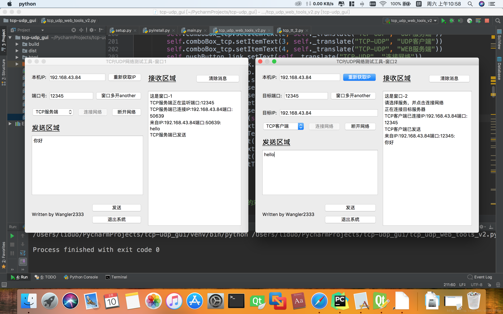
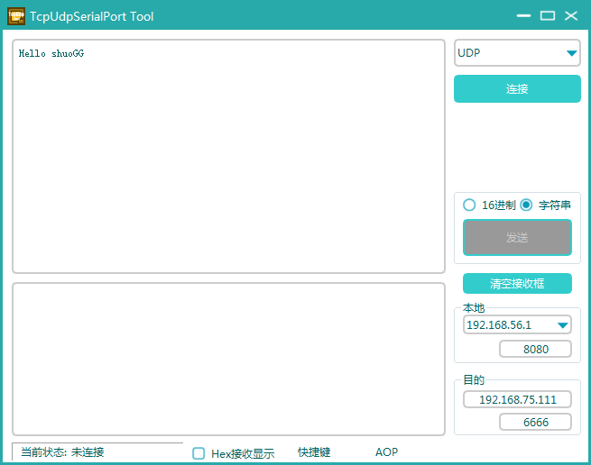

# Serial-Port, Tcp, Udp Tools

- [shuoGG1239/TcpUdpSerialPortTool](https://github.com/shuoGG1239/TcpUdpSerialPortTool)
    - Serial-Port, Tcp, Udp
    - 
- [Wangler2333/tcp_udp_web_tools-pyqt5](https://github.com/Wangler2333/tcp_udp_web_tools-pyqt5)
    - Tcp, Udp
    - 
    - it failed to install `QCandyUi` on mac, errors on the dependency of pywin32
    - do comment the `QCandyUi`