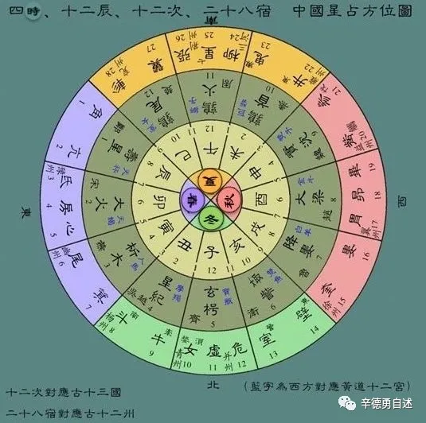

# 十二纪

## main

- 四时
  - 春、夏、秋、冬
  - 指的正是**陽曆年**的“四時”
  - 而不是“中國年”裏的四季
- 十二辰
  - 對**地平圈**十二等分後給每一個刻度所標示的名稱
- 十二次
  - 古人把**天赤道**帶均勻地十二等分，其每一個刻度，就是一次，合稱則爲“十二次”
- 二十八宿
  - **黃道**和**天赤道**附近地帶的二十八組恆星

## ref

- [西邊的太陽——秦始皇他爹的陽曆年](https://mp.weixin.qq.com/s/tkB8IssnfSavvUTfjndExw)