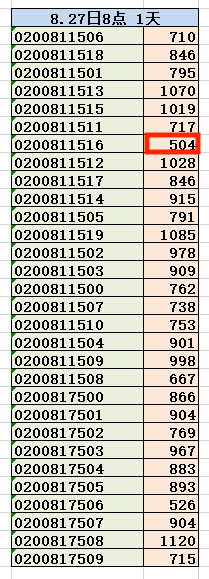

# 一次 Sql Server 数据存储错误的经历

- [一次 Sql Server 数据存储错误的经历](#一次-sql-server-数据存储错误的经历)
  - [背景](#背景)
  - [第一天出现异常后](#第一天出现异常后)
  - [第二天，无异常](#第二天无异常)
  - [约第三天，再现](#约第三天再现)
  - [约第七天，三现](#约第七天三现)
  - [最后的运气](#最后的运气)

## 背景
- 公司有一远程数据采集设备，定期通过 4G 网络发送数据至服务器，再由接收软件解析后存入 SQL Server，服务器为 window server
- 几天前发生了数据无法存储的情况
- 数据接收和解析正常，问题出在了最后的存储

## 第一天出现异常后
- 查看接收软件日志， 发现凌晨时段出现存储异常，约持续 1 小时后恢复正常
- 比较难堪的是，类似情况在 1 年多前发生过。当时发现是由于 2 个其他软件占用了所有 CPU 导致存储超时。所以第一反应是又有某个软件占用了 CPU。
- 开始确认服务器状态，CPU、内存、硬盘一切正常，于是判断是否是某个程序当前没有运行，但凌晨被启动，导致问题产生。
- 当前备选问题软件列表
  - 每小时运行 1 次的数据统计软件，后简称“小时软件”
  - 每天运行 1 次的数据统计软件，后简称“天软件”
- 分析
  - “小时软件”经观察后，发现每次运行时间在 1-15 秒之间，由此判断问题与它无关
  - “天软件”又是固定在每天 6 点运行，也无关
  - 那么判断是某个当前未知的软件造成该问题
- 当前如何处理
  - 需记录异常时，服务器的运行状态
  - 
  - 由于一年多前的出过问题，当时的积累是可以使用 windows 自带的 perfmon.exe，设置 CPU、内存、硬盘等过载时触发事件。当时直接触发为发送邮件，但缺点是没法定位到过载原因。
  - 所以目标是记录出现异常时，服务器的具体状态
- 开始搜索优化方案
  - 
  - 查到可以使用 ProcessMonitor 记录所有进程
  - 搜索后，发现一种不太完善的记录法，通过 perfmon.exe 触发 ProcessMonitor 记录进程状态
  - 设置 CPU、内存、硬盘，任一占用超过 99% 时触发
- 接着开始等待问题重现

## 第二天，无异常
- 第二天问题没有再现
- 之后发现，该异常带有随机性，一周出现 2-3 次，且时间不定

## 约第三天，再现
- 分析
  - 异常再次出现，但是 perfmon 没有触发事件，猜测没有发生过载现象，只能继续猜测可能出问题的程序
  - 第一想法是 SQL Server 可能在某一时刻被占用，因为之前，出现过“天软件”占用了大量 CPU 的情况。
  - 但本次 CPU 没有出现过载现象，只能先试了再说
- 实施
  - 使用 SQL Server Profile 记录所有 sql 调用
  - 同时 perfmon.exe 记录所有 CPU、内存、硬盘日志

## 约第七天，三现
- 现象
  - Perfmon.exe 显示，硬盘出现 5 分钟长期占用事件
  - Process Monitor 依然没有记录，说明占用未超过 99%，主要原因是硬盘占用的分析无法像分析 CPU、内存那么精确
    - 如，当只有 4M+ 的写入，仍导致硬盘过载，但此时 perfmon.exe 显示仍有 50% 空闲
- 插曲 
  - 正在分析时，出现内存被大量占用的状况
  - 此时，分析任务管理器中的 process 发现并没有占满内存，所以需要更精确的工具
  - 
  - 查询到 RAMMap 可以查看内存状态，发现有一文件占用了大量内存
  - 确定，是由于开启了 SQL Server Profiler 记录到文件，导致内存大量占用
  - 所以先关闭，有需要再开启
- 开始检查 SQL Sever Profiler 的日志
  - 发现 Reporting Service 在异常阶段不停地运行，
  - 信心满满地认为找到了问题根源，立马关闭，以为这就解决了
  - 因为好奇心，随便尝试了更多的查询，发现 Reporting Service 每时每刻都在运行，无论当时是否出现异常，这与认定的问题根源相冲突
- 插曲二
  - 正巧此时，“天软件”出现了一次异常
  - perfmon.exe 正好记录了其导致硬盘过载读写
  - 开始猜测，问题根源可能是“天软件”，但日志显示，之前异常时该软件并未运行
- 继续寻找
  - 
  - 发现，每次的异常都是由写入数据库 30 秒超时引起
  - 那么是硬盘先异常，导致 30 秒异常；还是该插入操作本身有问题，导致了 30 秒异常？无解
  - 当前已经无解，没法去确定问题源

## 最后的运气
- 还有什么能试的?
  - 去看看 windows 日志
  - 
  - “信息”就这么给出了答案：数据库日志文件，增量过大，导致超时
  - 去处理吧
  - 
- 上面的一大堆，都做了些什么
  - 做了一大堆无用功，或许真没用，或许也有点用

