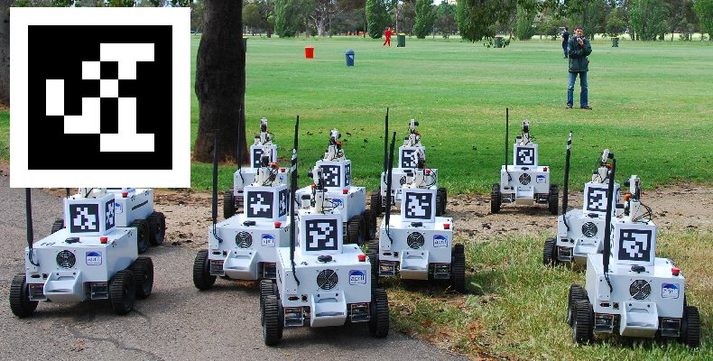

# ROS AprilTag



## 概述
需在 Ubuntu 20.xx 上运行 apriltag_ros 进行定位

## 安装
- 安装 Ubuntu 20.xx
- 安装 ROS
  - 直接按 ROS 官网教程，安装 noetic 版本
- 设置 ros 的 workspace
  - build 之间推荐先安装依赖，rosdep install --from-paths src --ignore-src
  - catkin build
  - workspace 文件夹在 catkin build 之后，运行 source ./devel/setup.bash，将加载至 ros 的 package 中，之后可直接调用
- 安装 usb_cam
  - 建议使用 apt 安装 usb_cam
  - 安装矫正库 rosdep install camera_calibration
- 安装 apriltag_ros
  - 按照 github 库安装
  - 会有 python 版本问题，似乎 Ubuntu 20.x 默认是 python3，所以有些库名写着 python-xx 的需要改成 python3-xx
  - 另，建议安装 python-is-python3，则 python 命令默认为 python3，运行相应代码也需为 python3

## 运行
``` bash
# 主程序
roscore

# 摄像头
roslaunch usb_cam usb_cam-test.launch

# 矫正
rosrun camera_calibration cameracalibrator.py --size 8x6 --square 0.0245 image:=/usb_cam/image_raw camera:=/usb_cam

# Apriltag
roslaunch apriltag_ros continuous_detection.launch

# 数据输出
rostopic echo /tag_detections

# 修改参数
~/catkin_ws/src/apriltag_ros/apriltag_ros/config/tags.yaml

```
