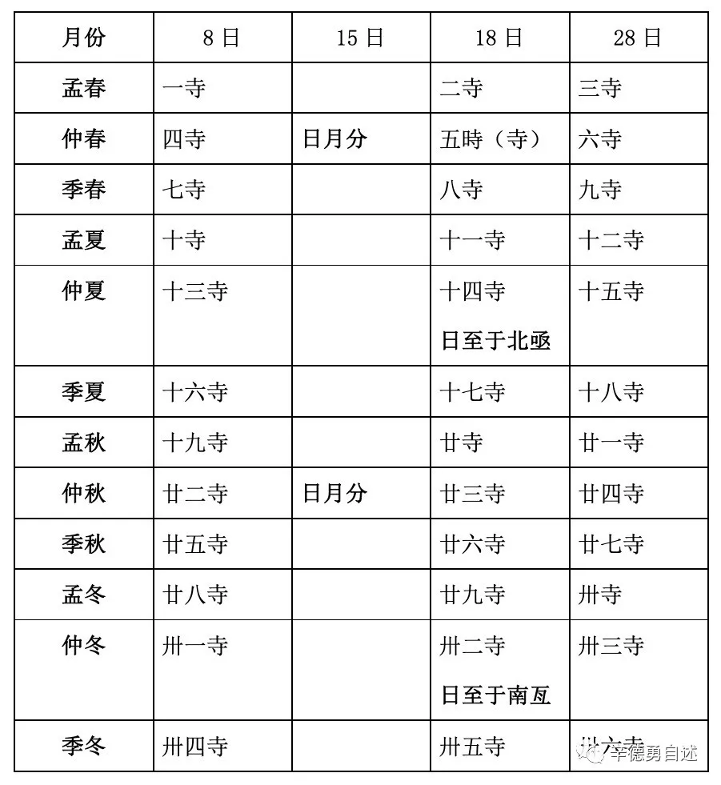

# 四寺

## 从“二分二至”到“四立”
- 《尚書·堯典》“二分二至”
    > 在《尚書·堯典》中就已經見有“二分二至”（分別稱作“日中”、“霄中”、“日永”和“日短”）
- 《呂氏春秋》“二分二至”和“四立”
    > 《呂氏春秋》的“十二月紀”，還僅僅列有“二分二至”（即春分、秋分、冬至和夏至）和“四立”（立春、立夏、立秋和立冬）這“八節”。
- 夹在中间的《四寺》衹有“二分二至”
    > 《尚書·堯典》的成書時間是一個相當麻煩的問題，不易簡單敘說清楚。我本人，傾向於認爲其寫定成書的時間是比較晚的，但這不等於書中的內容也都出自晚近的時代，這“二分二至”點的記述，依據相關的星象，就應該產生得很早。
    >
    > 這樣，從《尚書·堯典》到《呂氏春秋》的“十二月紀”，中間有很長一段空白的時間段，我們不清楚它是變了還是沒變。
    >
    > 在看到竹書《四寺》當中，我能夠清楚認證的衹有“二分二至”，即仲春之月，“日月分”——春分；仲秋之月，也是“日月分”—— 秋分；仲冬之月，“日至於南亙”——冬至；還有仲夏之月，“日至于北亟”—— 夏至。然而還沒有看到“四立”的名稱，更看不到“二分二至”之外任何一個太陽視運動軌跡中的節點。同時，《四寺》中每月三“寺”總共三十天的置月形式，也基本上排除了設置“四立”的可能。所以，我推斷在撰著這篇《四寺》的戰國時期，還沒有出現“四立”。

## “寺”与“二分二至”
- 

> 這七十二候是啓始於歲首立春，也就是以立春爲每年開頭第一候，而這一候的兆象就是“東風解凍”（《逸周書·時訓》）。
> 
> 相互參證上述情況，若是把“內（入）月四日”諸語分割出來的這種十日一斷的時段一分爲二，我們就會看到，每年十二個月各個月份三分後形成的那三十六個時段一經分割，就正好是七十二候的數目。

> 比對《逸周書·時訓》的記載，《四寺》中的“內（入）月四日”也就是孟春之月第五天，在這下面記述的“東風”和“解凍”等物候現象就都應該屬於從月首到這個月第五天之前的情況。

### 那麼，爲什麼每月的第一寺都要結束於該月的第八天呢？
> 這第一寺結束的時日，不上不下地定在了月初第八日這一天，正是因爲順着數下去，會數到一個非定在那裏不可的日子——這個日子是冬至這一天。

### 孟春之月的首日是怎樣設置的
> 以此爲基點向前逆推，到孟春之月的月首、也就是全年第一天，共有318天。按照清代以前中國自有二十四節氣以來實行的平朔制度，這大致相當於二十一個節氣的時間，而若是由冬至向前逆數二十一個節氣，這個節氣乃是立春。

### “二分”与“二至”的不同设置
> 《四寺》所述太陽年的歲首和孟春之月首日，是以實測的冬至點爲基礎，按照太陽視運動週期的長度向前逆推出來的結果，而春、秋二分則是以此立春之日爲出發點，依照七十二候的節奏向下順延的日期。正因爲參照的基準和推算的方式完全不同，所以我們纔會看到春秋二分同冬夏二至之間的距離出現了上述怪異現象。

## ref
- [辛德勇談清華簡“四時”篇 與中國古代的天文曆法](https://mp.weixin.qq.com/s/eJ4EuzialBqlB94Z6iE5MQ)
- [清華簡《四寺》的四至十二月](https://mp.weixin.qq.com/s/qHU-AirMMLoCLsM-9E8O1g)