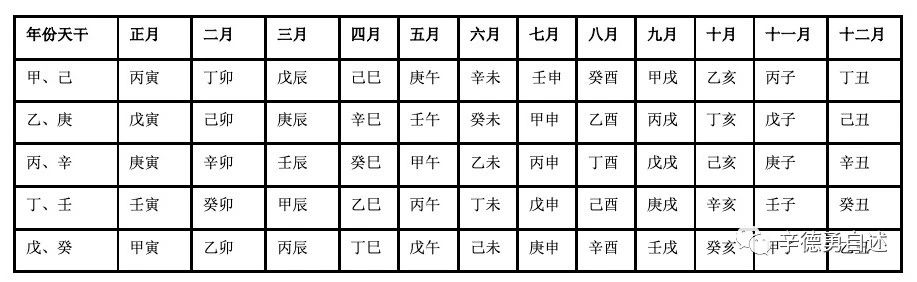
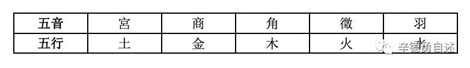
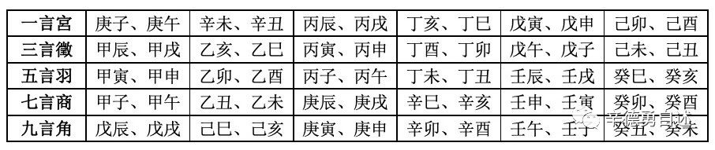
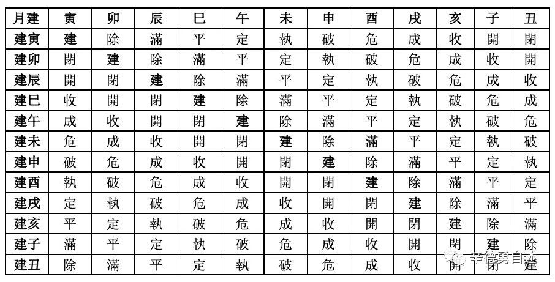

# [《羅氏墓志》與相關天文曆法知識](https://mp.weixin.qq.com/s/jp9tD3bSneu0zVMy_iiCEQ)

- [《羅氏墓志》與相關天文曆法知識](#羅氏墓志與相關天文曆法知識)
  - [《羅氏墓誌》的紀時](#羅氏墓誌的紀時)
  - [关于“载”](#关于载)

## 《羅氏墓誌》的紀時

> 《羅氏墓誌》所表述的紀時方式，有這樣兩條：一是“以天寶五載景戌律中姑洗日在胃建壬辰癸丑朔丁巳土滿……遘疾薨于義寧里之私第”，一是“以天寶六載丁亥律應夾鍾日在奎建癸卯丁未朔己酉土破遷合於元府君舊塋”，即前一條記述的是卒日，後一條記錄的是葬日。

- 卒日
  - 天寶五載
  - 景戌
    - 甲子紀年
    - 我推斷這種形式乃肇始於新莽時期而在東漢章帝元和二年始普遍施行。這一看法，被我寫在《建元與改元》的下篇《所謂“天鳳三年鄣郡都尉”磚銘文與秦“故鄣郡”的名稱以及莽漢之際的年號問題》當中
  - 律中姑洗
    - 十二律同十二月相配合
    - 比較系統的記載，見於呂不韋組織門客編著的《呂氏春秋》
  - 日在胃
    - 二十八宿來表述月份
    - 其比較系統的早期記載，也見於《呂氏春秋》
  - 建壬辰
    - 干支紀月法
    - 在《淮南子·時則》中對這種十二地支紀月法或十二辰紀月法有系統的記述
    - 《欽定協紀辨方書》卷二〇至三一《月表》
    - 
  - 癸丑朔
    - 指這兩個月份的朔日，也就是初一
    - 紀日時先記該月朔日再記具體日子的干支，這本是秦漢以來通行的紀時方式
  - 丁巳
    - 干支的形式來紀日
    - 像這樣以干支紀日，至遲從殷商時期起就是如此，而且這種紀日干支連綿不斷，直至今日
  - 土
    - 這個“土”字在這裏並不是直接表述五行之“土”，而是五音中的“土音”。
    - 五音與干支紀時體系相匹配
    - 依據《抱朴子·內篇·仙藥》的記載，在中國古代占筮家的觀念中，五音與五行對應，其與紀時干支搭配
    - 
    - 
  - 滿
    - “滿”、“破”二字。這兩個字，是建、除、滿、平、定、執、破、危、成、收、開、閉這一組建除家（陰陽數術的一種）術語中的兩個，而這十二個一組的建除家術語、亦即後世所謂建除十二直是同紀時十二辰、也就是十二地支相對應的。
    - 《淮南子·天文》中本有明確的記載
    - 
    - 表中所謂“月建”，是指《淮南子·時則》中提到的那種以“招搖指寅”等表述的“天文月”或唐代以干支紀月的“干支月”（如“建寅”之月即“孟春之月”，“建卯”之月即“仲春之月”，“建辰”之月即“季春之月”，依此類推，別詳拙稿《西邊的太陽——秦始皇他爹的陽曆年》），而表格最上一行的寅、卯、辰、巳等十二辰或十二支，則是逐月之下紀日的地支。
- 葬日
  - 天寶六載（年）
  - 丁亥（年）
  - 律應夾鍾（月）
  - 日在奎（月）
  - 建癸卯（月）
  - 丁未朔（本月初一）
  - 己酉（日）
  - 土（日）
  - 破（日）

> 需要指出的是，不管是十二音律紀月法，二十八宿紀月法，還是干支紀月法，其原初語義，都不是表記所謂“中國年”的月份，即與我們大家現在熟知的這種對應於月相的朔望月毫無關係，它指的是中國古代“陽曆年”（或可謂之曰“太陽年”）裏的“天文月”或“干支月”。關於這種“天文月”或“干支月”最早的系統記載，見於《呂氏春秋》，此後又被《禮記·月令》和《淮南子·時則》所沿承，感興趣的朋友可以去看今年8月我在上海書展上的講演稿《西邊的太陽——秦始皇他爹的太陽年》。可在這方《羅氏墓誌》裏，這幾種紀月方法所對應的卻是“中國年”裏的朔望月，是把兩種不同的月份強捏在同一個體系內，即以彼月作此月，這是民間應用過程中產生的變形，差不多對付着用；再說反正是糊弄鬼的事兒，不必太較真兒。

## 关于“载”

> 可以把這個“載”字解作“堪輿”巡行的一個週期，這個週期，在嚴格意義上講，就是現在所說的一個“陽曆年”，這也就是《尚書·堯典》裏講的“朞三百有六旬有六日”。不過唐朝人過的已經是現在世俗社會所習慣的“中國年”，即以太陽視運動的一個完整週期爲基礎，爲保證每一個具體日期同月相的對應性，積月成年，從而使得每一年都成了不三不四的年。我們可以把這種不三不四的“中國年”稱作“陰陽混合年”：其平年比標準的年短，加入閏月的閏年又比正常的年長。所以，就這個“載”字初始的天文曆法意義而言，在唐代以“載”名“年”並不貼切，唐玄宗想要利用的衹是它的政治象徵意義。
> 
> 按照我很不成熟的推測，這種“中國年”應當產生於西周時期，是所謂殷周之際社會大變革的一項重要構成部分（關於殷周之際這場社會大變革，請參見王國維先生的《殷周制度論》）。在這個意義上來看周文王“改法度，制正朔”的記載（《史記》卷四《周本紀》），或許其所謂“制正朔”云云講的就是開始在商人的陽曆年裏嵌入朔望月，從而纔形成那個不三不四的“中國年”。關於這些內容，我在這套《辛德勇讀書隨筆集》的《天文輿曆法》分冊裏已經有所闡述，感興趣的朋友不妨找來看看。