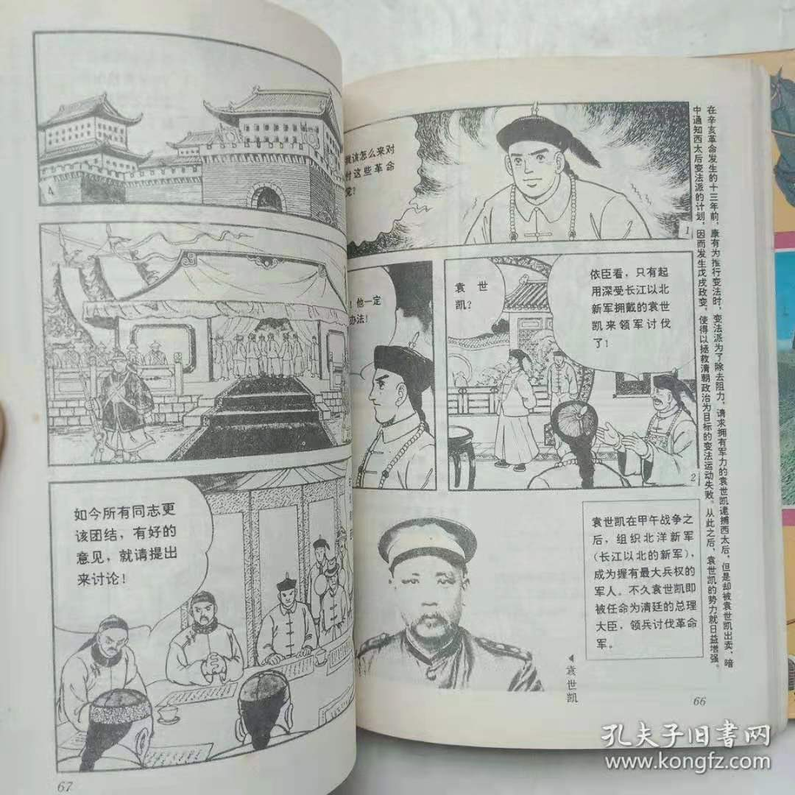

# 中国的历史 集英社

- [中国的历史 集英社](#中国的历史-集英社)
  - [缘起](#缘起)
  - [原版](#原版)
  - [台版](#台版)
  - [和谐](#和谐)
  - [内页](#内页)
  - [往事](#往事)

## 缘起

娃开始学钢琴了，这对大多数家长来说有点棘手，撒泼叫喊不想学是常事，爷家这位也不例外。为了让这狗东西能稍微对音乐有点好感，想着找来音乐家的故事给他讲讲。于是搜来了这本《给孩子们的音乐课》。

这书的封皮是张大事年表，其中还记录了一些和音乐无关的事件，比如“美国独立”，然后十万个为什么娃开始发力了，音乐家的故事没怎么听，问起爷来美国独立是什么？来讲讲啊！…… 那就想办法讲讲吧，可是对娃吧，你得找点合适的啊。历史经验告诉我们比较行得通的是图画本，要么绘本、要么漫画。于是淘宝大法，出现了一本漫画《美国独立与南北战争》，属于一套漫画《NEW 世界历史》，爷可是有买历史漫画经验的啊，决定入手。

接着又有一个问题出现了，咱中国历史也不能输在起跑线上啊。搜出了一堆看起来像漫画的漫画，但爷是个挑剔的人。漫画不要审美，那跟中国足球一样脸不要了啊。经过努力搜索，本文的主角终于出现了“小博士学习漫画系列”《中国的历史》，来自集英社，总算满足了。而且物美价廉，二话不说下单。

## 原版

书到手了，那咱也要和原版对比对比啊。赶紧的日亚搜起来。发现集英社有一套 2006 新版[《中国的历史》](https://www.amazon.co.jp/%E5%AD%A6%E7%BF%92%E6%BC%AB%E7%94%BB-%E4%B8%AD%E5%9B%BD%E3%81%AE%E6%AD%B4%E5%8F%B2-%E4%B8%AD%E5%9B%BD%E6%96%87%E6%98%8E%E3%81%AE%E3%81%82%E3%81%91%E3%81%BC%E3%81%AE-%E5%85%88%E5%8F%B2%E6%99%82%E4%BB%A3-%E6%AE%B7%E3%83%BB%E5%91%A8%E3%83%BB%E6%98%A5%E7%A7%8B%E3%83%BB%E6%88%A6%E5%9B%BD%E6%99%82%E4%BB%A3/dp/4082482016/)漫画。看到评论笑了…… “我有老版，买一本新版试试，不如之前的啊”。

> 1989版がベター
> 
> 集英社は1989等2006に中国の歴史のまんがシリーズを出版しました、前の方が詳しい。試しに2006版の1冊目を買ってみたけど、すでに持っていた1989版の方がいいことが分かりました。

需要说明的是，爷只查到 1987 年版，没有查到 1989 年版，是否是再版目前未知，大概率是买家记错了。因为如果再版了，亚马逊上大概率还是可以搜到这个版本的，但没有发现。

接着，搜到了当年的老板，发现多一卷人物介绍，估计引进时忽略了吧。

前 9 卷封面都一样，到了第 10 卷，可就有意思啦。咱天朝看来果然是重男亲女啊，要不怎么那位美女就不见了呢。

对于此书中文版的出版也是好奇，搜出版社、搜编修都失败了。但意外发现台湾也出过这个书。

## 台版

此博客值得参考，当然大家不一定能打开这个网址，你懂的。[《小牛頓學習漫畫 - 漫畫中國的歷史(1-10集)》](https://blog.xuite.net/wenshan288/twblog/576818260-%E5%B0%8F%E7%89%9B%E9%A0%93%E5%AD%B8%E7%BF%92%E6%BC%AB%E7%95%AB~%E6%BC%AB%E7%95%AB%E4%B8%AD%E5%9C%8B%E7%9A%84%E6%AD%B7%E5%8F%B2%281~10%E9%9B%86%29)

小牛顿系列，厉害了，不愧是牛顿博士。 神奇的封面再度来袭，来了个光头。

## 和谐

原来台版第 10 卷，也不一样啊，果然两岸是一家。

- 一个光头，一个伟人
  - 为啥两人都是同一个指点江山的动作乃？
- 一个红太阳照耀下的伟大历史建筑，一个是灰白堂
  - 高下立判嘛，红色建筑明显大出灰白建筑一圈嘛。咦，为什么红色建筑左下角有灰白的奇奇怪怪的尖刺啊？
  - 灰白的这个按之前提到的博客文章，其名为中正堂
  - 
- 一个出版是 1991，一个是XXX国 77 年
- 小牛顿、小博士
  - 小牛顿系列至少还有《世界的历史》，而小博士系列没有搜到其他书

## 内页

不能只有表皮功夫啊，看看爷选书时注重的画风，1991 年版有些页面的画风就神奇化了哦。您对比对比，品一品。

## 往事

话说二次元的图书引进和翻译有意思的内容太多了，拿《龙珠》举例，最早爷看到的是海南美术出版社的《七龙珠》，然后又陆续有了其他版本。还有一堆“日鸟山明”画风奇特，居然也出版了，嚯嚯。似乎我还买到过一本叫《日本小猴王》的，不知是否是港台版。总之，这些东西要是好好研究，趣味一点也不比研究古籍版本差，不知是否有大家开始研究这东西。地域啊、版本啊、译文啊、从盗版到官方啊、翻译小组啊、同人啊，大有可为，期待……
