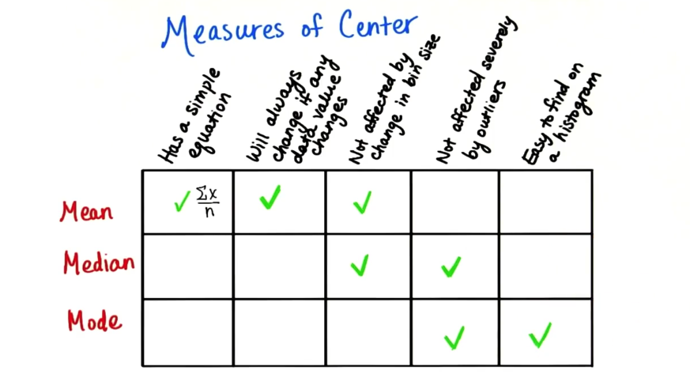
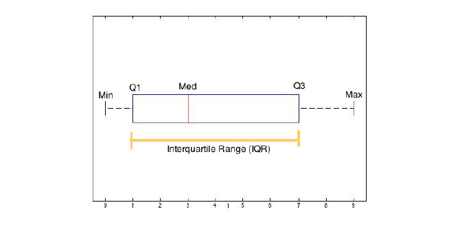
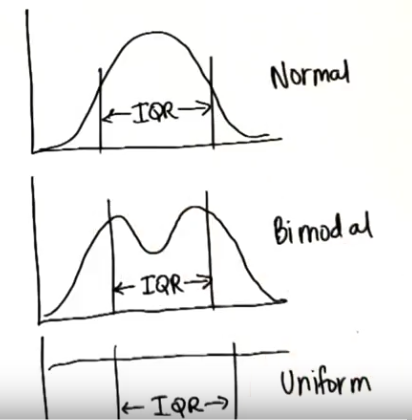
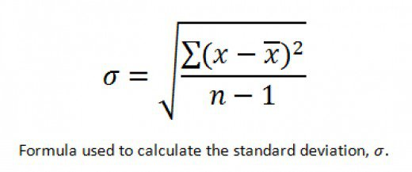
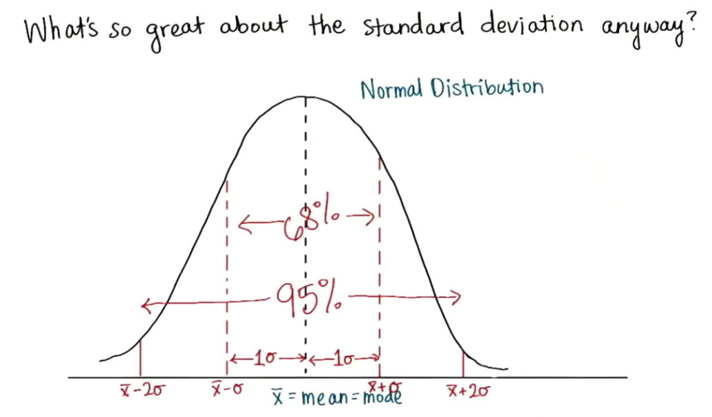
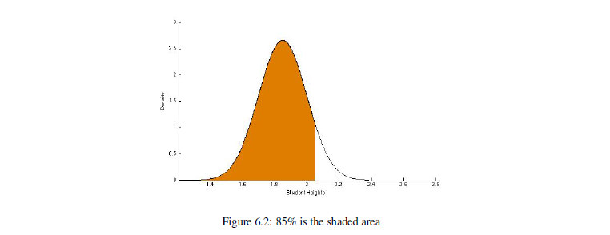
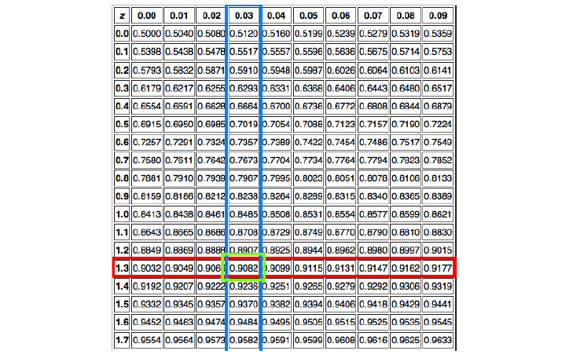
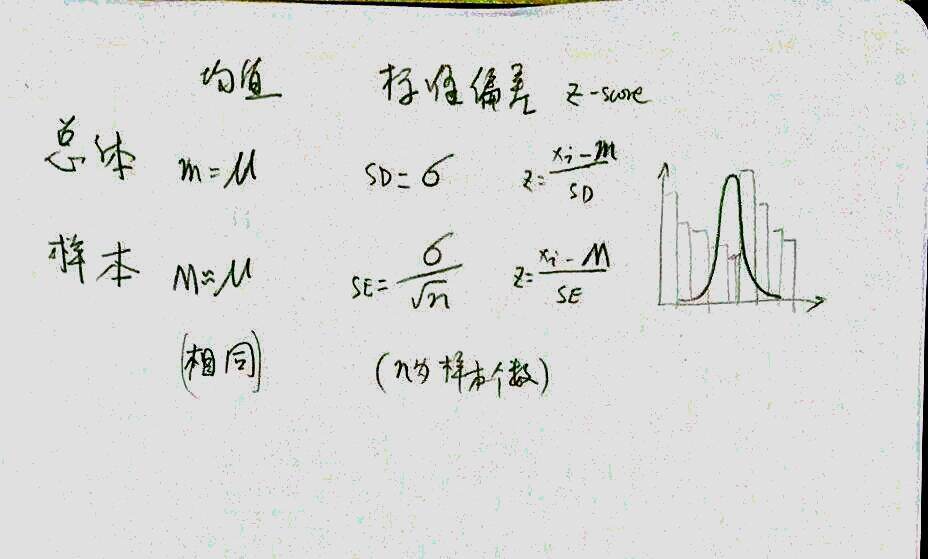

# Udacity Statistics - st095

- [Udacity Statistics - st095](#udacity-statistics---st095)
  - [Descriptive Statistics - ud827](#descriptive-statistics---ud827)
    - [1 Intro](#1-intro)
      - [1.1 构建物](#11-构建物)
      - [1.2 总量和样本](#12-总量和样本)
      - [1.3 实验（我就忽略了）](#13-实验我就忽略了)
    - [2 Visualizing Data（可视化数据）](#2-visualizing-data可视化数据)
      - [2.1 Frequency（频率）](#21-frequency频率)
      - [2.2 Histograms（柱状图）](#22-histograms柱状图)
    - [3 Central Tendency（中心趋势）](#3-central-tendency中心趋势)
    - [4 Variability (可变性)](#4-variability-可变性)
      - [4.1 Box Plots and the IQR](#41-box-plots-and-the-iqr)
      - [4.2 Variance and Standard Deviation (方差和标准均差)](#42-variance-and-standard-deviation-方差和标准均差)
    - [5 归一化](#5-归一化)
    - [6 正态分布](#6-正态分布)
    - [7 样本分布](#7-样本分布)
  - [Inferential Statistics - ud201](#inferential-statistics---ud201)
    - [1 Estimation](#1-estimation)
    - [2 Hypothesis Testing](#2-hypothesis-testing)
    - [3 t-tests](#3-t-tests)
    - [4 t-tests continued](#4-t-tests-continued)
    - [5 One-way ANOVA](#5-one-way-anova)
    - [6 ANOVA continued](#6-anova-continued)
    - [7 Correlation](#7-correlation)
    - [8 Regression](#8-regression)
    - [9 Chi-squared Tests](#9-chi-squared-tests)
  - [ref](#ref)

## Descriptive Statistics - ud827
### 1 Intro
#### 1.1 构建物
- Construct: 构建物，难以测量的某物，因为有多种方式可测量
- Operational Definition: 操作定义，对构建物使用的测量方法，使用后构建物就不再是构建物

#### 1.2 总量和样本
- Population: 总量， 平均值用 $\mu$
- Sample: 样本，平均值用 $\overline{x}$
- Parameter vs Statistic：参数 vs 统计，参数定义总量特征、统计定义样本特征

#### 1.3 实验（我就忽略了）
......

### 2 Visualizing Data（可视化数据）
#### 2.1 Frequency（频率）
- Frequency: 频率，某值出现的次数，多为柱状图中 Y 值

#### 2.2 Histograms（柱状图）
- Positive Skew: 正偏态，向左偏
- Negative Skew: 负偏态，向右偏

### 3 Central Tendency（中心趋势）
- Mean: 均值
- Median：中值
- Mode：众值

| | 简单方程 | 随数据变动 | 不受桶宽影响 | 不受异常值影响 | 通过读图获取 |
| :-: | :-: | :-: | :-: | :-: | :-: |
| 均值 | √ | √ |
| 中值 | | | √ | √ |
| 众数 | | | | √ | √ |

### 4 Variability (可变性)
#### 4.1 Box Plots and the IQR
- IQR 四分位数间距 (Inter Quartile Range)
- 优点：过滤过大过小值，缺点：无法反应数据分布
- 
- 

#### 4.2 Variance and Standard Deviation (方差和标准均差)
- 标准均差：
- 标准均差，根据数值大小可推断分布是否高斯，进一步如果是高斯可推断某一值处于百分之多少范围内。
- 
- Bessel's Correction （贝塞尔校正）, 样本要除以 n-1 而不是 n，因为样本会大量处于集中部分，容易缺失少数类型数据，导致均差偏小。

### 5 归一化
- 计算 z-score 可以将数值分布，统一为比例分布
- 

### 6 正态分布
- 依据 z-score 以及 z-table 可以获取到某一值的百分比
- 
- 

### 7 样本分布
- 多次取 n 个样本平均值，结果为正态分布。通过 z-score 可推断某一样本平均值的可能性。(中心极限定理)
- [中心极限定理](https://zh.wikipedia.org/zh/%E4%B8%AD%E5%BF%83%E6%9E%81%E9%99%90%E5%AE%9A%E7%90%86) (Central limit theorem) 
  - 是概率论中的一组定理。中心极限定理说明，在适当的条件下，大量相互独立随机变量的均值经适当标准化后依分布收敛于正态分布。这组定理是数理统计学和误差分析的理论基础，指出了大量随机变量之和近似服从正态分布的条件。
- [标准误差](https://zh.wikipedia.org/zh/%E6%A0%87%E5%87%86%E8%AF%AF%E5%B7%AE)（Standard Error）
  - 也称标准误，即样本平均数抽样分布的标准差（英文：Standard Deviation），是描述对应的样本平均数抽样分布的离散程度及衡量对应样本平均数抽样误差大小的尺度。
- 

## Inferential Statistics - ud201

### 1 Estimation
- Contents
  - Estimate population parameters from sample statistics using confidence intervals.
  - Estimate the effect of a treatment.
- 概要
  - 置信区间可以让我们帮助判断，某种特征如果处于极致区间内，是否为非常规特征
  - 课程中举例
    - 先使用中心极限定理，抽取多样本，形成正态分布
    - 再抽取带 Bieber Tweeter 特征的用户，发现他们的 z 值极大，可怀疑此群体带有异常特征
- 如何理解“置信区间”
  - 对 10 个数据进行随机抽样，在 95% 的置信水平下（可非完全理解为有 95% 的概率总平均分被包含在内），该班的总平均分为 60-80 分之间
- 可参考
  - 贾俊平:《统计学》第七版 - 第7章 参数估计

### 2 Hypothesis Testing
- How to determine if a treatment has changed the value of a population parameter.
- 使用 z-score 判断是否异常
- 可理解为是否在“置信区间”内

### 3 t-tests
- How to test the effect of a treatment.
- 当抽样数据较小时，t-score 代替 z-score
- t 分布为抽样分布的一类，图像扁平，数据量较小（由其他资料确定，本课程中未注意到）
- t-test 可以进行”独立双样本t检验“（直接使用 z-score 的正态分布不可？）

### 4 t-tests continued
- Compare the difference in means for two groups when there are small sample sizes.
- 小样本示例
- 双样本示例

### 5 One-way ANOVA
- F-test
- 多样本对比
- 可发现至少有一个样本不同

### 6 ANOVA continued
- Learn how to test whether or not there are differences between three or more groups.
- Tukey's HSD
- 可确定哪一个样本不同

### 7 Correlation
- Learn how to describe and test the strength of a relationship between two variables.
- 相关性
- Pearson's r

### 8 Regression
- How changes in one variable are related to changes in a second variable.

### 9 Chi-squared Tests
- Learn how to compare and test frequencies for categorical data.
- 对比分类数据

## ref
- [贾俊平 统计学 第七版](http://eol.bnuz.edu.cn/meol/common/script/preview/download_preview.jsp?fileid=2636820&resid=275382&lid=22755)